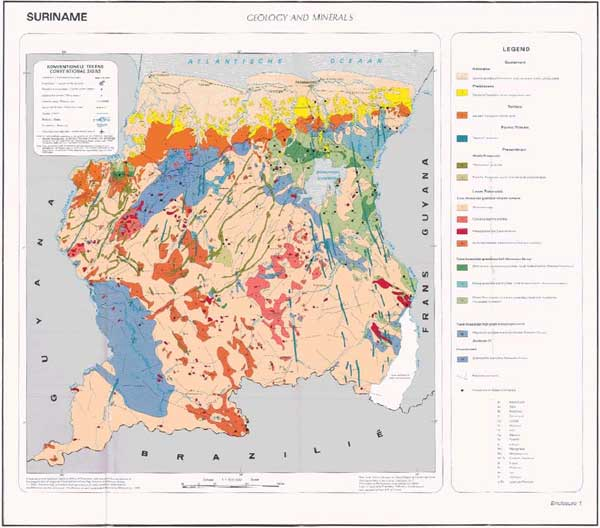
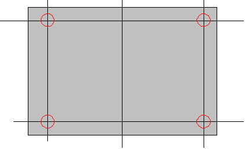
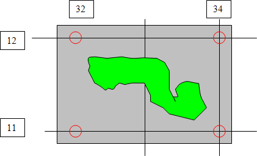

.. _service_provision_data_preparation_paper_map:

Scanning a paper map
====================

Scanning
--------

Your chosen paper map may look something like this one from the Dutch Geological Survey of Dutch Guyana or Suriname:

   Example geological map to scan

Step 1
^^^^^^

It is important to find a large scanner in your city, which could cover a whole paper map.  If this scanner is not available at your survey, you may try the Topographical Survey or a large bookshop or book printer.

Step 2A
^^^^^^^

If you could use a large scanner, you can scan the whole map at one time.  But remember to scan the geological map portion into a separate file from that for the legend i.e. you will have two files one for the map and one for the legend.  Alternatively, make a copy of an original digital image of the whole map face and cut out the map from the legend.

The preferable output format should be .TIFF as this format keeps most information, but if  you have a slow Personal Computer, you could temporarily work with a JPEG copy.  The file size is than much smaller and it can be accessed and geo-referenced faster.

Good software for cropping (or cutting out) the legend or map from the whole scanned image is `IrfanView <http://www.irfanview.com/>`_, `Adobe Photoshop <http://www.adobe.com/uk/products/photoshopfamily.html>`_ or `GNU Image Manipulation Program (GIMP) <https://www.gimp.org/>`_.

Tip: This cropped map is now ready for geo-referencing.

Note, an alternative approach is to georeference the whole scanned image, then use a GIS (such as `QGIS <https://www.qgis.org/en/site/about/index.html>`_) to crop out the map sheet using a polygon mask.  You might use this technique when your original data is a scan of a old map sheet.

Step 2B
^^^^^^^

For larger maps, or if you have only a small scanner, the map should be scanned in parts and later stitched together.

   Orientation of map for scanning
     

If you scan in parts always try to keep the crossings of the horizontal and vertical black lines in each of the four corners.  The straight horizontal and vertical black lines on the map are the altitude and longitude.  Then the stitching and geo-referencing will be much easier.

The output format should be .TIFF as this format keeps most pixel information available.

Step 2C
^^^^^^^

If scanners are not available, you could use a good digital camera.  Unfold the map on a well lit place without glare or light reflections.  Sometimes white sheets on the side will diffuse the light and prevent ugly reflections from the sun or from the light-bulb.  Take a picture right above the centre of the map.

Make several pictures with different lighting and shutter speed.  Choose the best colourful result.  Usually the export format is .JPG.

Step 3 ~ Stitching
^^^^^^^^^^^^^^^^^^

For the stitching of map parts many applications or free software are available, such as such as `GNU Image Manipulation Program (GIMP) <https://www.gimp.org/>`_, `OSSIM ImageLinker <http://www.ossim.org/>`_, or `QGIS <https://www.qgis.org/en/site/about/index.html>`_.

Georeferencing a scanned map
----------------------------

You have now a .TIFF file or maybe a .JPEG file, which is a representation of your paper map.  This digital file should now be brought into relation with the surface of the earth.  This is called geo-referencing.  For this action you need GIS software.

Commercial GIS software such as ESRI ArcGIS or MapInfo is widely available and ‘no-cost’ GIS software, which also could perform this task, is `ILWIS <https://github.com/52North/IlwisCore/>`_ , `Geothings Map Warper <http://mapwarper.net//>`_ or `QGIS <https://www.qgis.org/en/site/about/index.html>`_.

Note down the Coordinate system of the paper map, as this is necessary for the following process.  Sometimes paper maps are found and we are not sure what coordinate system was being used as it has not been clearly stated on the paper copy.  Some research may have to be done to estimate the original coordinate system used.  For the Suriname map example it is thought probable that the coordinate system originally used was GCS North American 1927.

It is important to find four or more fixed points in the corner of the picture, from which you know exactly the position.  Reliable points are church towers, railway and roads crossings, canals or bridges.  Be careful with coastal features or rivers as these tend to change slowly in time.  More points are desirable to prevent conical distortions, which often happen with digital cameras.

   Minimum number and location of control points when georectifying a scanned image.
     
Usually these are crossing points of an altitude line and a longitude line.

The x and y coordinates of each crossing should be given to the program.

Be careful to use the relevant degree-minutes-seconds or decimal entries for degrees depending on the particular program’s requirements.  After confirming the picture will be warped by the program so it fits now on the world surface.  Please check the accuracy, preferable with a topographical map, as often even the cartographers have made mistakes, or may have deliberately introduced errors for geopolitical or security reasons.  With slight alterations of the fixed points you can try to make a perfect overlap with a topographical map.

Image formats and transparency
------------------------------

Although your scanned image will be rectangular in shape, nearly all mapped geographic regions will have irregularly shaped boundaries.  Thus it is preferable to make the background parts of your image transparent rather than a solid background colour which will obscure neighbouring regions.  The variety of image formats that are usable with MapServer and their various advantages and disadvantages is a complex subject which we cannot be authoritative about.

We have found 32-bit TIFF (RGB plus alpha layer) or 8-bit palette PNG with a transparent background colour work; you may wish to experiment.

See `MapServer raster data <http://www.mapserver.org/input/raster.html>`_ for more information.

The legend for the scanned map
------------------------------

.. container:: floatright

   .. figure:: legend.jpg
      :width: 200
      :height: 681
      :alt: Paper legend
      :class: img floatright
   
      Detailed legend for scanning
   
A WMS based on a scanned map will not have the ability to click on a symbolized polygon and see what attributes and therefore what classification it has according to the legend.  A WMS based on GIS digital data polygons and attributes does have this capability and the legend is automatically created from such information by the MapServer software.  However for this scanned map based WMS it is possible to associate the scanned legend file for the map — which in the case of the Suriname example looked like this — with the WMS service by including the following lines in the Metadata section of the MapServer.map configuration file which is discussed later:

::

   METADATA
   
   ...
   
   "WMS_STYLE" "default"
   "WMS_STYLE_DEFAULT_LEGENDURL_HEIGHT" "353"
   "WMS_STYLE_DEFAULT_LEGENDURL_WIDTH" "253"
   "WMS_STYLE_DEFAULT_LEGENDURL_HREF" "http://www.dinoservices.nl/TNO_Suriname_Geology/surinameLegend.png"
   "WMS_STYLE_DEFAULT_LEGENDURL_FORMAT" "image/png"
   
   ...

Note that the image format should be one that can be directly displayed by a web browser, i.e. JPEG, PNG or GIF.

