1     Introduction
===============================================================

GeoSciML is an
application-neutral encoding format for geosciences information. It is based on Geography Markup Language v3.2
(GML) (ISO 19136:2007) for representation of features and geometry. GeoSciML was developed by the CGI (Commission for the
Management and Application of Geoscience Information), a Commission of the
International Union of Geological Sciences (IUGS). Following a memorandum of
understanding between IUGS and the Open Geospatial Consortium (OGC), GeoSciML v4.1 was published in 2017 as an OGC standard (`http://www.opengeospatial.org/standards/geosciml <http://www.opengeospatial.org/standards/geosciml>`_).
Future releases will be managed by the OGC GeoSciML Standards Working Group
(SWG).

GeoSciML
has a wide scope allowing the encoding of most information depicted on
geological maps, as well as information about boreholes and laboratory
analyses. This cookbook, however, concentrates on just those parts of GeoSciML
necessary for (i) encoding the INSPIRE Geology application schema and (ii)
delivering geological age and lithology information through OneGeology
services.

The
INSPIRE geology data specification (D2.8.II.4 Data Specification on Geology – 
Draft Technical Guidelines) describes the geological information that needs to
be made available through INSPIRE conformant web services. INSPIRE services can
be encoded using GeoSciML v4.1 in order to achieve maximum global
interoperability and to enable the INSPIRE geology data specification to be
extended to include other geosciences information. A mapping between the INSPIRE
specification and GeoSciML v4.1 is given in Annex 1. Note that the INSPIRE
Geology Data Specification also includes application schema for hydrogeology
and geophysics which are not covered by this cookbook.

Geological
age and lithology are used as the basis for querying and portrayal in
OneGeology and this cookbook covers the parts of GeoSciML required to be
delivered as part of a 5 star OneGeology service.

To facilitate semantic interoperability it is
important to use shared vocabularies. The CGI has developed suitable
vocabularies for many GeoSciML properties and these are available from the
GeoSciML resources website (`http://resource.geosciml.org/ <http://resource.geosciml.org/>`_).
For INSPIRE the vocabularies that must be used are included in the data
specification and are available from the INSPIRE registry (`http://inspire.ec.europa.eu/registry/ <http://inspire.ec.europa.eu/registry/>`_). The OneGeology portal can query services
using either CGI or INSPIRE vocabularies.Both sets of vocabularies use http
URIs as concept identifiers.

This cookbook is designed to assist users map their
data to the GeoSciML data model. In most cases users with digital geoscience
data will have their own formalised model of some type, although this will not
always be the case. Where a formalised user data model exists then the process
of mapping data to GeoSciML will largely involve mapping features/entities in
the user model to their equivalents in the GeoSciML logical data model. Where
no such user model exists then mapping must be carried out direct from the
data. 

To
carry out the mapping, from either a model or direct from data, requires staff
with geoscientific knowledge, familiarity with the user’s own data and data
model, and an understanding of the UML formalisation used in documenting
GeoSciML. These staff are likely to be geoscientists, possibly those who were
involved in developing the organisation’s own data model, and it is these
people who are seen as the main users of this cookbook.

Materials
and documentation on GeoSciML have been produced by the CGI  and OGC and are
available "as is" for download from `http://www.geosciml.org/ <http://www.geosciml.org/>`_
and `http://www.opengeospatial.org/standards/geosciml <http://www.opengeospatial.org/standards/geosciml>`_.
The supporting materials most
relevant to this cookbook include:

* Full documentation of the GeoSciML model. This is generated automatically from the GeoSciML UML diagrams and draws on the scope notes in those diagrams. This full documentation, however, does not include any best practice guidance
* An Enterprise Architect version of the UML for the CGI packages
* GeoSciML examples

.. todo::

   We’ll have to find somewhere else to put v4.1 compatible Schematron files for INSPIRE. They don’t belong on OGC site. Asked Olly to put at the specified 4.1 location. Will also ask Carlo Cipolloni to get them uploaded to envPlus INSPIRE validator.

There are also XML Schema documents which enable
validation of the GeoSciML instance documents that you produce from your mapped
data. These are listed at `http://schemas.opengis.net/gsml/4.1/ <http://schemas.opengis.net/gsml/4.1/>`_.
For the parts covered by this cookbook you will need http://schemas.opengis.net/gsml/4.1/geoSciMLBasic.xsd
and, if you are providing borehole data, `http://schemas.opengis.net/gsml/4.1/borehole.xsd <http://schemas.opengis.net/gsml/4.1/borehole.xsd>`_.
You can also find some Schematron files which provide extra validation for
the INSPIRE profile of GeoSciML. `http://schemas.geosciml.org/geosciml/4.1/geoSciMLBasic_inspire_mandatory.sch <http://schemas.geosciml.org/geosciml/4.1/geoSciMLBasic_inspire_mandatory.sch>`_
checks that all properties required by INSPIRE have been provided and `http://schemas.geosciml.org/geosciml/4.1/geoSciML_inspire_vocabularies.sch <http://schemas.geosciml.org/geosciml/4.1/geoSciML_inspire_vocabularies.sch>`_
checks that the appropriate INSPIRE vocabulary terms have been used. 

.. todo::

   This section on conditions probably needs deleting. Conditions belong on the GeoSciML and OGC sites, not here. Also I'm not sure whether these conditions were just made up by John Laxton or are actually based on some conditions published elsewhere?

Although use of GeoSciML is open to the geoscience
community, in order to ensure the integrity of the GeoSciML standard across the
community the CGI and OGC request that the following points be applied to any
work involving GeoSciML:

1. full compliance with existing GeoSciML conformance criteria 
2. the CGI and OGC and their GeoSciML products are not misrepresented or misused 
3. the CGI and OGC retain full copyright to all CGI and GeoSciML names and products, including logos, text, images and technical materials 
4. the GeoSciML name and associated namespaces, as well as the CGI and OGC name and associated task group names, are reserved strictly for CGI and OGC activities and products 
5. the GeoSciML products developed by the CGI and OGC may be freely copied and used within third-party information systems, with acknowledgements as per (8) below 
6. the GeoSciML products developed by the CGI and OGC are not to be modified by third-parties, except as part of the revision process within the OGC.
7. extensions to GeoSciML by third-parties remain distinct from GeoSciML, exist in non-GeoSciML namespaces, and are not to be represented as CGI or GeoSciML products 
8. acknowledgement of GeoSciML and the OGC is made in all communications and products related to work involving GeoSciML, with appropriate citation 
9. the CGI and OGC give no warranty, expressed or implied, as to the quality or accuracy of the information supplied, or to the information's suitability for any use. The CGI and OGC accept no liability whatever in respect of loss, damage, injury or other occurrence however caused 

2     GeoSciML model and INSPIRE encoding
===============================================================

There are six packages in GeoSciML. Two are required
for INSPIRE services: GeoSciML-Basic and Borehole. Only GeoSciML-Basic is
required for a 5 star OneGeology service. This section will describe those
parts of these packages which are the minimum requirement for conformance with
the INSPIRE geology application schema. The parts required for a One Geology
service are a subset of the INSPIRE ones and are highlighted as they are
covered.

In GeoSciML most properties are optional. For a
OneGeology service you may decide whether to omit or include properties that
are not specified below as required. If you wish to provide explicit reasons
for some missing values you can include the relevant property, add an
xsi:nil="true" attribute and use a nilReason attribute to specify the
reason the value is not being supplied. Unless your service is also an INSPIRE
service, one of the nilReasons defined in ISO 19136:2007 section 8.2.3.1 should
be used:

* **inapplicable** - there is no value
* **missing** - the correct value is not readily available to the sender of this data. Furthermore, a correct value may not exist
* **template** - the value will be available later
* **unknown** - the correct value is not known to, and not computable by, the sender of this data. However, a correct value probably exists
* **withheld** - the value is not divulged

However, for INSPIRE services all attributes in the
data specification should be provided. ‘Voidable’ does not mean ‘optional’ in
INSPIRE. Where no value is provided for an INSPIRE voidable attribute then a nilReason
must be provided. One of the nilReasons defined in the INSPIRE `VoidReasonValue <http://inspire.ec.europa.eu/codelist/VoidReasonValue/>`_
codelist should be used:

* `http://inspire.ec.europa.eu/codelist/VoidReasonValue/Unpopulated <http://inspire.ec.europa.eu/codelist/VoidReasonValue/Unpopulated>`_ - The characteristic is not part of the dataset maintained by the data provider. However, the characteristic may exist in the real world.
* `http://inspire.ec.europa.eu/codelist/VoidReasonValue/Unknown <http://inspire.ec.europa.eu/codelist/VoidReasonValue/Unknown>`_ - the correct value for the specific spatial object is not known to, and not computable by, the data provider. However, a correct value may exist.
* `http://inspire.ec.europa.eu/codelist/VoidReasonValue/Withheld <http://inspire.ec.europa.eu/codelist/VoidReasonValue/Withheld>`_ - the characteristic may exist, but it is confidential and not divulged by the data provider.

This doesn’t apply to attributes that exist in
GeoSciML but that aren’t part of the INSPIRE data specification. Where no value
is provided for these they may have any nilReason permitted by GeoSciML or may
simply be omitted if permitted by GeoSciML. Figure 1 shows examples of how to provide nil
values.

.. code-block:: xml

 <gsmlb:geologicUnitType xsi:nil="true" nilReason="http://inspire.ec.europa.eu/codelist/VoidReasonValue/Unknown" />
 <gsmlb:rank xsi:nil="true" nilReason="inapplicable" />

Figure 1 Examples of encoding
nil values

As GeoSciML is a GML schema all objects must have a
value for the mandatory gml:id attribute. This provides an identifier for the
XML element representing the object, and must be unique within the XML
document. XML elements representing a particular object, for example a specific
GeologicUnit, need only be described once in the document. Subsequent
occurrences can reference the element using the gml:id. The gml:id attribute
should not be used for the global identifier of the object, it is simply an
identifier within the XML document.

Vocabulary concepts should be encoded by reference.
This enables information about the concept, such as a full description, to be
accessed from the relevant vocabulary service. The general pattern is that the
href attribute provides the URI of the concept and the title attribute provides
a human readable label for it.

An example of encoding the INSPIRE Geology application
schema in GeoSciML is given in Annex 2. This example is structured as a GeologicCollection
with one of each type of INSPIRE feature included. It is designed to illustrate
GeoSciML encoding rather than illustrate what a real INSPIRE service might look
like.

An example of a response that would be suitable for a
OneGeology 5 star WFS is given in Annex 3.

2.1   Mapped Feature and Geologic Feature
---------------------------------------------------------------

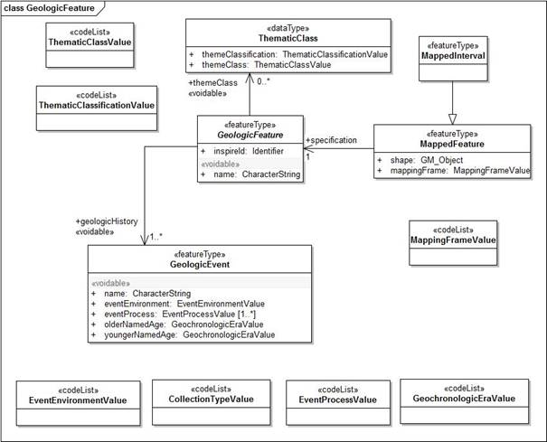

   Figure 2: INSPIRE UML class diagram for GeologicFeature, MappedFeature, GeologicEvent and ThematicClass

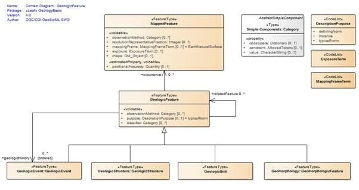

   Figure 3: UML context diagram for GeoSciML GeologicFeature

The INSPIRE UML class diagram
for GeologicFeature, MappedFeature, GeologicEvent and ThematicClass is shown in
Figure 2 and the UML of the equivalent GeoSciML classes in Figure 3.  

The MappedFeature and
GeologicFeature objects are at the core of GeoSciML. A MappedFeature can be
considered an occurrence, such as a polygon on a geologic map, of a real world
GeologicFeature the full extent of which is unknown. It is independent of
geometry, so the same GeologicFeature can have different MappedFeature
instances, representing mapped polygons at different scales or a modelled
volume for example. Each MappedFeature, however, can be specified by only one
GeologicFeature. The specification association, from MappedFeature to
GeologicFeature, is required by INSPIRE. An INSPIRE service provides a
collection of MappedFeatures. A OneGeology service provides a collection of
MappedFeatures specified by GeologicUnit features.

GeologicFeature is the abstract parent class for
GeologicUnit, GeologicStructure, GeomorphologicFeature and GeologicEvent. This
section will describe those properties which apply to all GeologicFeatures, but
these will always be encoded as part of one of the specialist child classes. The
INSPIRE GeologicFeature class has two associations, themeClass and
geologicHistory. The themeClass association should be encoded using the
GeoSciML classifier association, which will be explained in section 2.6, and geologicHistory should be encoded using the GeoSciML geologicHistory property
which has GeologicEvent values, explained in section 2.2.

2.1.1   Mapped Feature - mapping frame
^^^^^^^^^^^^^^^^^^^^^^^^^^^^^^^^^^^^^^^^^^^^^^^^^^^^^^^^^^^^^^^

The INSPIRE
mappingFrame property is equivalent to the GeoSciML mappingFrame. Each
MappedFeature has a mappingFrame property constrained by a vocabulary term that
indicates the spatial reference frame within which the MappedFeatures have been
observed, such as a surface of mapping. Values should be drawn from the
MappingFrameValue vocabulary (`http://inspire.ec.europa.eu/codelist/MappingFrameValue <http://inspire.ec.europa.eu/codelist/MappingFrameValue>`_). At
the time of writing an equivalent CGI vocabulary has been drafted but not yet
published.

.. code-block:: xml

 <gsmlb:mappingFrame
   xlink:href="http://inspire.ec.europa.eu/codelist/MappingFrameValue/topOfBedrock"
   xlink:title="top of bedrock"/>
 
Figure 4: Example of the
encoding of sampling frame

2.1.2    Mapped Feature - geometry (shape)
^^^^^^^^^^^^^^^^^^^^^^^^^^^^^^^^^^^^^^^^^^^^^^^^^^^^^^^^^^^^^^^

The geometry
of each MappedFeature is provided by the shape association to GM_Object. Figure 5 gives an example of encoding a polygon. This property is (obviously) required for a OneGeology service and should have Polygon values.

.. code-block:: xml

 <gsmlb:shape>
      <gml:Polygon srsName="urn:ogc:def:crs:EPSG::4326" gml:id="LOCAL_ID_0">
          <gml:exterior>
              <gml:LinearRing>
                  <gml:posList srsDimension="2" count="8">55.0760921318516
 -3.31719604609088 55.0833753209835 -3.31853455922777 55.0825574334633
 -3.31921378657955 55.0801997429522 -3.31978309699423 55.0768616358466
 -3.3194575613054 55.0741365291192 -3.31966903508197 55.0756843873373
 -3.31747948721346 55.0760921318516 -3.31719604609088</gml:posList> 
               </gml:LinearRing>
           </gml:exterior>
       </gml:Polygon>
   </gsmlb:shape>
 
Figure 5: Example of the encoding of MappedFeature geometry (shape)

2.1.3   Geologic Feature - inspireId
^^^^^^^^^^^^^^^^^^^^^^^^^^^^^^^^^^^^^^^^^^^^^^^^^^^^^^^^^^^^^^^

The INSPIRE inspireId
property is of type Identifier and provides the persistent identifier used for
the object by the data provider, for example the code from a stratigraphic
lexicon in the case of a GeologicUnit. In GeoSciML this should be encoded using
gml:identifier which requires both the identifier value, equivalent to
Identifier.localId, and the codespace, equivalent to Identifier.namespace,
identifying the data source (Figure 6).  

2.1.4   Geologic Feature - name
^^^^^^^^^^^^^^^^^^^^^^^^^^^^^^^^^^^^^^^^^^^^^^^^^^^^^^^^^^^^^^^

The INSPIRE name property
provides the name of the GeologicFeature, for example the expansion of the code
provided by inspireId. It should be encoded using gml:name (Figure 6). If the feature does not have a name use “Unnamed feature”.

.. code-block::xml

 <gsmlb:GeologicUnit gml:id="INV-SDSM">
           <gml:identifier codeSpace="http://data.bgs.ac.uk/">http://data.bgs.ac.uk/id/Lexicon/NamedRockUnit/INV</gml:identifier>
           <gml:name>INVERCLYDE GROUP</gml:name>
 
Figure 6:
Example of the encoding of identifier and name for a GeologicUnit

2.2   Geologic Age
---------------------------------------------------------------

In INSPIRE the geologicHistory association
from GeologicFeature to GeologicEvent is the way in which geologic age is
described (Figure 2). This applies to
all types of GeologicFeature: GeologicUnit, GeologicStructure and
GeomorphologicFeature. In GeoSciML age is modeled similarly, although
GeologicEvent is itself a type of GeologicFeature and may have further
geologicHistory properties. At least one GeologicEvent needs to be provided per
GeologicUnit. The OneGeology Portal has a query tool which will retrieve units
of a specified age or ages. The interpretation of the results of this particular
query tool will be clear if you were to provide only a single GeologicEvent for
each GeologicUnit and consider this event represents the formation of the unit.

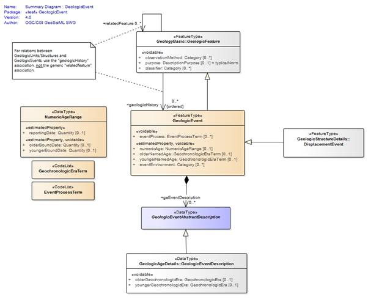

   Figure 7: UML summary diagram for GeoSciML GeologicEvent

2.2.1   Geologic Event - name
^^^^^^^^^^^^^^^^^^^^^^^^^^^^^^^^^^^^^^^^^^^^^^^^^^^^^^^^^^^^^^^

The INSPIRE name property
provides the name of the GeologicEvent, for example ‘Hercynian Orogeny’. Only
major events such as orogenies are likely to have names and other events should
be recorded as ‘Unnamed event’. The field should be encoded using gml:name. 

2.2.2    Geologic Event - youngerNamedAge and olderNamedAge
^^^^^^^^^^^^^^^^^^^^^^^^^^^^^^^^^^^^^^^^^^^^^^^^^^^^^^^^^^^^^^^

In INSPIRE it is necessary to
provide geologic age expressed using a geochronologic era defined according to
a geologic time scale. Geochronologic era names must be drawn from the GeochronologicEraValue
vocabulary (`http://inspire.ec.europa.eu/codelist/GeochronologicEraValue <http://inspire.ec.europa.eu/codelist/GeochronologicEraValue>`_), which is based on the International Commission for
Stratigraphy (ICS) international stratigraphic chart supplemented with a more
detailed chronology for parts of the Precambrian and Quaternary. Both the
olderNamedAge and the youngerNamedAge attributes should be populated, giving
the age of the start and end of the GeologicEvent respectively. It may be that the
GeologicEvent age is fully enclosed by a single geochronologic era, in which
case the olderNamedAge and the youngerNamedAge attributes should both be
populated with the same value.

These properties are required
for OneGeology services. If the service is not also an INSPIRE service the
values must be drawn from  the CGI vocabulary http://resource.geosciml.org/classifier/ics/ischart/Eras
which is based on the International Commission
for Stratigraphy (ICS) international stratigraphic chart or the supplement `http://resource.geosciml.org/vocabulary/timescale/1GE_PCExtension.rdf <http://resource.geosciml.org/vocabulary/timescale/1GE_PCExtension.rdf>`_
which contains a more detailed chronology for parts of the Precambrian.

2.2.3   Geologic Event - eventProcess
^^^^^^^^^^^^^^^^^^^^^^^^^^^^^^^^^^^^^^^^^^^^^^^^^^^^^^^^^^^^^^^

The eventProcess property
describes one or more processes that took place during the event to modify the
related GeologicFeature. For an INSPIRE service it should be encoded using
terms drawn from the EventProcessValue vocabulary (`http://inspire.ec.europa.eu/codelist/EventProcessValue <http://inspire.ec.europa.eu/codelist/EventProcessValue>`_). If it is provided for a non-INSPIRE OneGeology
service the CGI Event process vocabulary (`http://resource.geosciml.org/classifier/cgi/eventprocess <http://resource.geosciml.org/classifier/cgi/eventprocess>`_)
should be used.

2.2.4   Geologic Event - eventEnvironment
^^^^^^^^^^^^^^^^^^^^^^^^^^^^^^^^^^^^^^^^^^^^^^^^^^^^^^^^^^^^^^^

The eventEnvironment property
describes the environment within which the event took place. It is of type ‘Category’ which
provides the resolvable URI for the vocabulary containing the eventEnvironment
concepts in the codeSpace attribute, the URI identifier for the
eventEnvironment concept in the identifier attribute, and a human readable
version of the concept in the label attribute. For an INSPIRE service the
codeSpace should have the URI for the
EventEnvironmentValue vocabulary (`http://inspire.ec.europa.eu/codelist/EventEnvironmentValue <http://inspire.ec.europa.eu/codelist/EventEnvironmentValue>`_) and the values in the identifier should be taken
from this vocabulary. If it is provided for a non-INSPIRE OneGeology service values
from the CGI Event environment vocabulary (`http://resource.geosciml.org/classifier/cgi/eventenvironment <http://resource.geosciml.org/classifier/cgi/eventenvironment>`_)
should be used for identifier and the URI `http://resource.geosciml.org/classifierscheme/cgi/2016.01/eventenvironment <http://resource.geosciml.org/classifierscheme/cgi/2016.01/eventenvironment>`_ for the codeSpace.

.. todo::

   Used the ConceptScheme URI above for 2016 version. Not what was used for older 201211 version but there isn’t an equivalent “Dataset” object in 2016 vocab.

.. code-block:: xml

   <gsmlb:eventEnvironment>
    <swe:Category
     definition="http://inspire.ec.europa.eu/codelist/EventEnvironmentValue">
     <swe:identifier>http://inspire.ec.europa.eu/codelist/EventEnvironmentValue/riverPlainSystemSetting</swe:identifier>
     <swe:label>river plain system setting</swe:label>
     <swe:codeSpace
      xlink:href="http://inspire.ec.europa.eu/codelist/EventEnvironmentValue"/>
    </swe:Category>
   </gsmlb:eventEnvironment>

Figure 8: Example of encoding eventEnvironment

2.3   Geologic Unit and Earth Material 
---------------------------------------------------------------

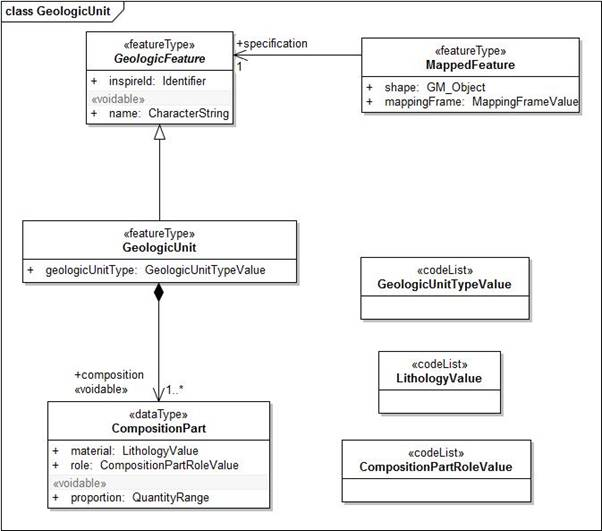

   Figure 9: INSPIRE UML class diagram for GeologicUnit

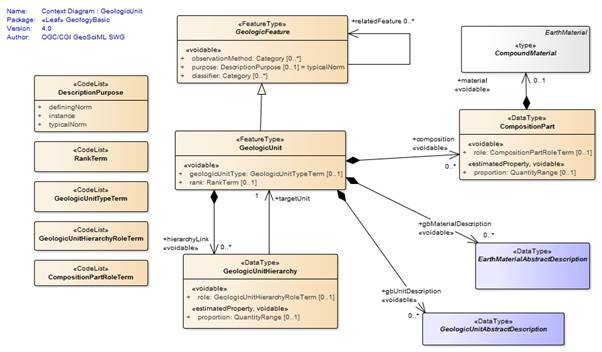

   Figure 10: UML context diagram for GeoSciML GeologicUnit

The INSPIRE UML class diagram
for GeologicUnit is shown in Figure 9 and the UML of the GeoSciML GeologicUnit package in Figure 10. GeologicUnit is a specialisation of GeologicFeature.  In INSPIRE only the geologicUnitType property is required, along with the
association to compositionPart, and as can be seen this is modelled in an
identical way in GeoSciML.

2.3.1   Geologic Unit - geologic unit type
^^^^^^^^^^^^^^^^^^^^^^^^^^^^^^^^^^^^^^^^^^^^^^^^^^^^^^^^^^^^^^^

The only GeologicUnit attribute that is mandatory for
INSPIRE is geologicUnitType. This indicates the type of the geologic unit, for
example a lithostratigraphic unit or a lithologic unit. Values must be drawn
from the GeologicUnitTypeValue vocabulary (`http://inspire.ec.europa.eu/codelist/GeologicUnitTypeValue <http://inspire.ec.europa.eu/codelist/GeologicUnitTypeValue>`_). If
it is provided for a non-INSPIRE OneGeology service the CGI Geologic unit type
vocabulary (`http://resource.geosciml.org/classifier/cgi/geologicunittype <http://resource.geosciml.org/classifier/cgi/geologicunittype>`_)
should be used.

2.3.2   Geologic Unit - composition
^^^^^^^^^^^^^^^^^^^^^^^^^^^^^^^^^^^^^^^^^^^^^^^^^^^^^^^^^^^^^^^

The composition association from GeologicUnit to
CompositionPart provides the means for describing the lithology of the
GeologicUnit. In INSPIRE a GeologicUnit must have at least one CompositionPart,
but can have several where the GeologicUnit is composed of several different
lithologies. For each CompositionPart values for three attributes must be
provided: role, material and proportion. The requirements are the same for a
OneGeology service.

2.3.3   Composition Part - role
^^^^^^^^^^^^^^^^^^^^^^^^^^^^^^^^^^^^^^^^^^^^^^^^^^^^^^^^^^^^^^^

Role
defines the relationship of the compositionPart to the GeologicUnit as a whole,
e.g. vein, interbedded constituent, layers, dominant constituent. Values should
be drawn from the CompositionPartRoleValue vocabulary (`http://inspire.ec.europa.eu/codelist/CompositionPartRoleValue <http://inspire.ec.europa.eu/codelist/CompositionPartRoleValue>`_). If it is
provided for a non-INSPIRE OneGeology service the CGI Geologic unit part role
vocabulary (`http://resource.geosciml.org/classifier/cgi/geologicunitpartrole <http://resource.geosciml.org/classifier/cgi/geologicunitpartrole>`_)
should be used.

2.3.4   Composition Part - proportion
^^^^^^^^^^^^^^^^^^^^^^^^^^^^^^^^^^^^^^^^^^^^^^^^^^^^^^^^^^^^^^^

The proportion attribute
defines the proportion of the GeologicUnit as a whole that the CompositionPart
comprises. It is expressed as two fractions giving the upper and lower limits
of the range within which the CompositionPart proportion is considered to lie. It
can be serialised with an swe:QuantityRange element in both INSPIRE and
GeoSciML. However, GeoSciML also provides the gsmlb:GSML_QuantityRange element
which can be substituted here. The latter expresses the limits both as a space
separated tuple compatible with SWE and in separate elements which enables
querying in a WFS. A OneGeology service must use the gsmlb:GSML_QuantityRange
element.

.. code-block:: xml

   <gsmlb:proportion>
    <gsmlb:GSML_QuantityRange>
     <swe:uom code="%" xlink:href="http://unitsofmeasure/ucum.html#para-29"
      xlink:title="percent"/>
     <swe:value>5.0 50.0</swe:value>
     <gsmlb:lowerValue>5.0</gsmlb:lowerValue>
     <gsmlb:upperValue>50.0</gsmlb:upperValue>
    </gsmlb:GSML_QuantityRange>
   </gsmlb:proportion>

Figure
11 Example of the encoding of proportion

2.3.5   Composition Part - material
^^^^^^^^^^^^^^^^^^^^^^^^^^^^^^^^^^^^^^^^^^^^^^^^^^^^^^^^^^^^^^^

The material attribute provides
the lithology of the CompositionPart and is of type LithologyValue (a codelist)
in INSPIRE (Figure 9) whereas in GeoSciML it is modelled as a CompoundMaterial (Figure 12). CompoundMaterial is a specialisation of EarthMaterial and the parent class of RockMaterial. The RockMaterial.lithology property is the equivalent of
INSPIRE CompositionPart.material.

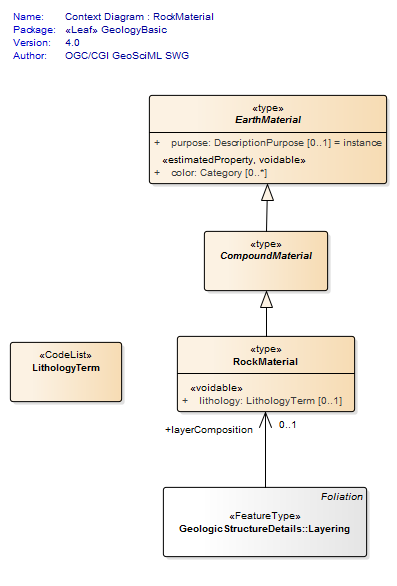

   Figure 12: UML context diagram for GeoSciML RockMaterial

2.3.6    Rock Material -lithology
^^^^^^^^^^^^^^^^^^^^^^^^^^^^^^^^^^^^^^^^^^^^^^^^^^^^^^^^^^^^^^^

The lithology attribute
provides the lithology of the CompositionPart. GeoSciML allows multiple
lithologies for each CompositionPart, but in INSPIRE each CompositionPart
should be restricted to a single lithology, although, as indicated in section 2.3.2, a
GeologicUnit can have multiple CompositionParts. Values for lithology should be
drawn from the LithologyValue vocabulary (`http://inspire.ec.europa.eu/codelist/LithologyValue <http://inspire.ec.europa.eu/codelist/LithologyValue>`_). This attribute is required for a OneGeology service
and the same restriction on having a single lithology per CompositionPart
applies. For a non-INSPIRE OneGeology service the CGI Simple lithology
vocabulary (`http://resource.geosciml.org/classifier/cgi/lithology <http://resource.geosciml.org/classifier/cgi/lithology>`_) must be used.

2.4   Geologic Structure
---------------------------------------------------------------

GeologicStructure is an abstract specialization of
GeologicFeature and in INSPIRE only two types of GeologicStructure are
required, ShearDisplacementStructure (faults) and Fold (Figure 13).

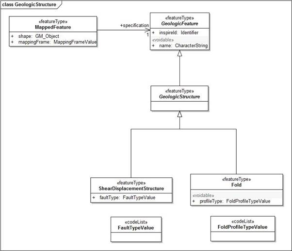

   Figure 13: INSPIRE UML class diagram for GeologicStructure

The GeoSciML modelling of
ShearDisplacementStructure is shown in Figure 14, and of Fold in Figure 15.

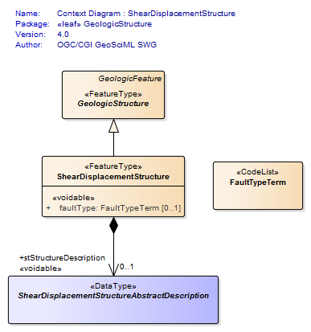

   Figure 14: UML context diagram for GeoSciML ShearDisplacementStructure

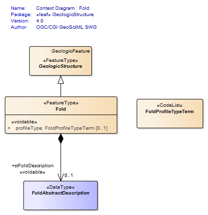

   Figure 15: UML context diagram for GeoSciML Fold

As can be seen in Figure 13, the only properties required by INSPIRE are faultType for ShearDisplacementStructure, and profileType for Fold.  

2.4.1   Shear Displacement Structure - faultType
^^^^^^^^^^^^^^^^^^^^^^^^^^^^^^^^^^^^^^^^^^^^^^^^^^^^^^^^^^^^^^^

The faultType property
describes the type of ShearDispacementStructure and should be populated with a
value drawn from the FaultTypeValue vocabulary (`http://inspire.ec.europa.eu/codelist/FaultTypeValue <http://inspire.ec.europa.eu/codelist/FaultTypeValue>`_). For a non-INSPIRE OneGeology service the CGI Fault
Type vocabulary (`http://resource.geosciml.org/classifier/cgi/faulttype <http://resource.geosciml.org/classifier/cgi/faulttype>`_)
should be used.

2.4.2   Fold - profileType
^^^^^^^^^^^^^^^^^^^^^^^^^^^^^^^^^^^^^^^^^^^^^^^^^^^^^^^^^^^^^^^

The profileType property describes
the type of fold defined according to its geometry and the younging direction
of the strata. It should be populated using values from the
FoldProfileTypeValue vocabulary (`http://inspire.ec.europa.eu/codelist/FoldProfileTypeValue <http://inspire.ec.europa.eu/codelist/FoldProfileTypeValue>`_). There isn’t currently an equivalent CGI vocabulary.

.. todo::

   As far as I can see there is still no CGI vocabulary for this property. Again not sure why previous version of cookbook didn’t even bother to say “there is no CGI version”?

2.5   Geomorphologic Feature
---------------------------------------------------------------

Figure 16 shows the INSPIRE UML class diagram for geomorphology, and Figure 17 the equivalent GeoSciML modeling. As can be seen
these are modeled in an identical way. GeomorphologicFeature is an abstract
specialization of GeologicFeature with two sub-types, AnthropogenicGeomorphologicFeature
and NaturalGeomorphologicFeature. 

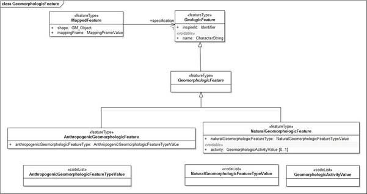

   Figure 16: INSPIRE UML class diagram for GeomorphologicFeature

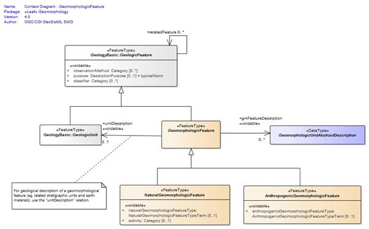

   Figure 17: UML context diagram for GeoSciML GeomorphologicFeature

2.5.1   Natural Geomorphologic Feature - NaturalGeomorphologicFeatureType
^^^^^^^^^^^^^^^^^^^^^^^^^^^^^^^^^^^^^^^^^^^^^^^^^^^^^^^^^^^^^^^^^^^^^^^^^

.. todo::

   For this and next two properties should I explicitly note that there is no current CGI vocabulary?

The
NaturalGeomorphologicFeatureType property describes the type of
NaturalGeomorphologicFeature and should be populated with a value drawn from
the NaturalGeomorphologicFeatureTypeValue vocabulary (`http://inspire.ec.europa.eu/codelist/NaturalGeomorphologicFeatureTypeValue <http://inspire.ec.europa.eu/codelist/NaturalGeomorphologicFeatureTypeValue>`_). There isn’t currently an equivalent CGI vocabulary.

2.5.2   Natural Geomorphologic Feature - activity
^^^^^^^^^^^^^^^^^^^^^^^^^^^^^^^^^^^^^^^^^^^^^^^^^^^^^^^^^^^^^^^

The activity property
describes the level of activity of a NaturalGeomorphologicFeature and should be
populated with a value from the GeomorphologicActivityValue vocabulary (`http://inspire.ec.europa.eu/codelist/GeomorphologicActivityValue <http://inspire.ec.europa.eu/codelist/GeomorphologicActivityValue>`_). There isn’t currently an equivalent CGI vocabulary.

2.5.3   Anthropogenic Geomorphologic Feature - AnthropogenicGeomorphologicFeatureType
^^^^^^^^^^^^^^^^^^^^^^^^^^^^^^^^^^^^^^^^^^^^^^^^^^^^^^^^^^^^^^^^^^^^^^^^^^^^^^^^^^^^^

The
AnthopogenicGeomorphologicFeatureType property describes the type of
AnthropogenicGeomorphologicFeature and should be populated with a value drawn
from the AnthropogenicGeomorphologicFeatureTypeValue vocabulary (`http://inspire.ec.europa.eu/codelist/AnthropogenicGeomorphologicFeatureTypeValue <http://inspire.ec.europa.eu/codelist/AnthropogenicGeomorphologicFeatureTypeValue>`_). There isn’t currently an equivalent CGI vocabulary.

2.6    Thematic Class
---------------------------------------------------------------

The INSPIRE Thematic Class datatype (Figure 2) is designed to enable information on thematic maps to be delivered. Thematic maps commonly take a standard
geological map and reclassify it using some vocabulary of concepts, for example
a standard lithostratigraphic map might be reclassified into ‘engineering
geology units’ based on various generalized physical properties of the
lithostratigraphic units. This doesn’t involve any new mapping, although it may
lead to units being merged together. 

There is no standard for thematic maps and therefore
each data provider must provide their own vocabulary for classifying a
particular map for a particular theme. 

2.6.1   Geologic Feature - classifier
^^^^^^^^^^^^^^^^^^^^^^^^^^^^^^^^^^^^^^^^^^^^^^^^^^^^^^^^^^^^^^^

There is no direct
equivalent of Thematic Class in GeoSciML but it can nevertheless be encoded in
GeoSciML using the classifier association from GeologicFeature to ControlledConcept
(Figure 3). This provides the URI of the relevant value in the thematic
classification vocabulary being used.

.. code-block:: xml

 <gsmlb:GeologicUnit gml:id="INV-SDSM">
 <gml:identifier codeSpace="http://data.bgs.ac.uk/">http://data.bgs.ac.uk/id/Lexicon/NamedRockUnit/INV</gml:identifier>
 <gml:name>INVERCLYDE GROUP</gml:name>
 <gsmlb:geologicHistory> [37 lines]
 <!--  -->
 <!-- Example of a thematic classification of a GeologicUnit -->
 <!--  -->
 <gsmlb:classifier
  xlink:href="http://data.bgs.ac.uk/ref/EngineeringGeologyTheme/strongSandstone"
  xlink:title="Engineering Geology theme: Strong Sandstone"/>

Figure 18:  Example of encoding a GeologicUnit with a
thematic classifier

2.7   Borehole
---------------------------------------------------------------

The
INSPIRE UML class diagram for Borehole is shown in 19 and the UML of the GeoSciML Borehole package in Figure 20. Although the modelling of boreholes in GeoSciML is more complex it includes everything required for INSPIRE which can therefore be encoded with
GeoSciML. One of the main differences is that in GeoSciML Borehole is modelled
as a type of SamplingCurve, drawn from the OGC Observations & Measurements
model. 

The
logElement association from Borehole to BoreholeInterval is the means by which
the borehole log is encoded. There should be one BoreholeInterval (logElement)
for every discrete unit described down the borehole. A borehole encoded as a
series of logElements can be seen as a ‘vertical geological map’ with each BoreholeInterval
specified by a GeologicFeature in the same way as polygons on the map. It is
also possible in GeoSciML to encode the borehole as a series of observations,
using the OGC Observations & Measurements model, but as this isn’t a
requirement for INSPIRE it won’t be described further here.

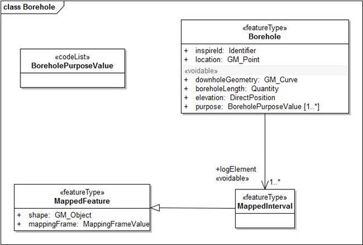

   Figure 19: INSPIRE UML class diagram for Borehole

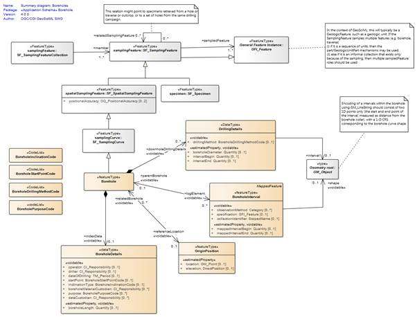

   Figure 20: UML for the GeoSciML Borehole package

2.7.1   Borehole - inspireId
^^^^^^^^^^^^^^^^^^^^^^^^^^^^^^^^^^^^^^^^^^^^^^^^^^^^^^^^^^^^^^^

The INSPIRE inspireId
property is of type Identifier and provides the persistent identifier used for
the borehole by the data provider. In GeoSciML this should be encoded using
gml:identifier which requires both the identifier value, equivalent to
Identifier.localId, and the codespace, equivalent to Identifier.namespace,
identifying the data source (Figure 6).

2.7.2   Borehole - sampledFeature
^^^^^^^^^^^^^^^^^^^^^^^^^^^^^^^^^^^^^^^^^^^^^^^^^^^^^^^^^^^^^^^

This property isn’t required
by INSPIRE but is mandatory for SamplingFeature and thus Borehole in GeoSciML.
In a typical borehole being encoded the sampledFeatures will be the features,
such as GeologicUnits, which the borehole penetrates and which specify the log elements
(see section 2.7.9). There should be one sampledFeature encoded for each
distinct feature sampled by the borehole. The positions where these features
are intersected by the borehole may be described in the log. Each feature only
needs to be described fully once and then can be referenced with an internal
xlink:href using the gml:id value of the feature. No extra information is
therefore required to encode this property. 

2.7.3   Borehole - downholeGeometry
^^^^^^^^^^^^^^^^^^^^^^^^^^^^^^^^^^^^^^^^^^^^^^^^^^^^^^^^^^^^^^^

This should be encoded using
the SF_SpatialSamplingFeature shape association to GM_Object to provide a
LineString with the 3D geometry of the borehole (Figure 21). Where the borehole is vertical the X and Y co-ordinates will be the same for all positions. The LineString should be given an identifier using
gml:id for use in referencing the log elements (section 2.7.8)

.. code-block:: xml

     <sams:shape>
        <gml:LineString gml:id="bh.ns94se5.shape" srsName="urn:ogc:def:crs:EPSG:6.15:7405">
          <gml:posList srsDimension="3" count="7">-30.7111 134.2059 321. -30.7112 134.2058 315.
            -30.7113 134.2057 303. -30.7114 134.2056 296.
            -30.7115 134.2055 272. -30.7116 134.2054 271.
            -30.7117 134.2053 270.</gml:posList>
        </gml:LineString>
      </sams:shape>

Figure 21: Example of encoding
the downhole geometry of a borehole

2.7.4   Borehole - location and elevation
^^^^^^^^^^^^^^^^^^^^^^^^^^^^^^^^^^^^^^^^^^^^^^^^^^^^^^^^^^^^^^^

The referenceLocation
association from borehole to OriginPosition allows the encoding of both
location and elevation. Location should be encoded as a two dimensional point
and elevation as a one dimensional value (Figure 22).

.. code-block:: xml

      <gsmlbh:referenceLocation>
        <gsmlbh:OriginPosition gml:id="op1">
          <gsmlbh:location>
            <gml:Point gml:id="pt1" srsName="urn:ogc:def:crs:EPSG:6.15:27700" srsDimension="2">
              <gml:pos>-30.7 134.2</gml:pos>
            </gml:Point>
          </gsmlbh:location>
          <gsmlbh:elevation srsName="urn:ogc:def:crs:EPSG:6.15:5701" srsDimension="1"
            >321.0</gsmlbh:elevation>
        </gsmlbh:OriginPosition>
      </gsmlbh:referenceLocation>

Figure 22: Example of encoding
the location and elevation of a borehole

2.7.5   Borehole - purpose
^^^^^^^^^^^^^^^^^^^^^^^^^^^^^^^^^^^^^^^^^^^^^^^^^^^^^^^^^^^^^^^

.. todo::

   Again note no CGI vocabulary?

The purpose property
describes the purpose for which the Borehole was drilled and should be
populated with a value from the BoreholePurposeValue vocabulary (`http://inspire.ec.europa.eu/codelist/BoreholePurposeValue <http://inspire.ec.europa.eu/codelist/BoreholePurposeValue>`_). In GeoSciML this property is inside
indexData/BoreholeDetails. There isn’t currently an equivalent CGI vocabulary.

2.7.6   Borehole - boreholeLength
^^^^^^^^^^^^^^^^^^^^^^^^^^^^^^^^^^^^^^^^^^^^^^^^^^^^^^^^^^^^^^^

The boreholeLength records
the total length down the borehole and should be encoded as a Quantity value,
which requires the units of measurement to be recorded along with the value (Figure 23). The unit of measure should reference the URI of an OGC definition. Again this is found inside the indexData/BoreholeDetails element.

.. code-block:: xml

 <gsmlbh:indexData>
  <gsmlbh:BoreholeDetails>
   <gsmlbh:purpose
    xlink:href="http://inspire.ec.europa.eu/codelist/BoreholePurposeValue/geologicalSurvey"
    xlink:title="geological Survey"/>
   <gsmlbh:boreholeLength>
    <swe:Quantity>
     <swe:uom code="m" xlink:href="http://www.opengis.net/def/uom/OGC/1.0/metre"
      xlink:title="metre"/>
     <swe:value>51.0</swe:value>
    </swe:Quantity>
   </gsmlbh:boreholeLength>
  </gsmlbh:BoreholeDetails>
 </gsmlbh:indexData>

Figure 23: Example of encoding
the purpose and boreholeLength

2.7.7   Borehole Interval - mappingFrame
^^^^^^^^^^^^^^^^^^^^^^^^^^^^^^^^^^^^^^^^^^^^^^^^^^^^^^^^^^^^^^^

The BoreholeInterval in
GeoSciML v4.1 does not have a mappingFrame / samplingFrame property as this
will always be the borehole to which it belongs. Thus, although in the INSPIRE
geology theme Schema the property is encoded by referencing the gml:id of the
borehole, for GeoSciML nothing needs specifying explicitly.

2.7.8    BoreholeInterval - geometry (shape)
^^^^^^^^^^^^^^^^^^^^^^^^^^^^^^^^^^^^^^^^^^^^^^^^^^^^^^^^^^^^^^^

The geometry of the BoreholeInterval
is the one dimensional linear segment down the borehole that the BoreholeInterval
refers to. The reference system is the geometry of the borehole, which can be
referenced using the gml:id of the borehole shape property (Figure 21). An example of encoding BoreholeInterval geometry is given in Figure 24.  

.. code-block:: xml

   <gsmlbh:shape>
    <gml:LineString gml:id="ls1" srsName="#bh.ns94se5.shape">
     <gml:posList srsDimension="1" count="2">0.0 2.0</gml:posList>
    </gml:LineString>
   </gsmlbh:shape>

Figure 24: Example of encoding BoreholeInterval
geometry

2.7.9    BoreholeInterval - specification
^^^^^^^^^^^^^^^^^^^^^^^^^^^^^^^^^^^^^^^^^^^^^^^^^^^^^^^^^^^^^^^

A BoreholeInterval is
specified by a GeologicFeature in exactly the same way as described in section
2.1 for MappedFeature. The encoding of a GeologicFeature specifying a
MappedInterval is therefore identical to that described above for
MappedFeatures and won’t be repeated here.

2.7.10 BoreholeInterval - mappedIntervalBegin & mappedIntervalEnd
^^^^^^^^^^^^^^^^^^^^^^^^^^^^^^^^^^^^^^^^^^^^^^^^^^^^^^^^^^^^^^^^^

The mappedIntervalBegin and
mappedIntervalEnd properties hold the one dimensional co-ordinates of the start
and end of the mappedInterval, as measured down the borehole, encoded as
Quantity values (Figure 25). This information duplicates that held in the shape property, but
queries such as ‘find all MappedIntervals within 10m of the surface’ are
difficult to implement with current technology using the shape property and the
mappedIntervalBegin and mappedIntervalEnd properties have been introduced to
address this problem.

.. code-block:: xml

          <gsmlbh:mappedIntervalBegin>
            <swe:Quantity>
              <swe:uom code="m" xlink:href="http://www.opengis.net/def/uom/OGC/1.0/metre"
                xlink:title="metre"/>
              <swe:value>0.0</swe:value>
            </swe:Quantity>
          </gsmlbh:mappedIntervalBegin>
          <gsmlbh:mappedIntervalEnd>
            <swe:Quantity>
              <swe:uom code="m" xlink:href="http://www.opengis.net/def/uom/OGC/1.0/metre"
                xlink:title="metre"/>
              <swe:value>2.0</swe:value>
            </swe:Quantity>
          </gsmlbh:mappedIntervalEnd>

Figure 25: Example of encoding mappedIntervalBegin and mappedIntervalEnd

2.8   Geologic Collection
---------------------------------------------------------------

The GeologicCollection in
INSPIRE is designed to enable features which comprise a higher level object,
such as a geological map or a borehole exploration programme, to be grouped
together. This enables information such as metadata to be provided for the collection
of features as a whole. It is not necessary to use a GeologicCollection where
features do not form part of such a higher level object. The INSPIRE UML class
diagram for GeologicCollection is shown in Figure 26. 

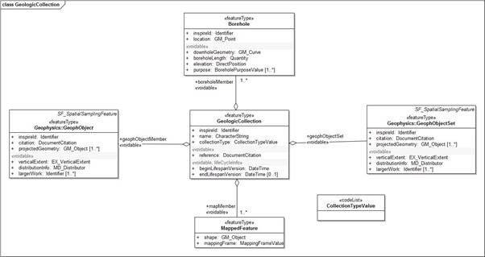

   Figure 26: INSPIRE UML class diagram for GeologicCollection

In GeoSciML collections are
modelled with the GSML feature (Figure 28).  

Where features are not part
of a GSML collection each individual feature is a member of a
wfs:FeatureCollection. GSML is a GML feature so where a GSML collection is
being delivered it is the GSML collection which is a member of the
wfs:FeatureCollection and individual features are members of the GSML
collection (Figure 27).

.. code-block:: xml

  <wfs:member>
    <gsmlb:GSML gml:id="col1">
      <gml:metaDataProperty> [81 lines]
      <gml:identifier codeSpace="http://data.bgs.ac.uk">http://data.bgs.ac.uk/id/625KGeologyMap</gml:identifier>
      <gml:name>BGS 1:625 000 Digital Geological Map</gml:name>
      <gsmlb:collectionType
       xlink:href="http://inspire.ec.europa.eu/codelist/CollectionTypeValue/geologicalMap"
       xlink:title="geological map"/>
      <gsmlb:member>
      <gsmlb:MappedFeature gml:id="mf.16">
        ....

Figure 27: Example of encoding a GSML collection as a member
of a wfs:FeatureCollection and a MappedFeature as a member of the GSML
collection

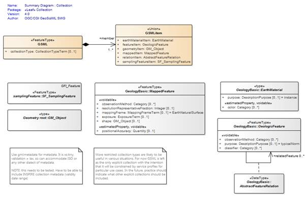

   Figure 28: UML class diagram for GeoSciML Collection package

The INSPIRE reference,
beginLifespanVersion and endLifespanVersion properties can all be implemented
in GeoSciML using the standard gml:metaDataProperty to contain elements from
the ISO 19139 metadata schema. The use of MD_Metadata also requires certain
other mandatory properties to be encoded which are not required by the INSPIRE
data specification.

2.8.1   Geologic Collection - inspireId
^^^^^^^^^^^^^^^^^^^^^^^^^^^^^^^^^^^^^^^^^^^^^^^^^^^^^^^^^^^^^^^

The INSPIRE inspireId
property is of type Identifier and provides the persistent identifier used for
the GeologicCollection by the data provider. In GeoSciML this should be encoded
using gml:identifier which requires both the identifier value, equivalent to Identifier.localId,
and the codespace, equivalent to Identifier.namespace, identifying the data
source (Figure 28).

2.8.2    GeologicCollection - name
^^^^^^^^^^^^^^^^^^^^^^^^^^^^^^^^^^^^^^^^^^^^^^^^^^^^^^^^^^^^^^^

The INSPIRE name property
provides the name of the GeologicCollection. It should be encoded using
gml:name (Figure 28).

2.8.3   Geologic Collection - collectionType
^^^^^^^^^^^^^^^^^^^^^^^^^^^^^^^^^^^^^^^^^^^^^^^^^^^^^^^^^^^^^^^

.. todo::

   A CGI vocab based on the INSPIRE code list is a CGI draft schema. Need to check when this gets published.

The collectionType
property describes the type of collection and should be populated with a value
from the CollectionTypeValue vocabulary (`http://inspire.ec.europa.eu/codelist/CollectionTypeValue <http://inspire.ec.europa.eu/codelist/CollectionTypeValue>`_) (Figure 28). At the time of writing an equivalent CGI vocabulary has been drafted but not yet published.

2.8.4   Geologic Collection - member
^^^^^^^^^^^^^^^^^^^^^^^^^^^^^^^^^^^^^^^^^^^^^^^^^^^^^^^^^^^^^^^

In INSPIRE there are four
types of feature which can be members of a GeologicCollection: MappedFeature;
Borehole; GeophObject; and GeophObjectSet (Figure 26). GeophObject and GeophObjectSet are features in the geophysics application schema and won’t be discussed further here. In GeoSciML the member
association from GSML to GSMLItem allows the members of a GSML collection to be
any of the types in the GSMLItem union class. The types of member of an INSPIRE
GeologicCollection can be mapped to these: MappedFeature maps to mappedItem and
Borehole to samplingFeatureItem (Figure 28). Figure 27 shows the encoding of a MappedFeature as a member of a GSML collection.

2.8.5   MD_Metadata - contact
^^^^^^^^^^^^^^^^^^^^^^^^^^^^^^^^^^^^^^^^^^^^^^^^^^^^^^^^^^^^^^^

Although the MD_Metadata
contact property is not required by INSPIRE it is mandatory for MD_Metadata. It
identifies the organisation providing the metadata and its role with respect to
the metadata. It is of type CI_ResponsibleParty which requires the encoding of
the organisationName and role properties, the latter with values drawn from the
CI_RoleCode vocabulary (`http://www.isotc211.org/2005/resources/Codelist/gmxCodelists.xml#CI_RoleCode <http://www.isotc211.org/2005/resources/Codelist/gmxCodelists.xml#CI_RoleCode>`_). Figure 29 gives an example of the encoding of contact.

.. code-block:: xml

 <gmd:contact>
     <gmd:CI_ResponsibleParty>
        <gmd:organisationName>
           <gco:CharacterString>British Geological Survey (BGS)</gco:CharacterString>
        </gmd:organisationName>
        <gmd:role>
           <gmd:CI_RoleCode codeList="http://www.isotc211.org/2005/resources/Codelist/gmxCodelists.xml#CI_RoleCode" 
                  codeListValue="owner">owner</gmd:CI_RoleCode>
        </gmd:role>
     </gmd:CI_ResponsibleParty>
 </gmd:contact>

Figure 29: Example of encoding MD_Metadata.contact

2.8.6   MD_Metadata - dateStamp
^^^^^^^^^^^^^^^^^^^^^^^^^^^^^^^^^^^^^^^^^^^^^^^^^^^^^^^^^^^^^^^

Although the MD_Metadata
dateStamp property is not required by INSPIRE it is mandatory for MD_Metadata.
It provides the date when the metadata was created and should follow the format
defined in ISO8601. An example of encoding dateStamp is given in Figure 30.

.. code-block:: xml

          <gmd:dateStamp>
            <gco:Date>2011-03-08</gco:Date>
          </gmd:dateStamp>

Figure 30: Example of encoding MD_Metadata.dateStamp

2.8.7   Geologic Collection - reference
^^^^^^^^^^^^^^^^^^^^^^^^^^^^^^^^^^^^^^^^^^^^^^^^^^^^^^^^^^^^^^^

The reference property is of
type DocumentCitation which requires the provision of a name, shortName, date
and link (URL). The first three of these properties can be encoded using the
MD_DataIdentification.citation property which is of type CI_Citation.

2.8.7.1   DocumentCitation - name
"""""""""""""""""""""""""""""""""""""""""""""""""""""""""""""""

The DocumentCitation.name
property can be encoded with CI_Citation.title (Figure 31). This property duplicates the information encoded in gml:name (section 2.8.2).

2.8.7.2   DocumentCitation - shortName
"""""""""""""""""""""""""""""""""""""""""""""""""""""""""""""""

The
DocumentCitation.shortName property can be encoded with
CI_Citation.alternateTitle (Figure 31). This property is optional in INSPIRE and should be used where the GeologicCollection has a well recognised short name.

2.8.7.3  Document Citation - date
"""""""""""""""""""""""""""""""""""""""""""""""""""""""""""""""

The DocumentCitation.date
refers to the date cited in the reference, such as publication date or revision
date. It can be encoded with CI_Citation.date (Figure 31) which is of type CI_Date requiring both the date and the dateType to be
provided. The dateType property identifies what the date is referring to and
should be encoded using a value drawn from the CI_DateTypeCode vocabulary (`http://www.isotc211.org/2005/resources/Codelist/gmxCodelists.xml#CI_DateTypeCod <http://www.isotc211.org/2005/resources/Codelist/gmxCodelists.xml#CI_DateTypeCod>`_). 

.. code-block:: xml

                <gmd:CI_Citation>
                  <gmd:title>
                    <gco:CharacterString>BGS 1:625 000 Digital Geological Map</gco:CharacterString>
                  </gmd:title>
                  <gmd:alternateTitle>
                    <gco:CharacterString>BGS 625k Map</gco:CharacterString>
                  </gmd:alternateTitle>
                  <gmd:date>
                    <gmd:CI_Date>
                      <gmd:date>
                        <gco:Date>2008</gco:Date>
                      </gmd:date>
                      <gmd:dateType>
                        <gmd:CI_DateTypeCode codeList="http://www.isotc211.org/2005/resources/Codelist/gmxCodelists.xml#CI_DateTypeCode" 
                          codeListValue="revision">revision</gmd:CI_DateTypeCode>
                      </gmd:dateType>
                    </gmd:CI_Date>
                  </gmd:date>
                  <gmd:date>
                </gmd:CI_Citation>

Figure 31: Example of encoding DocumentCitation using CI_Citation

2.8.7.4   DocumentCitation - link
"""""""""""""""""""""""""""""""""""""""""""""""""""""""""""""""

The DocumentCitation.link
property is defined as providing an online link to the document (not to the
citation of the document), and so should provide the URL of the
GeologicCollection. This can be encoded using the MD_Metadata.dataSetURI property (Figure 32). 

.. todo::

   James Passmore established that it is likely that CI_OnlineResource is now preferred over MD_Metadata.dataSetURI (rather than John Laxton’s original comment on MD_DigitalTransferOptions.online) from reference: https://geo-ide.noaa.gov/wiki/index.php?title=ISO_FAQ#What_is_the_Dataset_URI.3F. However, we have no examples so we are just going to leave the old advice for the moment. Have updated to use gmx:Anchor rather than gco:CharacterString as BP for links though.

.. code-block:: xml

    <gmd:dataSetURI>
     <gmx:Anchor href="http://www.bgs.ac.uk/products/digitalmaps/digmapgb_625.html" />
    </gmd:dataSetURI>

Figure 32: Example of encoding DocumentCitation.link using MD_Metadata.dataSetURI

2.8.8   Geologic Collection - beginLifespanVersion & endLifespanVersion
^^^^^^^^^^^^^^^^^^^^^^^^^^^^^^^^^^^^^^^^^^^^^^^^^^^^^^^^^^^^^^^^^^^^^^^

The beginLifespanVersion and
endLifespanVersion properties can both be encoded using the CI_Citation.date
property (section 2.8.7.3), but
with different values for the dateType property. The date should be encoded
using the format defined in ISO8601. In the revised version of ISO19115 the
CI_DateTypeCode vocabulary has been significantly extended and beginLifespanVersion
should have a dateType code value of validityBegins and endLifespanVersion
should have a dateType code value of validityEnds (Figure 33). The endLifespanVersion property should not be encoded if the GeologicCollection is still valid.

.. code-block:: xml

                  <gmd:date>
                    <gmd:CI_Date>
                      <gmd:date>
                        <gco:Date>2008</gco:Date>
                      </gmd:date>
                      <gmd:dateType>
                        <gmd:CI_DateTypeCode codeList="http://www.isotc211.org/2005/resources/Codelist/gmxCodelists.xml#CI_DateTypeCode" 
                          codeListValue="validityBegins">validityBegins</gmd:CI_DateTypeCode>
                      </gmd:dateType>
                    </gmd:CI_Date> 
                  </gmd:date>
                  <gmd:date>
                    <gmd:CI_Date>
                      <gmd:date>
                        <gco:Date>2013</gco:Date>
                      </gmd:date>
                      <gmd:dateType>
                        <gmd:CI_DateTypeCode codeList="http://www.isotc211.org/2005/resources/Codelist/gmxCodelists.xml#CI_DateTypeCode" 
                          codeListValue="validityEnds">validityEnds</gmd:CI_DateTypeCode>
                      </gmd:dateType>
                    </gmd:CI_Date>                   
                  </gmd:date>

Figure 33:
Example of encoding beginLifespanVersion and endLifespanVersion using
CI_Citation.date

2.8.9   MD_DataIdentification - abstract
^^^^^^^^^^^^^^^^^^^^^^^^^^^^^^^^^^^^^^^^^^^^^^^^^^^^^^^^^^^^^^^

Although the
MD_DataIdentification abstract property is not required by INSPIRE it is
mandatory for MD_DataIdentification. It should be populated with a text description
of the GeologicCollection (Figure 34).

2.8.10 MD_DataIdentification - language
^^^^^^^^^^^^^^^^^^^^^^^^^^^^^^^^^^^^^^^^^^^^^^^^^^^^^^^^^^^^^^^

Although the
MD_DataIdentification language property is not required by INSPIRE it is
mandatory for MD_DataIdentification. It identifies the language(s) used in the
GeologicCollection and should be encoded using the language codes defined in
ISO639-2 (Figure 34).

If the dataset has no natural
language the special code of "zxx" of the ISO 639-2/B reserved for
"no linguistic content; not applicable" shall be used.

2.8.11 MD_DataIdentification - topicCategory
^^^^^^^^^^^^^^^^^^^^^^^^^^^^^^^^^^^^^^^^^^^^^^^^^^^^^^^^^^^^^^^

Although the
MD_DataIdentification topicCategory property is not required by INSPIRE it is
mandatory for MD_DataIdentification where the metadata is referring to a
dataset. A GeologicCollection can be considered a dataset. MD_DataIdentification
topicCategory should be populated with a value from the MD_TopicCategory_Code
vocabulary (`http://www.isotc211.org/2005/resources/Codelist/gmxCodelists.xml#MD_TopicCategoryCode <http://www.isotc211.org/2005/resources/Codelist/gmxCodelists.xml#MD_TopicCategoryCode>`_) (Figure 34). 

.. code-block:: xml

              <gmd:abstract>
                <gco:CharacterString>The data shows polygonal and selected linear geological information, sourced
                  from published BGS 1:625 000 scale maps of Great Britain.  However, geological units are identified
                  using the most up-to-date nomenclature that may differ from that on the printed maps. The maps are
                  generally based on published material at 1:50 000 scale and compiled using techniques of selection,
                  generalisation and exaggeration. The geology is fitted to a relevant topographic base at the time
                  of production. Full UK coverage is available. The data is available in vector format. BGS licensing
                  terms and conditions apply to external use of the data. The data can be used free of charge for
                  non commercial use and is downloadable from the website.</gco:CharacterString>
              </gmd:abstract>
              <gmd:language>
                  <gmd:LanguageCode  
                   codeList="http://standards.iso.org/ittf/PubliclyAvailableStandards/ISO_19139_Schemas/resources/codelist/ML_gmxCodelists.xml#LanguageCode"
                   codeListValue="eng">English</gmd:LanguageCode>
              </gmd:language>
              <gmd:topicCategory>
                <gmd:MD_TopicCategoryCode>geoscientificInformation</gmd:MD_TopicCategoryCode>
              </gmd:topicCategory>

Figure 34: Example of encoding MD_Identification.abstract, MD_Identification.language and
MD_Identification.topicCategory

3     OneGeology-Global querying
===============================================================

.. todo::

   Note the Portal will need updating to send v4.1 as well as v4.0 queries (or are there few enough v4.0 services that we can get them all converted first?)

The
OneGeology-Global portal at present implements three queries which will be
briefly explained here: spatial, lithology and age. These queries can be
combined so as to select, for example, all those MappedFeatures of a particular
age and lithology within a specified area. The purpose of the queries is to
enable the delivery of just a sub-set of the data provided by the service, to
more closely meet the requirements of the user. 

3.1   Spatial querying
---------------------------------------------------------------

Spatial querying is possible
using a defined rectangle. In the query (Figure 35) the BBOX operator is used to filter for all those MappedFeatures where the geometry given by the shape attribute (section 2.1.2) lies
within a rectangle defined by upper and lower corner points.

.. code-block:: xml

 <wfs:GetFeature xmlns:xsi="http://www.w3.org/2001/XMLSchema-instance"
  xsi:schemaLocation="http://www.opengis.net/wfs/2.0
 http://schemas.opengis.net/wfs/2.0/wfs.xsd
  http://www.opengis.net/gml/3.2
 http://schemas.opengis.net/gml/3.2.1/gml.xsd"
  xmlns:wfs="http://www.opengis.net/wfs/2.0" 
  xmlns:fes="http://www.opengis.net/fes/2.0"
  xmlns:gsmlb="http://www.opengis.net/gsml/4.1/GeoSciML-Basic"
  xmlns:gml="http://www.opengis.net/gml/3.2"
  service="WFS" version="2.0.0" count="100">
  <wfs:Query typeNames="gsmlb:MappedFeature">
   <fes:Filter>
    <fes:BBOX>
     <fes:ValueReference>gsmlb:shape</fes:ValueReference>
     <gml:Envelope srsName="urn:ogc:def:crs:EPSG::4326">
      <gml:lowerCorner>56.08643859340388 -4.0004826736994445</gml:lowerCorner>
      <gml:upperCorner>56.165510496146474 -3.8381055732299343</gml:upperCorner>
     </gml:Envelope>
    </fes:BBOX>
   </fes:Filter>
  </wfs:Query>
 </wfs:GetFeature>
 
Figure 35: Example of a spatial
query using a rectangle

3.2   Lithology querying
---------------------------------------------------------------

The first lithology query (Figure 36) filters on the lithology attribute (section 2.3.6), looking for an exact match with the specified value. Note that the portal client by
default adds any child concepts for lithologies you select to the query so in
this example, where limestone was selected, the sub-types of limestone (chalk
and travertine) are also included in the query. As explained in section 2.3.2 a
GeologicUnit can have multiple CompositionParts describing the different
lithological components of the GeologicUnit. This lithology query takes no
account of the proportion attribute and will retrieve GeologicUnits where any
CompositionPart is of the specified lithology, not just those where the
specified lithology is predominant.

.. code-block:: xml

 <wfs:GetFeature xmlns:xsi="http://www.w3.org/2001/XMLSchema-instance"
  xsi:schemaLocation="http://www.opengis.net/wfs/2.0
 http://schemas.opengis.net/wfs/2.0/wfs.xsd"
  xmlns:wfs="http://www.opengis.net/wfs/2.0" 
  xmlns:fes="http://www.opengis.net/fes/2.0"
  xmlns:gsmlb="http://www.opengis.net/gsml/4.1/GeoSciML-Basic"
  xmlns:xlink="http://www.w3.org/1999/xlink"
  service="WFS" version="2.0.0" count="100">
  <wfs:Query typeNames="gsmlb:MappedFeature">
   <fes:Filter>
    <fes:Or>
     <fes:PropertyIsEqualTo>
      <fes:ValueReference>gsmlb:specification/gsmlb:GeologicUnit/gsmlb:composition/gsmlb:CompositionPart/gsmlb:material/gsmlb:RockMaterial/gsmlb:lithology/@xlink:href</fes:ValueReference>
      <fes:Literal>http://resource.geosciml.org/classifier/cgi/lithology/limestone</fes:Literal>
     </fes:PropertyIsEqualTo>
     <fes:PropertyIsEqualTo>
      <fes:ValueReference>gsmlb:specification/gsmlb:GeologicUnit/gsmlb:composition/gsmlb:CompositionPart/gsmlb:material/gsmlb:RockMaterial/gsmlb:lithology/@xlink:href</fes:ValueReference>
      <fes:Literal>http://resource.geosciml.org/classifier/cgi/lithology/chalk</fes:Literal>
     </fes:PropertyIsEqualTo>
     <fes:PropertyIsEqualTo>
      <fes:ValueReference>gsmlb:specification/gsmlb:GeologicUnit/gsmlb:composition/gsmlb:CompositionPart/gsmlb:material/gsmlb:RockMaterial/gsmlb:lithology/@xlink:href</fes:ValueReference>
      <fes:Literal>http://resource.geosciml.org/classifier/cgi/lithology/travertine</fes:Literal>
     </fes:PropertyIsEqualTo>
    </fes:Or>
   </fes:Filter>
  </wfs:Query>
 </wfs:GetFeature>
 
Figure 36: Example of a lithology
query

In addition there is a query
on a single lithology only which will take into account the proportion
attribute and allow you to restrict the returned features to those where the
requested lithology has a proportion range with lower bound at least as large
as some user specified value (Figure 37). This allows you not to retrieve features where the specified lithology is only present in minor amounts.

.. code-block:: xml

 <wfs:GetFeature xmlns:xsi="http://www.w3.org/2001/XMLSchema-instance"
  xsi:schemaLocation="http://www.opengis.net/wfs/2.0
 http://schemas.opengis.net/wfs/2.0/wfs.xsd"
  xmlns:wfs="http://www.opengis.net/wfs/2.0" xmlns:fes="http://www.opengis.net/fes/2.0"
  xmlns:gsmlb="http://www.opengis.net/gsml/4.1/GeoSciML-Basic"
  xmlns:xlink="http://www.w3.org/1999/xlink" service="WFS" version="2.0.0" count="100">
  <wfs:Query typeNames="gsmlb:MappedFeature">
   <fes:Filter>
    <fes:PropertyIsGreaterThanOrEqualTo>
     <fes:ValueReference>gsmlb:specification/gsmlb:GeologicUnit/gsmlb:composition/gsmlb:CompositionPart[gsmlb:material/gsmlb:RockMaterial/gsmlb:lithology/@xlink:href
 =
 'http://resource.geosciml.org/classifier/cgi/lithology/clastic_mudstone']/gsmlb:proportion/gsmlb:GSML_QuantityRange/gsmlb:lowerValue</fes:ValueReference>
     <fes:Literal>50</fes:Literal>
    </fes:PropertyIsGreaterThanOrEqualTo>
   </fes:Filter>
  </wfs:Query>
 </wfs:GetFeature>
 
Figure 37 Example of a
lithology query conditional on proportion

3.3   Age querying
---------------------------------------------------------------

The age query (Figure 38) filters on the olderNamedAge attribute (section 2.2.2), looking for an exact match with the specified value. This means that only
GeologicUnits the upper boundary of which lies with the specified
geochronologic unit will be retrieved, not those which encompass the
geochronologic unit or have their lower boundary within it. Note that the
portal client by default adds any child named ages to the query so, in the
example given in Figure 38 where the Pliocene epoch was selected, the Piacenzian and Zanclean stages are
also included in the query, so a GeologicUnit with its upper boundary in either
of these geochronologic units would be retrieved. The query does not look at
any properties of GeologicEvent to determine if the event is that which formed
the GeologicUnit and it would therefore retrieve any GeologicEvent matching the
age criteria. Only the GeologicEvent responsible for the formation of the
GeologicUnit should therefore be provided in the OneGeology-Global service.

.. code-block:: xml

 <wfs:GetFeature xmlns:xsi="http://www.w3.org/2001/XMLSchema-instance"
  xsi:schemaLocation="http://www.opengis.net/wfs/2.0
 http://schemas.opengis.net/wfs/2.0/wfs.xsd"
  xmlns:wfs="http://www.opengis.net/wfs/2.0" 
  xmlns:fes="http://www.opengis.net/fes/2.0"
  xmlns:gsmlb="http://www.opengis.net/gsml/4.1/GeoSciML-Basic"
  xmlns:xlink="http://www.w3.org/1999/xlink"
  service="WFS" version="2.0.0" count="100">
  <wfs:Query typeNames="gsmlb:MappedFeature">
   <fes:Filter>
    <fes:Or>
     <fes:PropertyIsEqualTo>
      <fes:ValueReference>gsmlb:specification/gsmlb:GeologicUnit/gsmlb:geologicHistory/gsmlb:GeologicEvent/gsmlb:youngerNamedAge/@xlink:href</fes:ValueReference>
      <fes:Literal>http://resource.geosciml.org/classifier/ics/ischart/LowerDevonian</fes:Literal>
     </fes:PropertyIsEqualTo>
     <fes:PropertyIsEqualTo>
      <fes:ValueReference>gsmlb:specification/gsmlb:GeologicUnit/gsmlb:geologicHistory/gsmlb:GeologicEvent/gsmlb:youngerNamedAge/@xlink:href</fes:ValueReference>
      <fes:Literal>http://resource.geosciml.org/classifier/ics/ischart/Emsian</fes:Literal>
     </fes:PropertyIsEqualTo>
     <fes:PropertyIsEqualTo>
      <fes:ValueReference>gsmlb:specification/gsmlb:GeologicUnit/gsmlb:geologicHistory/gsmlb:GeologicEvent/gsmlb:youngerNamedAge/@xlink:href</fes:ValueReference>
      <fes:Literal>http://resource.geosciml.org/classifier/ics/ischart/Lochkovian</fes:Literal>
     </fes:PropertyIsEqualTo>
     <fes:PropertyIsEqualTo>
      <fes:ValueReference>gsmlb:specification/gsmlb:GeologicUnit/gsmlb:geologicHistory/gsmlb:GeologicEvent/gsmlb:youngerNamedAge/@xlink:href</fes:ValueReference>
      <fes:Literal>http://resource.geosciml.org/classifier/ics/ischart/Pragian</fes:Literal>
     </fes:PropertyIsEqualTo>
    </fes:Or>
   </fes:Filter>
  </wfs:Query>
 </wfs:GetFeature>
 
Figure 38: Example of an age
query

Annex 1: Mapping of INSPIRE GE classes and properties to GeoSciML equivalents
=============================================================================

.. raw:: html

 <table class=MsoNormalTable border=1 cellspacing=0 cellpadding=0
  style='margin-left:5.4pt;border-collapse:collapse;border:none'>
  <tr style='height:2.85pt'>
   <td valign=top style='border:solid windowtext 1.0pt;padding:0cm 5.4pt 0cm 5.4pt;
   height:2.85pt'>
 
 <b>INSPIRE GE class</b>
   </td>
   <td valign=top style='border:solid windowtext 1.0pt;border-left:none;
   padding:0cm 5.4pt 0cm 5.4pt;height:2.85pt'>
 
 <b>INSPIRE GE property /association </b>
   </td>
   <td valign=top style='border:solid windowtext 1.0pt;border-left:none;
   padding:0cm 5.4pt 0cm 5.4pt;height:2.85pt'>
 
 <b>GeoSciML class</b>
   </td>
   <td valign=top style='border:solid windowtext 1.0pt;border-left:none;
   padding:0cm 5.4pt 0cm 5.4pt;height:2.85pt'>
 
 <b>GeoSciML property / association</b>
   </td>
  </tr>
  <tr style='height:2.85pt'>
   <td valign=top style='border:solid windowtext 1.0pt;border-top:none;
   padding:0cm 5.4pt 0cm 5.4pt;height:2.85pt'>
 
 AnthropogenicGeomorphologicFeature
   </td>
   <td valign=top style='border-top:none;border-left:none;border-bottom:solid windowtext 1.0pt;
   border-right:solid windowtext 1.0pt;padding:0cm 5.4pt 0cm 5.4pt;height:2.85pt'>
 
  
   </td>
   <td valign=top style='border-top:none;border-left:none;border-bottom:solid windowtext 1.0pt;
   border-right:solid windowtext 1.0pt;padding:0cm 5.4pt 0cm 5.4pt;height:2.85pt'>
 
 AnthropogenicGeomorphologicFeature
   </td>
   <td valign=top style='border-top:none;border-left:none;border-bottom:solid windowtext 1.0pt;
   border-right:solid windowtext 1.0pt;padding:0cm 5.4pt 0cm 5.4pt;height:2.85pt'>
 
  
   </td>
  </tr>
  <tr style='height:2.85pt'>
   <td valign=top style='border:solid windowtext 1.0pt;border-top:none;
   padding:0cm 5.4pt 0cm 5.4pt;height:2.85pt'>
 
 AnthropogenicGeomorphologicFeature
   </td>
   <td valign=top style='border-top:none;border-left:none;border-bottom:solid windowtext 1.0pt;
   border-right:solid windowtext 1.0pt;padding:0cm 5.4pt 0cm 5.4pt;height:2.85pt'>
 
 anthropogenic
 
 GeomorphologicFeatureType
   </td>
   <td valign=top style='border-top:none;border-left:none;border-bottom:solid windowtext 1.0pt;
   border-right:solid windowtext 1.0pt;padding:0cm 5.4pt 0cm 5.4pt;height:2.85pt'>
 
 AnthropogenicGeomorphologicFeature
   </td>
   <td valign=top style='border-top:none;border-left:none;border-bottom:solid windowtext 1.0pt;
   border-right:solid windowtext 1.0pt;padding:0cm 5.4pt 0cm 5.4pt;height:2.85pt'>
 
 anthropogenic
 
 GeomorphologicFeatureType
   </td>
  </tr>
  <tr style='height:2.85pt'>
   <td valign=top style='border:solid windowtext 1.0pt;border-top:none;
   padding:0cm 5.4pt 0cm 5.4pt;height:2.85pt'>
 
 AnthropogenicGeomorphologicfeatureTypeValue
   </td>
   <td valign=top style='border-top:none;border-left:none;border-bottom:solid windowtext 1.0pt;
   border-right:solid windowtext 1.0pt;padding:0cm 5.4pt 0cm 5.4pt;height:2.85pt'>
 
  
   </td>
   <td valign=top style='border-top:none;border-left:none;border-bottom:solid windowtext 1.0pt;
   border-right:solid windowtext 1.0pt;padding:0cm 5.4pt 0cm 5.4pt;height:2.85pt'>
 
 AnthropogenicGeomorphologicfeatureTypeTerm
   </td>
   <td valign=top style='border-top:none;border-left:none;border-bottom:solid windowtext 1.0pt;
   border-right:solid windowtext 1.0pt;padding:0cm 5.4pt 0cm 5.4pt;height:2.85pt'>
 
  
   </td>
  </tr>
  <tr style='height:2.85pt'>
   <td valign=top style='border:solid windowtext 1.0pt;border-top:none;
   padding:0cm 5.4pt 0cm 5.4pt;height:2.85pt'>
 
 Borehole
   </td>
   <td valign=top style='border-top:none;border-left:none;border-bottom:solid windowtext 1.0pt;
   border-right:solid windowtext 1.0pt;padding:0cm 5.4pt 0cm 5.4pt;height:2.85pt'>
 
  
   </td>
   <td valign=top style='border-top:none;border-left:none;border-bottom:solid windowtext 1.0pt;
   border-right:solid windowtext 1.0pt;padding:0cm 5.4pt 0cm 5.4pt;height:2.85pt'>
 
 Borehole
   </td>
   <td valign=top style='border-top:none;border-left:none;border-bottom:solid windowtext 1.0pt;
   border-right:solid windowtext 1.0pt;padding:0cm 5.4pt 0cm 5.4pt;height:2.85pt'>
 
  
   </td>
  </tr>
  <tr style='height:2.85pt'>
   <td valign=top style='border:solid windowtext 1.0pt;border-top:none;
   padding:0cm 5.4pt 0cm 5.4pt;height:2.85pt'>
 
 Borehole
   </td>
   <td valign=top style='border-top:none;border-left:none;border-bottom:solid windowtext 1.0pt;
   border-right:solid windowtext 1.0pt;padding:0cm 5.4pt 0cm 5.4pt;height:2.85pt'>
 
 inspireId
   </td>
   <td valign=top style='border-top:none;border-left:none;border-bottom:solid windowtext 1.0pt;
   border-right:solid windowtext 1.0pt;padding:0cm 5.4pt 0cm 5.4pt;height:2.85pt'>
 
 Borehole
   </td>
   <td valign=top style='border-top:none;border-left:none;border-bottom:solid windowtext 1.0pt;
   border-right:solid windowtext 1.0pt;padding:0cm 5.4pt 0cm 5.4pt;height:2.85pt'>
 
 gml:identifier
   </td>
  </tr>
  <tr style='height:2.85pt'>
   <td valign=top style='border:solid windowtext 1.0pt;border-top:none;
   padding:0cm 5.4pt 0cm 5.4pt;height:2.85pt'>
 
 Borehole
   </td>
   <td valign=top style='border-top:none;border-left:none;border-bottom:solid windowtext 1.0pt;
   border-right:solid windowtext 1.0pt;padding:0cm 5.4pt 0cm 5.4pt;height:2.85pt'>
 
 downholeGeometry
   </td>
   <td valign=top style='border-top:none;border-left:none;border-bottom:solid windowtext 1.0pt;
   border-right:solid windowtext 1.0pt;padding:0cm 5.4pt 0cm 5.4pt;height:2.85pt'>
 
 Borehole
   </td>
   <td valign=top style='border-top:none;border-left:none;border-bottom:solid windowtext 1.0pt;
   border-right:solid windowtext 1.0pt;padding:0cm 5.4pt 0cm 5.4pt;height:2.85pt'>
 
 sams:shape
   </td>
  </tr>
  <tr style='height:2.85pt'>
   <td valign=top style='border:solid windowtext 1.0pt;border-top:none;
   padding:0cm 5.4pt 0cm 5.4pt;height:2.85pt'>
 
 Borehole
   </td>
   <td valign=top style='border-top:none;border-left:none;border-bottom:solid windowtext 1.0pt;
   border-right:solid windowtext 1.0pt;padding:0cm 5.4pt 0cm 5.4pt;height:2.85pt'>
 
 location
   </td>
   <td valign=top style='border-top:none;border-left:none;border-bottom:solid windowtext 1.0pt;
   border-right:solid windowtext 1.0pt;padding:0cm 5.4pt 0cm 5.4pt;height:2.85pt'>
 
 OriginPosition
   </td>
   <td valign=top style='border-top:none;border-left:none;border-bottom:solid windowtext 1.0pt;
   border-right:solid windowtext 1.0pt;padding:0cm 5.4pt 0cm 5.4pt;height:2.85pt'>
 
 location
   </td>
  </tr>
  <tr style='height:2.85pt'>
   <td valign=top style='border:solid windowtext 1.0pt;border-top:none;
   padding:0cm 5.4pt 0cm 5.4pt;height:2.85pt'>
 
 Borehole
   </td>
   <td valign=top style='border-top:none;border-left:none;border-bottom:solid windowtext 1.0pt;
   border-right:solid windowtext 1.0pt;padding:0cm 5.4pt 0cm 5.4pt;height:2.85pt'>
 
 boreholeLength
   </td>
   <td valign=top style='border-top:none;border-left:none;border-bottom:solid windowtext 1.0pt;
   border-right:solid windowtext 1.0pt;padding:0cm 5.4pt 0cm 5.4pt;height:2.85pt'>
 
 BoreholeDetails
   </td>
   <td valign=top style='border-top:none;border-left:none;border-bottom:solid windowtext 1.0pt;
   border-right:solid windowtext 1.0pt;padding:0cm 5.4pt 0cm 5.4pt;height:2.85pt'>
 
 boreholeLength
   </td>
  </tr>
  <tr style='height:2.85pt'>
   <td valign=top style='border:solid windowtext 1.0pt;border-top:none;
   padding:0cm 5.4pt 0cm 5.4pt;height:2.85pt'>
 
 Borehole
   </td>
   <td valign=top style='border-top:none;border-left:none;border-bottom:solid windowtext 1.0pt;
   border-right:solid windowtext 1.0pt;padding:0cm 5.4pt 0cm 5.4pt;height:2.85pt'>
 
 elevation
   </td>
   <td valign=top style='border-top:none;border-left:none;border-bottom:solid windowtext 1.0pt;
   border-right:solid windowtext 1.0pt;padding:0cm 5.4pt 0cm 5.4pt;height:2.85pt'>
 
 OriginPosition
   </td>
   <td valign=top style='border-top:none;border-left:none;border-bottom:solid windowtext 1.0pt;
   border-right:solid windowtext 1.0pt;padding:0cm 5.4pt 0cm 5.4pt;height:2.85pt'>
 
 elevation
   </td>
  </tr>
  <tr style='height:2.85pt'>
   <td valign=top style='border:solid windowtext 1.0pt;border-top:none;
   padding:0cm 5.4pt 0cm 5.4pt;height:2.85pt'>
 
 Borehole
   </td>
   <td valign=top style='border-top:none;border-left:none;border-bottom:solid windowtext 1.0pt;
   border-right:solid windowtext 1.0pt;padding:0cm 5.4pt 0cm 5.4pt;height:2.85pt'>
 
 purpose
   </td>
   <td valign=top style='border-top:none;border-left:none;border-bottom:solid windowtext 1.0pt;
   border-right:solid windowtext 1.0pt;padding:0cm 5.4pt 0cm 5.4pt;height:2.85pt'>
 
 BoreholeDetails
   </td>
   <td valign=top style='border-top:none;border-left:none;border-bottom:solid windowtext 1.0pt;
   border-right:solid windowtext 1.0pt;padding:0cm 5.4pt 0cm 5.4pt;height:2.85pt'>
 
 purpose
   </td>
  </tr>
  <tr style='height:2.85pt'>
   <td valign=top style='border:solid windowtext 1.0pt;border-top:none;
   padding:0cm 5.4pt 0cm 5.4pt;height:2.85pt'>
 
 Borehole
   </td>
   <td valign=top style='border-top:none;border-left:none;border-bottom:solid windowtext 1.0pt;
   border-right:solid windowtext 1.0pt;padding:0cm 5.4pt 0cm 5.4pt;height:2.85pt'>
 
 logElement
   </td>
   <td valign=top style='border-top:none;border-left:none;border-bottom:solid windowtext 1.0pt;
   border-right:solid windowtext 1.0pt;padding:0cm 5.4pt 0cm 5.4pt;height:2.85pt'>
 
 Borehole
   </td>
   <td valign=top style='border-top:none;border-left:none;border-bottom:solid windowtext 1.0pt;
   border-right:solid windowtext 1.0pt;padding:0cm 5.4pt 0cm 5.4pt;height:2.85pt'>
 
 logElement
   </td>
  </tr>
  <tr style='height:2.85pt'>
   <td valign=top style='border:solid windowtext 1.0pt;border-top:none;
   padding:0cm 5.4pt 0cm 5.4pt;height:2.85pt'>
 
 BoreholePurposeValue
   </td>
   <td valign=top style='border-top:none;border-left:none;border-bottom:solid windowtext 1.0pt;
   border-right:solid windowtext 1.0pt;padding:0cm 5.4pt 0cm 5.4pt;height:2.85pt'>
 
  
   </td>
   <td valign=top style='border-top:none;border-left:none;border-bottom:solid windowtext 1.0pt;
   border-right:solid windowtext 1.0pt;padding:0cm 5.4pt 0cm 5.4pt;height:2.85pt'>
 
 BoreholePurposeCode
   </td>
   <td valign=top style='border-top:none;border-left:none;border-bottom:solid windowtext 1.0pt;
   border-right:solid windowtext 1.0pt;padding:0cm 5.4pt 0cm 5.4pt;height:2.85pt'>
 
  
   </td>
  </tr>
  <tr style='height:2.85pt'>
   <td valign=top style='border:solid windowtext 1.0pt;border-top:none;
   padding:0cm 5.4pt 0cm 5.4pt;height:2.85pt'>
 
 CollectionTypeValue
   </td>
   <td valign=top style='border-top:none;border-left:none;border-bottom:solid windowtext 1.0pt;
   border-right:solid windowtext 1.0pt;padding:0cm 5.4pt 0cm 5.4pt;height:2.85pt'>
 
  
   </td>
   <td valign=top style='border-top:none;border-left:none;border-bottom:solid windowtext 1.0pt;
   border-right:solid windowtext 1.0pt;padding:0cm 5.4pt 0cm 5.4pt;height:2.85pt'>
 
 CollectionTypeTerm
   </td>
   <td valign=top style='border-top:none;border-left:none;border-bottom:solid windowtext 1.0pt;
   border-right:solid windowtext 1.0pt;padding:0cm 5.4pt 0cm 5.4pt;height:2.85pt'>
 
  
   </td>
  </tr>
  <tr style='height:2.85pt'>
   <td valign=top style='border:solid windowtext 1.0pt;border-top:none;
   padding:0cm 5.4pt 0cm 5.4pt;height:2.85pt'>
 
 CompositionPart
   </td>
   <td valign=top style='border-top:none;border-left:none;border-bottom:solid windowtext 1.0pt;
   border-right:solid windowtext 1.0pt;padding:0cm 5.4pt 0cm 5.4pt;height:2.85pt'>
 
  
   </td>
   <td valign=top style='border-top:none;border-left:none;border-bottom:solid windowtext 1.0pt;
   border-right:solid windowtext 1.0pt;padding:0cm 5.4pt 0cm 5.4pt;height:2.85pt'>
 
 CompositionPart
   </td>
   <td valign=top style='border-top:none;border-left:none;border-bottom:solid windowtext 1.0pt;
   border-right:solid windowtext 1.0pt;padding:0cm 5.4pt 0cm 5.4pt;height:2.85pt'>
 
  
   </td>
  </tr>
  <tr style='height:2.85pt'>
   <td valign=top style='border:solid windowtext 1.0pt;border-top:none;
   padding:0cm 5.4pt 0cm 5.4pt;height:2.85pt'>
 
 CompositionPart
   </td>
   <td valign=top style='border-top:none;border-left:none;border-bottom:solid windowtext 1.0pt;
   border-right:solid windowtext 1.0pt;padding:0cm 5.4pt 0cm 5.4pt;height:2.85pt'>
 
 material
   </td>
   <td valign=top style='border-top:none;border-left:none;border-bottom:solid windowtext 1.0pt;
   border-right:solid windowtext 1.0pt;padding:0cm 5.4pt 0cm 5.4pt;height:2.85pt'>
 
 RockMaterial
   </td>
   <td valign=top style='border-top:none;border-left:none;border-bottom:solid windowtext 1.0pt;
   border-right:solid windowtext 1.0pt;padding:0cm 5.4pt 0cm 5.4pt;height:2.85pt'>
 
 lithology
   </td>
  </tr>
  <tr style='height:2.85pt'>
   <td valign=top style='border:solid windowtext 1.0pt;border-top:none;
   padding:0cm 5.4pt 0cm 5.4pt;height:2.85pt'>
 
 CompositionPart
   </td>
   <td valign=top style='border-top:none;border-left:none;border-bottom:solid windowtext 1.0pt;
   border-right:solid windowtext 1.0pt;padding:0cm 5.4pt 0cm 5.4pt;height:2.85pt'>
 
 role
   </td>
   <td valign=top style='border-top:none;border-left:none;border-bottom:solid windowtext 1.0pt;
   border-right:solid windowtext 1.0pt;padding:0cm 5.4pt 0cm 5.4pt;height:2.85pt'>
 
 CompositionPart
   </td>
   <td valign=top style='border-top:none;border-left:none;border-bottom:solid windowtext 1.0pt;
   border-right:solid windowtext 1.0pt;padding:0cm 5.4pt 0cm 5.4pt;height:2.85pt'>
 
 role
   </td>
  </tr>
  <tr style='height:2.85pt'>
   <td valign=top style='border:solid windowtext 1.0pt;border-top:none;
   padding:0cm 5.4pt 0cm 5.4pt;height:2.85pt'>
 
 CompositionPart
   </td>
   <td valign=top style='border-top:none;border-left:none;border-bottom:solid windowtext 1.0pt;
   border-right:solid windowtext 1.0pt;padding:0cm 5.4pt 0cm 5.4pt;height:2.85pt'>
 
 proportion
   </td>
   <td valign=top style='border-top:none;border-left:none;border-bottom:solid windowtext 1.0pt;
   border-right:solid windowtext 1.0pt;padding:0cm 5.4pt 0cm 5.4pt;height:2.85pt'>
 
 CompositionPart
   </td>
   <td valign=top style='border-top:none;border-left:none;border-bottom:solid windowtext 1.0pt;
   border-right:solid windowtext 1.0pt;padding:0cm 5.4pt 0cm 5.4pt;height:2.85pt'>
 
 proportion
   </td>
  </tr>
  <tr style='height:2.85pt'>
   <td valign=top style='border:solid windowtext 1.0pt;border-top:none;
   padding:0cm 5.4pt 0cm 5.4pt;height:2.85pt'>
 
 CompositionPartRoleValue
   </td>
   <td valign=top style='border-top:none;border-left:none;border-bottom:solid windowtext 1.0pt;
   border-right:solid windowtext 1.0pt;padding:0cm 5.4pt 0cm 5.4pt;height:2.85pt'>
 
  
   </td>
   <td valign=top style='border-top:none;border-left:none;border-bottom:solid windowtext 1.0pt;
   border-right:solid windowtext 1.0pt;padding:0cm 5.4pt 0cm 5.4pt;height:2.85pt'>
 
 CompositionPartRoleTerm
   </td>
   <td valign=top style='border-top:none;border-left:none;border-bottom:solid windowtext 1.0pt;
   border-right:solid windowtext 1.0pt;padding:0cm 5.4pt 0cm 5.4pt;height:2.85pt'>
 
  
   </td>
  </tr>
  <tr style='height:2.85pt'>
   <td valign=top style='border:solid windowtext 1.0pt;border-top:none;
   padding:0cm 5.4pt 0cm 5.4pt;height:2.85pt'>
 
 EventEnvironmentValue
   </td>
   <td valign=top style='border-top:none;border-left:none;border-bottom:solid windowtext 1.0pt;
   border-right:solid windowtext 1.0pt;padding:0cm 5.4pt 0cm 5.4pt;height:2.85pt'>
 
  
   </td>
   <td valign=top style='border-top:none;border-left:none;border-bottom:solid windowtext 1.0pt;
   border-right:solid windowtext 1.0pt;padding:0cm 5.4pt 0cm 5.4pt;height:2.85pt'>
 
  
   </td>
   <td valign=top style='border-top:none;border-left:none;border-bottom:solid windowtext 1.0pt;
   border-right:solid windowtext 1.0pt;padding:0cm 5.4pt 0cm 5.4pt;height:2.85pt'>
 
  
   </td>
  </tr>
  <tr style='height:2.85pt'>
   <td valign=top style='border:solid windowtext 1.0pt;border-top:none;
   padding:0cm 5.4pt 0cm 5.4pt;height:2.85pt'>
 
 EventProcessValue
   </td>
   <td valign=top style='border-top:none;border-left:none;border-bottom:solid windowtext 1.0pt;
   border-right:solid windowtext 1.0pt;padding:0cm 5.4pt 0cm 5.4pt;height:2.85pt'>
 
  
   </td>
   <td valign=top style='border-top:none;border-left:none;border-bottom:solid windowtext 1.0pt;
   border-right:solid windowtext 1.0pt;padding:0cm 5.4pt 0cm 5.4pt;height:2.85pt'>
 
 EventProcessTerm
   </td>
   <td valign=top style='border-top:none;border-left:none;border-bottom:solid windowtext 1.0pt;
   border-right:solid windowtext 1.0pt;padding:0cm 5.4pt 0cm 5.4pt;height:2.85pt'>
 
  
   </td>
  </tr>
  <tr style='height:2.85pt'>
   <td valign=top style='border:solid windowtext 1.0pt;border-top:none;
   padding:0cm 5.4pt 0cm 5.4pt;height:2.85pt'>
 
 FaultTypeValue
   </td>
   <td valign=top style='border-top:none;border-left:none;border-bottom:solid windowtext 1.0pt;
   border-right:solid windowtext 1.0pt;padding:0cm 5.4pt 0cm 5.4pt;height:2.85pt'>
 
  
   </td>
   <td valign=top style='border-top:none;border-left:none;border-bottom:solid windowtext 1.0pt;
   border-right:solid windowtext 1.0pt;padding:0cm 5.4pt 0cm 5.4pt;height:2.85pt'>
 
 FaultTypeTerm
   </td>
   <td valign=top style='border-top:none;border-left:none;border-bottom:solid windowtext 1.0pt;
   border-right:solid windowtext 1.0pt;padding:0cm 5.4pt 0cm 5.4pt;height:2.85pt'>
 
  
   </td>
  </tr>
  <tr style='height:2.85pt'>
   <td valign=top style='border:solid windowtext 1.0pt;border-top:none;
   padding:0cm 5.4pt 0cm 5.4pt;height:2.85pt'>
 
 Fold
   </td>
   <td valign=top style='border-top:none;border-left:none;border-bottom:solid windowtext 1.0pt;
   border-right:solid windowtext 1.0pt;padding:0cm 5.4pt 0cm 5.4pt;height:2.85pt'>
 
  
   </td>
   <td valign=top style='border-top:none;border-left:none;border-bottom:solid windowtext 1.0pt;
   border-right:solid windowtext 1.0pt;padding:0cm 5.4pt 0cm 5.4pt;height:2.85pt'>
 
 Fold
   </td>
   <td valign=top style='border-top:none;border-left:none;border-bottom:solid windowtext 1.0pt;
   border-right:solid windowtext 1.0pt;padding:0cm 5.4pt 0cm 5.4pt;height:2.85pt'>
 
  
   </td>
  </tr>
  <tr style='height:2.85pt'>
   <td valign=top style='border:solid windowtext 1.0pt;border-top:none;
   padding:0cm 5.4pt 0cm 5.4pt;height:2.85pt'>
 
 Fold
   </td>
   <td valign=top style='border-top:none;border-left:none;border-bottom:solid windowtext 1.0pt;
   border-right:solid windowtext 1.0pt;padding:0cm 5.4pt 0cm 5.4pt;height:2.85pt'>
 
 profileType
   </td>
   <td valign=top style='border-top:none;border-left:none;border-bottom:solid windowtext 1.0pt;
   border-right:solid windowtext 1.0pt;padding:0cm 5.4pt 0cm 5.4pt;height:2.85pt'>
 
 Fold
   </td>
   <td valign=top style='border-top:none;border-left:none;border-bottom:solid windowtext 1.0pt;
   border-right:solid windowtext 1.0pt;padding:0cm 5.4pt 0cm 5.4pt;height:2.85pt'>
 
 profileType
   </td>
  </tr>
  <tr style='height:2.85pt'>
   <td valign=top style='border:solid windowtext 1.0pt;border-top:none;
   padding:0cm 5.4pt 0cm 5.4pt;height:2.85pt'>
 
 FoldProfileTypeValue
   </td>
   <td valign=top style='border-top:none;border-left:none;border-bottom:solid windowtext 1.0pt;
   border-right:solid windowtext 1.0pt;padding:0cm 5.4pt 0cm 5.4pt;height:2.85pt'>
 
  
   </td>
   <td valign=top style='border-top:none;border-left:none;border-bottom:solid windowtext 1.0pt;
   border-right:solid windowtext 1.0pt;padding:0cm 5.4pt 0cm 5.4pt;height:2.85pt'>
 
 FoldProfileTypeTerm
   </td>
   <td valign=top style='border-top:none;border-left:none;border-bottom:solid windowtext 1.0pt;
   border-right:solid windowtext 1.0pt;padding:0cm 5.4pt 0cm 5.4pt;height:2.85pt'>
 
  
   </td>
  </tr>
  <tr style='height:2.85pt'>
   <td valign=top style='border:solid windowtext 1.0pt;border-top:none;
   padding:0cm 5.4pt 0cm 5.4pt;height:2.85pt'>
 
 GeochronologicEraValue
   </td>
   <td valign=top style='border-top:none;border-left:none;border-bottom:solid windowtext 1.0pt;
   border-right:solid windowtext 1.0pt;padding:0cm 5.4pt 0cm 5.4pt;height:2.85pt'>
 
  
   </td>
   <td valign=top style='border-top:none;border-left:none;border-bottom:solid windowtext 1.0pt;
   border-right:solid windowtext 1.0pt;padding:0cm 5.4pt 0cm 5.4pt;height:2.85pt'>
 
 GeochronologicEra
   </td>
   <td valign=top style='border-top:none;border-left:none;border-bottom:solid windowtext 1.0pt;
   border-right:solid windowtext 1.0pt;padding:0cm 5.4pt 0cm 5.4pt;height:2.85pt'>
 
  
   </td>
  </tr>
  <tr style='height:2.85pt'>
   <td valign=top style='border:solid windowtext 1.0pt;border-top:none;
   padding:0cm 5.4pt 0cm 5.4pt;height:2.85pt'>
 
 GeologicCollection
   </td>
   <td valign=top style='border-top:none;border-left:none;border-bottom:solid windowtext 1.0pt;
   border-right:solid windowtext 1.0pt;padding:0cm 5.4pt 0cm 5.4pt;height:2.85pt'>
 
  
   </td>
   <td valign=top style='border-top:none;border-left:none;border-bottom:solid windowtext 1.0pt;
   border-right:solid windowtext 1.0pt;padding:0cm 5.4pt 0cm 5.4pt;height:2.85pt'>
 
 GSML
   </td>
   <td valign=top style='border-top:none;border-left:none;border-bottom:solid windowtext 1.0pt;
   border-right:solid windowtext 1.0pt;padding:0cm 5.4pt 0cm 5.4pt;height:2.85pt'>
 
  
   </td>
  </tr>
  <tr style='height:2.85pt'>
   <td valign=top style='border:solid windowtext 1.0pt;border-top:none;
   padding:0cm 5.4pt 0cm 5.4pt;height:2.85pt'>
 
 GeologicCollection
   </td>
   <td valign=top style='border-top:none;border-left:none;border-bottom:solid windowtext 1.0pt;
   border-right:solid windowtext 1.0pt;padding:0cm 5.4pt 0cm 5.4pt;height:2.85pt'>
 
 inspireId
   </td>
   <td valign=top style='border-top:none;border-left:none;border-bottom:solid windowtext 1.0pt;
   border-right:solid windowtext 1.0pt;padding:0cm 5.4pt 0cm 5.4pt;height:2.85pt'>
 
 GSML
   </td>
   <td valign=top style='border-top:none;border-left:none;border-bottom:solid windowtext 1.0pt;
   border-right:solid windowtext 1.0pt;padding:0cm 5.4pt 0cm 5.4pt;height:2.85pt'>
 
 gml:identifier
   </td>
  </tr>
  <tr style='height:2.85pt'>
   <td valign=top style='border:solid windowtext 1.0pt;border-top:none;
   padding:0cm 5.4pt 0cm 5.4pt;height:2.85pt'>
 
 GeologicCollection
   </td>
   <td valign=top style='border-top:none;border-left:none;border-bottom:solid windowtext 1.0pt;
   border-right:solid windowtext 1.0pt;padding:0cm 5.4pt 0cm 5.4pt;height:2.85pt'>
 
 name
   </td>
   <td valign=top style='border-top:none;border-left:none;border-bottom:solid windowtext 1.0pt;
   border-right:solid windowtext 1.0pt;padding:0cm 5.4pt 0cm 5.4pt;height:2.85pt'>
 
 GSML
   </td>
   <td valign=top style='border-top:none;border-left:none;border-bottom:solid windowtext 1.0pt;
   border-right:solid windowtext 1.0pt;padding:0cm 5.4pt 0cm 5.4pt;height:2.85pt'>
 
 gml:name
   </td>
  </tr>
  <tr style='height:2.85pt'>
   <td valign=top style='border:solid windowtext 1.0pt;border-top:none;
   padding:0cm 5.4pt 0cm 5.4pt;height:2.85pt'>
 
 GeologicCollection
   </td>
   <td valign=top style='border-top:none;border-left:none;border-bottom:solid windowtext 1.0pt;
   border-right:solid windowtext 1.0pt;padding:0cm 5.4pt 0cm 5.4pt;height:2.85pt'>
 
 collectionType
   </td>
   <td valign=top style='border-top:none;border-left:none;border-bottom:solid windowtext 1.0pt;
   border-right:solid windowtext 1.0pt;padding:0cm 5.4pt 0cm 5.4pt;height:2.85pt'>
 
 GSML
   </td>
   <td valign=top style='border-top:none;border-left:none;border-bottom:solid windowtext 1.0pt;
   border-right:solid windowtext 1.0pt;padding:0cm 5.4pt 0cm 5.4pt;height:2.85pt'>
 
 collectionType
   </td>
  </tr>
  <tr style='height:2.85pt'>
   <td valign=top style='border:solid windowtext 1.0pt;border-top:none;
   padding:0cm 5.4pt 0cm 5.4pt;height:2.85pt'>
 
 GeologicCollection
   </td>
   <td valign=top style='border-top:none;border-left:none;border-bottom:solid windowtext 1.0pt;
   border-right:solid windowtext 1.0pt;padding:0cm 5.4pt 0cm 5.4pt;height:2.85pt'>
 
 reference
   </td>
   <td valign=top style='border-top:none;border-left:none;border-bottom:solid windowtext 1.0pt;
   border-right:solid windowtext 1.0pt;padding:0cm 5.4pt 0cm 5.4pt;height:2.85pt'>
 
 GSML
   </td>
   <td valign=top style='border-top:none;border-left:none;border-bottom:solid windowtext 1.0pt;
   border-right:solid windowtext 1.0pt;padding:0cm 5.4pt 0cm 5.4pt;height:2.85pt'>
 
 metadata
   </td>
  </tr>
  <tr style='height:2.85pt'>
   <td valign=top style='border:solid windowtext 1.0pt;border-top:none;
   padding:0cm 5.4pt 0cm 5.4pt;height:2.85pt'>
 
 GeologicCollection
   </td>
   <td valign=top style='border-top:none;border-left:none;border-bottom:solid windowtext 1.0pt;
   border-right:solid windowtext 1.0pt;padding:0cm 5.4pt 0cm 5.4pt;height:2.85pt'>
 
 beginLifespanVersion
   </td>
   <td valign=top style='border-top:none;border-left:none;border-bottom:solid windowtext 1.0pt;
   border-right:solid windowtext 1.0pt;padding:0cm 5.4pt 0cm 5.4pt;height:2.85pt'>
 
 GSML
   </td>
   <td valign=top style='border-top:none;border-left:none;border-bottom:solid windowtext 1.0pt;
   border-right:solid windowtext 1.0pt;padding:0cm 5.4pt 0cm 5.4pt;height:2.85pt'>
 
 metadata
   </td>
  </tr>
  <tr style='height:2.85pt'>
   <td valign=top style='border:solid windowtext 1.0pt;border-top:none;
   padding:0cm 5.4pt 0cm 5.4pt;height:2.85pt'>
 
 GeologicCollection
   </td>
   <td valign=top style='border-top:none;border-left:none;border-bottom:solid windowtext 1.0pt;
   border-right:solid windowtext 1.0pt;padding:0cm 5.4pt 0cm 5.4pt;height:2.85pt'>
 
 endLifeSpanVersion
   </td>
   <td valign=top style='border-top:none;border-left:none;border-bottom:solid windowtext 1.0pt;
   border-right:solid windowtext 1.0pt;padding:0cm 5.4pt 0cm 5.4pt;height:2.85pt'>
 
 GSML
   </td>
   <td valign=top style='border-top:none;border-left:none;border-bottom:solid windowtext 1.0pt;
   border-right:solid windowtext 1.0pt;padding:0cm 5.4pt 0cm 5.4pt;height:2.85pt'>
 
 metadata
   </td>
  </tr>
  <tr style='height:2.85pt'>
   <td valign=top style='border:solid windowtext 1.0pt;border-top:none;
   padding:0cm 5.4pt 0cm 5.4pt;height:2.85pt'>
 
 GeologicCollection
   </td>
   <td valign=top style='border-top:none;border-left:none;border-bottom:solid windowtext 1.0pt;
   border-right:solid windowtext 1.0pt;padding:0cm 5.4pt 0cm 5.4pt;height:2.85pt'>
 
 boreholeMember
   </td>
   <td valign=top style='border-top:none;border-left:none;border-bottom:solid windowtext 1.0pt;
   border-right:solid windowtext 1.0pt;padding:0cm 5.4pt 0cm 5.4pt;height:2.85pt'>
 
 GSML
   </td>
   <td valign=top style='border-top:none;border-left:none;border-bottom:solid windowtext 1.0pt;
   border-right:solid windowtext 1.0pt;padding:0cm 5.4pt 0cm 5.4pt;height:2.85pt'>
 
 member (where GSMLitem =
   samplingFeatureItem)
   </td>
  </tr>
  <tr style='height:2.85pt'>
   <td valign=top style='border:solid windowtext 1.0pt;border-top:none;
   padding:0cm 5.4pt 0cm 5.4pt;height:2.85pt'>
 
 GeologicCollection
   </td>
   <td valign=top style='border-top:none;border-left:none;border-bottom:solid windowtext 1.0pt;
   border-right:solid windowtext 1.0pt;padding:0cm 5.4pt 0cm 5.4pt;height:2.85pt'>
 
 mapMember
   </td>
   <td valign=top style='border-top:none;border-left:none;border-bottom:solid windowtext 1.0pt;
   border-right:solid windowtext 1.0pt;padding:0cm 5.4pt 0cm 5.4pt;height:2.85pt'>
 
 GSML
   </td>
   <td valign=top style='border-top:none;border-left:none;border-bottom:solid windowtext 1.0pt;
   border-right:solid windowtext 1.0pt;padding:0cm 5.4pt 0cm 5.4pt;height:2.85pt'>
 
 member (where GSMLitem = mappedItem)
   </td>
  </tr>
  <tr style='height:2.85pt'>
   <td valign=top style='border:solid windowtext 1.0pt;border-top:none;
   padding:0cm 5.4pt 0cm 5.4pt;height:2.85pt'>
 
 GeologicCollection
   </td>
   <td valign=top style='border-top:none;border-left:none;border-bottom:solid windowtext 1.0pt;
   border-right:solid windowtext 1.0pt;padding:0cm 5.4pt 0cm 5.4pt;height:2.85pt'>
 
 geophObjectMember
   </td>
   <td valign=top style='border-top:none;border-left:none;border-bottom:solid windowtext 1.0pt;
   border-right:solid windowtext 1.0pt;padding:0cm 5.4pt 0cm 5.4pt;height:2.85pt'>
 
 GSML
   </td>
   <td valign=top style='border-top:none;border-left:none;border-bottom:solid windowtext 1.0pt;
   border-right:solid windowtext 1.0pt;padding:0cm 5.4pt 0cm 5.4pt;height:2.85pt'>
 
 member (where GSMLitem =
   samplingFeatureItem)
   </td>
  </tr>
  <tr style='height:2.85pt'>
   <td valign=top style='border:solid windowtext 1.0pt;border-top:none;
   padding:0cm 5.4pt 0cm 5.4pt;height:2.85pt'>
 
 GeologicCollection
   </td>
   <td valign=top style='border-top:none;border-left:none;border-bottom:solid windowtext 1.0pt;
   border-right:solid windowtext 1.0pt;padding:0cm 5.4pt 0cm 5.4pt;height:2.85pt'>
 
 geophObjectSet
   </td>
   <td valign=top style='border-top:none;border-left:none;border-bottom:solid windowtext 1.0pt;
   border-right:solid windowtext 1.0pt;padding:0cm 5.4pt 0cm 5.4pt;height:2.85pt'>
 
 GSML
   </td>
   <td valign=top style='border-top:none;border-left:none;border-bottom:solid windowtext 1.0pt;
   border-right:solid windowtext 1.0pt;padding:0cm 5.4pt 0cm 5.4pt;height:2.85pt'>
 
 member (where GSMLitem =
   samplingFeatureItem)
   </td>
  </tr>
  <tr style='height:2.85pt'>
   <td valign=top style='border:solid windowtext 1.0pt;border-top:none;
   padding:0cm 5.4pt 0cm 5.4pt;height:2.85pt'>
 
 GeologicEvent
   </td>
   <td valign=top style='border-top:none;border-left:none;border-bottom:solid windowtext 1.0pt;
   border-right:solid windowtext 1.0pt;padding:0cm 5.4pt 0cm 5.4pt;height:2.85pt'>
 
  
   </td>
   <td valign=top style='border-top:none;border-left:none;border-bottom:solid windowtext 1.0pt;
   border-right:solid windowtext 1.0pt;padding:0cm 5.4pt 0cm 5.4pt;height:2.85pt'>
 
 GeologicEvent
   </td>
   <td valign=top style='border-top:none;border-left:none;border-bottom:solid windowtext 1.0pt;
   border-right:solid windowtext 1.0pt;padding:0cm 5.4pt 0cm 5.4pt;height:2.85pt'>
 
  
   </td>
  </tr>
  <tr style='height:2.85pt'>
   <td valign=top style='border:solid windowtext 1.0pt;border-top:none;
   padding:0cm 5.4pt 0cm 5.4pt;height:2.85pt'>
 
 GeologicEvent
   </td>
   <td valign=top style='border-top:none;border-left:none;border-bottom:solid windowtext 1.0pt;
   border-right:solid windowtext 1.0pt;padding:0cm 5.4pt 0cm 5.4pt;height:2.85pt'>
 
 name
   </td>
   <td valign=top style='border-top:none;border-left:none;border-bottom:solid windowtext 1.0pt;
   border-right:solid windowtext 1.0pt;padding:0cm 5.4pt 0cm 5.4pt;height:2.85pt'>
 
 GeologicFeature
   </td>
   <td valign=top style='border-top:none;border-left:none;border-bottom:solid windowtext 1.0pt;
   border-right:solid windowtext 1.0pt;padding:0cm 5.4pt 0cm 5.4pt;height:2.85pt'>
 
 gml:name
   </td>
  </tr>
  <tr style='height:2.85pt'>
   <td valign=top style='border:solid windowtext 1.0pt;border-top:none;
   padding:0cm 5.4pt 0cm 5.4pt;height:2.85pt'>
 
 GeologicEvent
   </td>
   <td valign=top style='border-top:none;border-left:none;border-bottom:solid windowtext 1.0pt;
   border-right:solid windowtext 1.0pt;padding:0cm 5.4pt 0cm 5.4pt;height:2.85pt'>
 
 eventEnvironment
   </td>
   <td valign=top style='border-top:none;border-left:none;border-bottom:solid windowtext 1.0pt;
   border-right:solid windowtext 1.0pt;padding:0cm 5.4pt 0cm 5.4pt;height:2.85pt'>
 
 GeologicEvent
   </td>
   <td valign=top style='border-top:none;border-left:none;border-bottom:solid windowtext 1.0pt;
   border-right:solid windowtext 1.0pt;padding:0cm 5.4pt 0cm 5.4pt;height:2.85pt'>
 
 eventEnvironment
   </td>
  </tr>
  <tr style='height:2.85pt'>
   <td valign=top style='border:solid windowtext 1.0pt;border-top:none;
   padding:0cm 5.4pt 0cm 5.4pt;height:2.85pt'>
 
 GeologicEvent
   </td>
   <td valign=top style='border-top:none;border-left:none;border-bottom:solid windowtext 1.0pt;
   border-right:solid windowtext 1.0pt;padding:0cm 5.4pt 0cm 5.4pt;height:2.85pt'>
 
 eventProcess
   </td>
   <td valign=top style='border-top:none;border-left:none;border-bottom:solid windowtext 1.0pt;
   border-right:solid windowtext 1.0pt;padding:0cm 5.4pt 0cm 5.4pt;height:2.85pt'>
 
 GeologicEvent
   </td>
   <td valign=top style='border-top:none;border-left:none;border-bottom:solid windowtext 1.0pt;
   border-right:solid windowtext 1.0pt;padding:0cm 5.4pt 0cm 5.4pt;height:2.85pt'>
 
 eventProcess
   </td>
  </tr>
  <tr style='height:2.85pt'>
   <td valign=top style='border:solid windowtext 1.0pt;border-top:none;
   padding:0cm 5.4pt 0cm 5.4pt;height:2.85pt'>
 
 GeologicEvent
   </td>
   <td valign=top style='border-top:none;border-left:none;border-bottom:solid windowtext 1.0pt;
   border-right:solid windowtext 1.0pt;padding:0cm 5.4pt 0cm 5.4pt;height:2.85pt'>
 
 olderNamedAge
   </td>
   <td valign=top style='border-top:none;border-left:none;border-bottom:solid windowtext 1.0pt;
   border-right:solid windowtext 1.0pt;padding:0cm 5.4pt 0cm 5.4pt;height:2.85pt'>
 
 GeologicEvent
   </td>
   <td valign=top style='border-top:none;border-left:none;border-bottom:solid windowtext 1.0pt;
   border-right:solid windowtext 1.0pt;padding:0cm 5.4pt 0cm 5.4pt;height:2.85pt'>
 
 olderNamedAge
   </td>
  </tr>
  <tr style='height:2.85pt'>
   <td valign=top style='border:solid windowtext 1.0pt;border-top:none;
   padding:0cm 5.4pt 0cm 5.4pt;height:2.85pt'>
 
 GeologicEvent
   </td>
   <td valign=top style='border-top:none;border-left:none;border-bottom:solid windowtext 1.0pt;
   border-right:solid windowtext 1.0pt;padding:0cm 5.4pt 0cm 5.4pt;height:2.85pt'>
 
 youngerNamedAge
   </td>
   <td valign=top style='border-top:none;border-left:none;border-bottom:solid windowtext 1.0pt;
   border-right:solid windowtext 1.0pt;padding:0cm 5.4pt 0cm 5.4pt;height:2.85pt'>
 
 GeologicEvent
   </td>
   <td valign=top style='border-top:none;border-left:none;border-bottom:solid windowtext 1.0pt;
   border-right:solid windowtext 1.0pt;padding:0cm 5.4pt 0cm 5.4pt;height:2.85pt'>
 
 youngerNamedAge
   </td>
  </tr>
  <tr style='height:2.85pt'>
   <td valign=top style='border:solid windowtext 1.0pt;border-top:none;
   padding:0cm 5.4pt 0cm 5.4pt;height:2.85pt'>
 
 GeologicFeature
   </td>
   <td valign=top style='border-top:none;border-left:none;border-bottom:solid windowtext 1.0pt;
   border-right:solid windowtext 1.0pt;padding:0cm 5.4pt 0cm 5.4pt;height:2.85pt'>
 
  
   </td>
   <td valign=top style='border-top:none;border-left:none;border-bottom:solid windowtext 1.0pt;
   border-right:solid windowtext 1.0pt;padding:0cm 5.4pt 0cm 5.4pt;height:2.85pt'>
 
 GeologicFeature
   </td>
   <td valign=top style='border-top:none;border-left:none;border-bottom:solid windowtext 1.0pt;
   border-right:solid windowtext 1.0pt;padding:0cm 5.4pt 0cm 5.4pt;height:2.85pt'>
 
  
   </td>
  </tr>
  <tr style='height:2.85pt'>
   <td valign=top style='border:solid windowtext 1.0pt;border-top:none;
   padding:0cm 5.4pt 0cm 5.4pt;height:2.85pt'>
 
 GeologicFeature
   </td>
   <td valign=top style='border-top:none;border-left:none;border-bottom:solid windowtext 1.0pt;
   border-right:solid windowtext 1.0pt;padding:0cm 5.4pt 0cm 5.4pt;height:2.85pt'>
 
 inspireId
   </td>
   <td valign=top style='border-top:none;border-left:none;border-bottom:solid windowtext 1.0pt;
   border-right:solid windowtext 1.0pt;padding:0cm 5.4pt 0cm 5.4pt;height:2.85pt'>
 
 GeologicFeature
   </td>
   <td valign=top style='border-top:none;border-left:none;border-bottom:solid windowtext 1.0pt;
   border-right:solid windowtext 1.0pt;padding:0cm 5.4pt 0cm 5.4pt;height:2.85pt'>
 
 gml:identifier
   </td>
  </tr>
  <tr style='height:2.85pt'>
   <td valign=top style='border:solid windowtext 1.0pt;border-top:none;
   padding:0cm 5.4pt 0cm 5.4pt;height:2.85pt'>
 
 GeologicFeature
   </td>
   <td valign=top style='border-top:none;border-left:none;border-bottom:solid windowtext 1.0pt;
   border-right:solid windowtext 1.0pt;padding:0cm 5.4pt 0cm 5.4pt;height:2.85pt'>
 
 name
   </td>
   <td valign=top style='border-top:none;border-left:none;border-bottom:solid windowtext 1.0pt;
   border-right:solid windowtext 1.0pt;padding:0cm 5.4pt 0cm 5.4pt;height:2.85pt'>
 
 GeologicFeature
   </td>
   <td valign=top style='border-top:none;border-left:none;border-bottom:solid windowtext 1.0pt;
   border-right:solid windowtext 1.0pt;padding:0cm 5.4pt 0cm 5.4pt;height:2.85pt'>
 
 gml:name
   </td>
  </tr>
  <tr style='height:2.85pt'>
   <td valign=top style='border:solid windowtext 1.0pt;border-top:none;
   padding:0cm 5.4pt 0cm 5.4pt;height:2.85pt'>
 
 GeologicFeature
   </td>
   <td valign=top style='border-top:none;border-left:none;border-bottom:solid windowtext 1.0pt;
   border-right:solid windowtext 1.0pt;padding:0cm 5.4pt 0cm 5.4pt;height:2.85pt'>
 
 themeClass
   </td>
   <td valign=top style='border-top:none;border-left:none;border-bottom:solid windowtext 1.0pt;
   border-right:solid windowtext 1.0pt;padding:0cm 5.4pt 0cm 5.4pt;height:2.85pt'>
 
 GeologicFeature
   </td>
   <td valign=top style='border-top:none;border-left:none;border-bottom:solid windowtext 1.0pt;
   border-right:solid windowtext 1.0pt;padding:0cm 5.4pt 0cm 5.4pt;height:2.85pt'>
 
 classifier
   </td>
  </tr>
  <tr style='height:2.85pt'>
   <td valign=top style='border:solid windowtext 1.0pt;border-top:none;
   padding:0cm 5.4pt 0cm 5.4pt;height:2.85pt'>
 
 GeologicFeature
   </td>
   <td valign=top style='border-top:none;border-left:none;border-bottom:solid windowtext 1.0pt;
   border-right:solid windowtext 1.0pt;padding:0cm 5.4pt 0cm 5.4pt;height:2.85pt'>
 
 geologicHistory
   </td>
   <td valign=top style='border-top:none;border-left:none;border-bottom:solid windowtext 1.0pt;
   border-right:solid windowtext 1.0pt;padding:0cm 5.4pt 0cm 5.4pt;height:2.85pt'>
 
 GeologicFeature
   </td>
   <td valign=top style='border-top:none;border-left:none;border-bottom:solid windowtext 1.0pt;
   border-right:solid windowtext 1.0pt;padding:0cm 5.4pt 0cm 5.4pt;height:2.85pt'>
 
 geologicHistory
   </td>
  </tr>
  <tr style='height:2.85pt'>
   <td valign=top style='border:solid windowtext 1.0pt;border-top:none;
   padding:0cm 5.4pt 0cm 5.4pt;height:2.85pt'>
 
 GeologicStructure
   </td>
   <td valign=top style='border-top:none;border-left:none;border-bottom:solid windowtext 1.0pt;
   border-right:solid windowtext 1.0pt;padding:0cm 5.4pt 0cm 5.4pt;height:2.85pt'>
 
  
   </td>
   <td valign=top style='border-top:none;border-left:none;border-bottom:solid windowtext 1.0pt;
   border-right:solid windowtext 1.0pt;padding:0cm 5.4pt 0cm 5.4pt;height:2.85pt'>
 
 GeologicStructure
   </td>
   <td valign=top style='border-top:none;border-left:none;border-bottom:solid windowtext 1.0pt;
   border-right:solid windowtext 1.0pt;padding:0cm 5.4pt 0cm 5.4pt;height:2.85pt'>
 
  
   </td>
  </tr>
  <tr style='height:2.85pt'>
   <td valign=top style='border:solid windowtext 1.0pt;border-top:none;
   padding:0cm 5.4pt 0cm 5.4pt;height:2.85pt'>
 
 GeologicUnit
   </td>
   <td valign=top style='border-top:none;border-left:none;border-bottom:solid windowtext 1.0pt;
   border-right:solid windowtext 1.0pt;padding:0cm 5.4pt 0cm 5.4pt;height:2.85pt'>
 
  
   </td>
   <td valign=top style='border-top:none;border-left:none;border-bottom:solid windowtext 1.0pt;
   border-right:solid windowtext 1.0pt;padding:0cm 5.4pt 0cm 5.4pt;height:2.85pt'>
 
 GeologicUnit
   </td>
   <td valign=top style='border-top:none;border-left:none;border-bottom:solid windowtext 1.0pt;
   border-right:solid windowtext 1.0pt;padding:0cm 5.4pt 0cm 5.4pt;height:2.85pt'>
 
  
   </td>
  </tr>
  <tr style='height:2.85pt'>
   <td valign=top style='border:solid windowtext 1.0pt;border-top:none;
   padding:0cm 5.4pt 0cm 5.4pt;height:2.85pt'>
 
 GeologicUnit
   </td>
   <td valign=top style='border-top:none;border-left:none;border-bottom:solid windowtext 1.0pt;
   border-right:solid windowtext 1.0pt;padding:0cm 5.4pt 0cm 5.4pt;height:2.85pt'>
 
 geologicUnitType
   </td>
   <td valign=top style='border-top:none;border-left:none;border-bottom:solid windowtext 1.0pt;
   border-right:solid windowtext 1.0pt;padding:0cm 5.4pt 0cm 5.4pt;height:2.85pt'>
 
 GeologicUnit
   </td>
   <td valign=top style='border-top:none;border-left:none;border-bottom:solid windowtext 1.0pt;
   border-right:solid windowtext 1.0pt;padding:0cm 5.4pt 0cm 5.4pt;height:2.85pt'>
 
 geologicUnitType
   </td>
  </tr>
  <tr style='height:2.85pt'>
   <td valign=top style='border:solid windowtext 1.0pt;border-top:none;
   padding:0cm 5.4pt 0cm 5.4pt;height:2.85pt'>
 
 GeologicUnit
   </td>
   <td valign=top style='border-top:none;border-left:none;border-bottom:solid windowtext 1.0pt;
   border-right:solid windowtext 1.0pt;padding:0cm 5.4pt 0cm 5.4pt;height:2.85pt'>
 
 composition
   </td>
   <td valign=top style='border-top:none;border-left:none;border-bottom:solid windowtext 1.0pt;
   border-right:solid windowtext 1.0pt;padding:0cm 5.4pt 0cm 5.4pt;height:2.85pt'>
 
 GeologicUnit
   </td>
   <td valign=top style='border-top:none;border-left:none;border-bottom:solid windowtext 1.0pt;
   border-right:solid windowtext 1.0pt;padding:0cm 5.4pt 0cm 5.4pt;height:2.85pt'>
 
 composition
   </td>
  </tr>
  <tr style='height:2.85pt'>
   <td valign=top style='border:solid windowtext 1.0pt;border-top:none;
   padding:0cm 5.4pt 0cm 5.4pt;height:2.85pt'>
 
 GeologicUnitTypeValue
   </td>
   <td valign=top style='border-top:none;border-left:none;border-bottom:solid windowtext 1.0pt;
   border-right:solid windowtext 1.0pt;padding:0cm 5.4pt 0cm 5.4pt;height:2.85pt'>
 
  
   </td>
   <td valign=top style='border-top:none;border-left:none;border-bottom:solid windowtext 1.0pt;
   border-right:solid windowtext 1.0pt;padding:0cm 5.4pt 0cm 5.4pt;height:2.85pt'>
 
 GeologicUnitTypeTerm
   </td>
   <td valign=top style='border-top:none;border-left:none;border-bottom:solid windowtext 1.0pt;
   border-right:solid windowtext 1.0pt;padding:0cm 5.4pt 0cm 5.4pt;height:2.85pt'>
 
  
   </td>
  </tr>
  <tr style='height:2.85pt'>
   <td valign=top style='border:solid windowtext 1.0pt;border-top:none;
   padding:0cm 5.4pt 0cm 5.4pt;height:2.85pt'>
 
 GeomorphologicActivityValue
   </td>
   <td valign=top style='border-top:none;border-left:none;border-bottom:solid windowtext 1.0pt;
   border-right:solid windowtext 1.0pt;padding:0cm 5.4pt 0cm 5.4pt;height:2.85pt'>
 
  
   </td>
   <td valign=top style='border-top:none;border-left:none;border-bottom:solid windowtext 1.0pt;
   border-right:solid windowtext 1.0pt;padding:0cm 5.4pt 0cm 5.4pt;height:2.85pt'>
 
 ActivityStatus
   </td>
   <td valign=top style='border-top:none;border-left:none;border-bottom:solid windowtext 1.0pt;
   border-right:solid windowtext 1.0pt;padding:0cm 5.4pt 0cm 5.4pt;height:2.85pt'>
 
  
   </td>
  </tr>
  <tr style='height:2.85pt'>
   <td valign=top style='border:solid windowtext 1.0pt;border-top:none;
   padding:0cm 5.4pt 0cm 5.4pt;height:2.85pt'>
 
 GeomorphologicFeature
   </td>
   <td valign=top style='border-top:none;border-left:none;border-bottom:solid windowtext 1.0pt;
   border-right:solid windowtext 1.0pt;padding:0cm 5.4pt 0cm 5.4pt;height:2.85pt'>
 
  
   </td>
   <td valign=top style='border-top:none;border-left:none;border-bottom:solid windowtext 1.0pt;
   border-right:solid windowtext 1.0pt;padding:0cm 5.4pt 0cm 5.4pt;height:2.85pt'>
 
 GeomorphologicFeature
   </td>
   <td valign=top style='border-top:none;border-left:none;border-bottom:solid windowtext 1.0pt;
   border-right:solid windowtext 1.0pt;padding:0cm 5.4pt 0cm 5.4pt;height:2.85pt'>
 
  
   </td>
  </tr>
  <tr style='height:2.85pt'>
   <td valign=top style='border:solid windowtext 1.0pt;border-top:none;
   padding:0cm 5.4pt 0cm 5.4pt;height:2.85pt'>
 
 LithologyValue
   </td>
   <td valign=top style='border-top:none;border-left:none;border-bottom:solid windowtext 1.0pt;
   border-right:solid windowtext 1.0pt;padding:0cm 5.4pt 0cm 5.4pt;height:2.85pt'>
 
  
   </td>
   <td valign=top style='border-top:none;border-left:none;border-bottom:solid windowtext 1.0pt;
   border-right:solid windowtext 1.0pt;padding:0cm 5.4pt 0cm 5.4pt;height:2.85pt'>
 
 LithologyTerm
   </td>
   <td valign=top style='border-top:none;border-left:none;border-bottom:solid windowtext 1.0pt;
   border-right:solid windowtext 1.0pt;padding:0cm 5.4pt 0cm 5.4pt;height:2.85pt'>
 
  
   </td>
  </tr>
  <tr style='height:2.85pt'>
   <td valign=top style='border:solid windowtext 1.0pt;border-top:none;
   padding:0cm 5.4pt 0cm 5.4pt;height:2.85pt'>
 
 MappedFeature
   </td>
   <td valign=top style='border-top:none;border-left:none;border-bottom:solid windowtext 1.0pt;
   border-right:solid windowtext 1.0pt;padding:0cm 5.4pt 0cm 5.4pt;height:2.85pt'>
 
  
   </td>
   <td valign=top style='border-top:none;border-left:none;border-bottom:solid windowtext 1.0pt;
   border-right:solid windowtext 1.0pt;padding:0cm 5.4pt 0cm 5.4pt;height:2.85pt'>
 
 MappedFeature
   </td>
   <td valign=top style='border-top:none;border-left:none;border-bottom:solid windowtext 1.0pt;
   border-right:solid windowtext 1.0pt;padding:0cm 5.4pt 0cm 5.4pt;height:2.85pt'>
 
  
   </td>
  </tr>
  <tr style='height:2.85pt'>
   <td valign=top style='border:solid windowtext 1.0pt;border-top:none;
   padding:0cm 5.4pt 0cm 5.4pt;height:2.85pt'>
 
 MappedFeature
   </td>
   <td valign=top style='border-top:none;border-left:none;border-bottom:solid windowtext 1.0pt;
   border-right:solid windowtext 1.0pt;padding:0cm 5.4pt 0cm 5.4pt;height:2.85pt'>
 
 shape
   </td>
   <td valign=top style='border-top:none;border-left:none;border-bottom:solid windowtext 1.0pt;
   border-right:solid windowtext 1.0pt;padding:0cm 5.4pt 0cm 5.4pt;height:2.85pt'>
 
 MappedFeature
   </td>
   <td valign=top style='border-top:none;border-left:none;border-bottom:solid windowtext 1.0pt;
   border-right:solid windowtext 1.0pt;padding:0cm 5.4pt 0cm 5.4pt;height:2.85pt'>
 
 shape
   </td>
  </tr>
  <tr style='height:2.85pt'>
   <td valign=top style='border:solid windowtext 1.0pt;border-top:none;
   padding:0cm 5.4pt 0cm 5.4pt;height:2.85pt'>
 
 MappedFeature
   </td>
   <td valign=top style='border-top:none;border-left:none;border-bottom:solid windowtext 1.0pt;
   border-right:solid windowtext 1.0pt;padding:0cm 5.4pt 0cm 5.4pt;height:2.85pt'>
 
 mappingFrame
   </td>
   <td valign=top style='border-top:none;border-left:none;border-bottom:solid windowtext 1.0pt;
   border-right:solid windowtext 1.0pt;padding:0cm 5.4pt 0cm 5.4pt;height:2.85pt'>
 
 MappedFeature
   </td>
   <td valign=top style='border-top:none;border-left:none;border-bottom:solid windowtext 1.0pt;
   border-right:solid windowtext 1.0pt;padding:0cm 5.4pt 0cm 5.4pt;height:2.85pt'>
 
 mappingFrame
   </td>
  </tr>
  <tr style='height:2.85pt'>
   <td valign=top style='border:solid windowtext 1.0pt;border-top:none;
   padding:0cm 5.4pt 0cm 5.4pt;height:2.85pt'>
 
 MappedFeature
   </td>
   <td valign=top style='border-top:none;border-left:none;border-bottom:solid windowtext 1.0pt;
   border-right:solid windowtext 1.0pt;padding:0cm 5.4pt 0cm 5.4pt;height:2.85pt'>
 
 specification
   </td>
   <td valign=top style='border-top:none;border-left:none;border-bottom:solid windowtext 1.0pt;
   border-right:solid windowtext 1.0pt;padding:0cm 5.4pt 0cm 5.4pt;height:2.85pt'>
 
 MappedFeature
   </td>
   <td valign=top style='border-top:none;border-left:none;border-bottom:solid windowtext 1.0pt;
   border-right:solid windowtext 1.0pt;padding:0cm 5.4pt 0cm 5.4pt;height:2.85pt'>
 
 specification
   </td>
  </tr>
  <tr style='height:2.85pt'>
   <td valign=top style='border:solid windowtext 1.0pt;border-top:none;
   padding:0cm 5.4pt 0cm 5.4pt;height:2.85pt'>
 
 MappedInterval
   </td>
   <td valign=top style='border-top:none;border-left:none;border-bottom:solid windowtext 1.0pt;
   border-right:solid windowtext 1.0pt;padding:0cm 5.4pt 0cm 5.4pt;height:2.85pt'>
 
  
   </td>
   <td valign=top style='border-top:none;border-left:none;border-bottom:solid windowtext 1.0pt;
   border-right:solid windowtext 1.0pt;padding:0cm 5.4pt 0cm 5.4pt;height:2.85pt'>
 
 MappedInterval
   </td>
   <td valign=top style='border-top:none;border-left:none;border-bottom:solid windowtext 1.0pt;
   border-right:solid windowtext 1.0pt;padding:0cm 5.4pt 0cm 5.4pt;height:2.85pt'>
 
  
   </td>
  </tr>
  <tr style='height:2.85pt'>
   <td valign=top style='border:solid windowtext 1.0pt;border-top:none;
   padding:0cm 5.4pt 0cm 5.4pt;height:2.85pt'>
 
 MappingFrameValue
   </td>
   <td valign=top style='border-top:none;border-left:none;border-bottom:solid windowtext 1.0pt;
   border-right:solid windowtext 1.0pt;padding:0cm 5.4pt 0cm 5.4pt;height:2.85pt'>
 
  
   </td>
   <td valign=top style='border-top:none;border-left:none;border-bottom:solid windowtext 1.0pt;
   border-right:solid windowtext 1.0pt;padding:0cm 5.4pt 0cm 5.4pt;height:2.85pt'>
 
  
   </td>
   <td valign=top style='border-top:none;border-left:none;border-bottom:solid windowtext 1.0pt;
   border-right:solid windowtext 1.0pt;padding:0cm 5.4pt 0cm 5.4pt;height:2.85pt'>
 
  
   </td>
  </tr>
  <tr style='height:2.85pt'>
   <td valign=top style='border:solid windowtext 1.0pt;border-top:none;
   padding:0cm 5.4pt 0cm 5.4pt;height:2.85pt'>
 
 NaturalGeomorphologicFeature
   </td>
   <td valign=top style='border-top:none;border-left:none;border-bottom:solid windowtext 1.0pt;
   border-right:solid windowtext 1.0pt;padding:0cm 5.4pt 0cm 5.4pt;height:2.85pt'>
 
  
   </td>
   <td valign=top style='border-top:none;border-left:none;border-bottom:solid windowtext 1.0pt;
   border-right:solid windowtext 1.0pt;padding:0cm 5.4pt 0cm 5.4pt;height:2.85pt'>
 
 NaturalGeomorphologicFeature
   </td>
   <td valign=top style='border-top:none;border-left:none;border-bottom:solid windowtext 1.0pt;
   border-right:solid windowtext 1.0pt;padding:0cm 5.4pt 0cm 5.4pt;height:2.85pt'>
 
  
   </td>
  </tr>
  <tr style='height:2.85pt'>
   <td valign=top style='border:solid windowtext 1.0pt;border-top:none;
   padding:0cm 5.4pt 0cm 5.4pt;height:2.85pt'>
 
 NaturalGeomorphologicFeature
   </td>
   <td valign=top style='border-top:none;border-left:none;border-bottom:solid windowtext 1.0pt;
   border-right:solid windowtext 1.0pt;padding:0cm 5.4pt 0cm 5.4pt;height:2.85pt'>
 
 naturalGeomorphologicFeatureType
   </td>
   <td valign=top style='border-top:none;border-left:none;border-bottom:solid windowtext 1.0pt;
   border-right:solid windowtext 1.0pt;padding:0cm 5.4pt 0cm 5.4pt;height:2.85pt'>
 
 NaturalGeomorphologicFeature
   </td>
   <td valign=top style='border-top:none;border-left:none;border-bottom:solid windowtext 1.0pt;
   border-right:solid windowtext 1.0pt;padding:0cm 5.4pt 0cm 5.4pt;height:2.85pt'>
 
 naturalGeomorphologicFeatureType
   </td>
  </tr>
  <tr style='height:2.85pt'>
   <td valign=top style='border:solid windowtext 1.0pt;border-top:none;
   padding:0cm 5.4pt 0cm 5.4pt;height:2.85pt'>
 
 NaturalGeomorphologicFeature
   </td>
   <td valign=top style='border-top:none;border-left:none;border-bottom:solid windowtext 1.0pt;
   border-right:solid windowtext 1.0pt;padding:0cm 5.4pt 0cm 5.4pt;height:2.85pt'>
 
 activity
   </td>
   <td valign=top style='border-top:none;border-left:none;border-bottom:solid windowtext 1.0pt;
   border-right:solid windowtext 1.0pt;padding:0cm 5.4pt 0cm 5.4pt;height:2.85pt'>
 
 NaturalGeomorphologicFeature
   </td>
   <td valign=top style='border-top:none;border-left:none;border-bottom:solid windowtext 1.0pt;
   border-right:solid windowtext 1.0pt;padding:0cm 5.4pt 0cm 5.4pt;height:2.85pt'>
 
 activity
   </td>
  </tr>
  <tr style='height:2.85pt'>
   <td valign=top style='border:solid windowtext 1.0pt;border-top:none;
   padding:0cm 5.4pt 0cm 5.4pt;height:2.85pt'>
 
 NaturalGeomorphologicFeatureTypeValue
   </td>
   <td valign=top style='border-top:none;border-left:none;border-bottom:solid windowtext 1.0pt;
   border-right:solid windowtext 1.0pt;padding:0cm 5.4pt 0cm 5.4pt;height:2.85pt'>
 
  
   </td>
   <td valign=top style='border-top:none;border-left:none;border-bottom:solid windowtext 1.0pt;
   border-right:solid windowtext 1.0pt;padding:0cm 5.4pt 0cm 5.4pt;height:2.85pt'>
 
 NaturalGeomorphologicFeatureTypeTerm
   </td>
   <td valign=top style='border-top:none;border-left:none;border-bottom:solid windowtext 1.0pt;
   border-right:solid windowtext 1.0pt;padding:0cm 5.4pt 0cm 5.4pt;height:2.85pt'>
 
  
   </td>
  </tr>
  <tr style='height:2.85pt'>
   <td valign=top style='border:solid windowtext 1.0pt;border-top:none;
   padding:0cm 5.4pt 0cm 5.4pt;height:2.85pt'>
 
 ShearDispacementStructure
   </td>
   <td valign=top style='border-top:none;border-left:none;border-bottom:solid windowtext 1.0pt;
   border-right:solid windowtext 1.0pt;padding:0cm 5.4pt 0cm 5.4pt;height:2.85pt'>
 
  
   </td>
   <td valign=top style='border-top:none;border-left:none;border-bottom:solid windowtext 1.0pt;
   border-right:solid windowtext 1.0pt;padding:0cm 5.4pt 0cm 5.4pt;height:2.85pt'>
 
 ShearDispacementStructure
   </td>
   <td valign=top style='border-top:none;border-left:none;border-bottom:solid windowtext 1.0pt;
   border-right:solid windowtext 1.0pt;padding:0cm 5.4pt 0cm 5.4pt;height:2.85pt'>
 
  
   </td>
  </tr>
  <tr style='height:2.85pt'>
   <td valign=top style='border:solid windowtext 1.0pt;border-top:none;
   padding:0cm 5.4pt 0cm 5.4pt;height:2.85pt'>
 
 ShearDispacementStructure
   </td>
   <td valign=top style='border-top:none;border-left:none;border-bottom:solid windowtext 1.0pt;
   border-right:solid windowtext 1.0pt;padding:0cm 5.4pt 0cm 5.4pt;height:2.85pt'>
 
 faultTypeTerm
   </td>
   <td valign=top style='border-top:none;border-left:none;border-bottom:solid windowtext 1.0pt;
   border-right:solid windowtext 1.0pt;padding:0cm 5.4pt 0cm 5.4pt;height:2.85pt'>
 
 ShearDispacementStructure
   </td>
   <td valign=top style='border-top:none;border-left:none;border-bottom:solid windowtext 1.0pt;
   border-right:solid windowtext 1.0pt;padding:0cm 5.4pt 0cm 5.4pt;height:2.85pt'>
 
 faultTypeTerm
   </td>
  </tr>
  <tr style='height:2.85pt'>
   <td valign=top style='border:solid windowtext 1.0pt;border-top:none;
   padding:0cm 5.4pt 0cm 5.4pt;height:2.85pt'>
 
 ThematicClass
   </td>
   <td valign=top style='border-top:none;border-left:none;border-bottom:solid windowtext 1.0pt;
   border-right:solid windowtext 1.0pt;padding:0cm 5.4pt 0cm 5.4pt;height:2.85pt'>
 
  
   </td>
   <td valign=top style='border-top:none;border-left:none;border-bottom:solid windowtext 1.0pt;
   border-right:solid windowtext 1.0pt;padding:0cm 5.4pt 0cm 5.4pt;height:2.85pt'>
 
 GeologicFeature
   </td>
   <td valign=top style='border-top:none;border-left:none;border-bottom:solid windowtext 1.0pt;
   border-right:solid windowtext 1.0pt;padding:0cm 5.4pt 0cm 5.4pt;height:2.85pt'>
 
  
   </td>
  </tr>
  <tr style='height:2.85pt'>
   <td valign=top style='border:solid windowtext 1.0pt;border-top:none;
   padding:0cm 5.4pt 0cm 5.4pt;height:2.85pt'>
 
 ThematicClass
   </td>
   <td valign=top style='border-top:none;border-left:none;border-bottom:solid windowtext 1.0pt;
   border-right:solid windowtext 1.0pt;padding:0cm 5.4pt 0cm 5.4pt;height:2.85pt'>
 
 themeClassification
   </td>
   <td valign=top style='border-top:none;border-left:none;border-bottom:solid windowtext 1.0pt;
   border-right:solid windowtext 1.0pt;padding:0cm 5.4pt 0cm 5.4pt;height:2.85pt'>
 
 GeologicFeature
   </td>
   <td valign=top style='border-top:none;border-left:none;border-bottom:solid windowtext 1.0pt;
   border-right:solid windowtext 1.0pt;padding:0cm 5.4pt 0cm 5.4pt;height:2.85pt'>
 
 classifier
   </td>
  </tr>
  <tr style='height:2.85pt'>
   <td valign=top style='border:solid windowtext 1.0pt;border-top:none;
   padding:0cm 5.4pt 0cm 5.4pt;height:2.85pt'>
 
 ThematicClass
   </td>
   <td valign=top style='border-top:none;border-left:none;border-bottom:solid windowtext 1.0pt;
   border-right:solid windowtext 1.0pt;padding:0cm 5.4pt 0cm 5.4pt;height:2.85pt'>
 
 themeClass
   </td>
   <td valign=top style='border-top:none;border-left:none;border-bottom:solid windowtext 1.0pt;
   border-right:solid windowtext 1.0pt;padding:0cm 5.4pt 0cm 5.4pt;height:2.85pt'>
 
 GeologicFeature
   </td>
   <td valign=top style='border-top:none;border-left:none;border-bottom:solid windowtext 1.0pt;
   border-right:solid windowtext 1.0pt;padding:0cm 5.4pt 0cm 5.4pt;height:2.85pt'>
 
 classifier
   </td>
  </tr>
  <tr style='height:2.85pt'>
   <td valign=top style='border:solid windowtext 1.0pt;border-top:none;
   padding:0cm 5.4pt 0cm 5.4pt;height:2.85pt'>
 
 ThemeClassValue
   </td>
   <td valign=top style='border-top:none;border-left:none;border-bottom:solid windowtext 1.0pt;
   border-right:solid windowtext 1.0pt;padding:0cm 5.4pt 0cm 5.4pt;height:2.85pt'>
 
  
   </td>
   <td valign=top style='border-top:none;border-left:none;border-bottom:solid windowtext 1.0pt;
   border-right:solid windowtext 1.0pt;padding:0cm 5.4pt 0cm 5.4pt;height:2.85pt'>
 
  
   </td>
   <td valign=top style='border-top:none;border-left:none;border-bottom:solid windowtext 1.0pt;
   border-right:solid windowtext 1.0pt;padding:0cm 5.4pt 0cm 5.4pt;height:2.85pt'>
 
  
   </td>
  </tr>
  <tr style='height:2.85pt'>
   <td valign=top style='border:solid windowtext 1.0pt;border-top:none;
   padding:0cm 5.4pt 0cm 5.4pt;height:2.85pt'>
 
 ThemeClassificationValue
   </td>
   <td valign=top style='border-top:none;border-left:none;border-bottom:solid windowtext 1.0pt;
   border-right:solid windowtext 1.0pt;padding:0cm 5.4pt 0cm 5.4pt;height:2.85pt'>
 
  
   </td>
   <td valign=top style='border-top:none;border-left:none;border-bottom:solid windowtext 1.0pt;
   border-right:solid windowtext 1.0pt;padding:0cm 5.4pt 0cm 5.4pt;height:2.85pt'>
 
  
   </td>
   <td valign=top style='border-top:none;border-left:none;border-bottom:solid windowtext 1.0pt;
   border-right:solid windowtext 1.0pt;padding:0cm 5.4pt 0cm 5.4pt;height:2.85pt'>
 
  
   </td>
  </tr>
 </table>

Annex 2:Example of encoding the INSPIRE Geology application schema in GeoSciML
==============================================================================

.. code-block:: xml

 <?xml version="1.0"
 encoding="UTF-8"?>
 <wfs:FeatureCollection xmlns:xsi="http://www.w3.org/2001/XMLSchema-instance"
  xmlns:xs="http://www.w3.org/2001/XMLSchema"
  xmlns:gml="http://www.opengis.net/gml/3.2"
  xmlns:xlink="http://www.w3.org/1999/xlink"
  xmlns:gmd="http://www.isotc211.org/2005/gmd"
  xmlns:gco="http://www.isotc211.org/2005/gco"
  xmlns:gss="http://www.isotc211.org/2005/gss"
  xmlns:gts="http://www.isotc211.org/2005/gts"
  xmlns:gsr="http://www.isotc211.org/2005/gsr"
  xmlns:swe="http://www.opengis.net/swe/2.0"
  xmlns:sam="http://www.opengis.net/sampling/2.0"
  xmlns:om="http://www.opengis.net/om/2.0"
  xmlns:sams="http://www.opengis.net/samplingSpatial/2.0"
  xmlns:gsmlb="http://www.opengis.net/gsml/4.1/GeoSciML-Basic"
  xmlns:gsmlbh="http://www.opengis.net/gsml/4.1/GeoSciML-Basic"
  xmlns:wfs="http://www.opengis.net/wfs/2.0"
  xsi:schemaLocation="http://www.opengis.net/gsml/4.1/GeoSciML-Basic http://schemas.opengis.net/gsml/4.1/geoSciMLBasic.xsd
  http://www.opengis.net/gsml/4.1/Borehole
 http://schemas.opengis.net/gsml/4.1/borehole.xsd
   http://www.opengis.net/wfs/2.0
 http://schemas.opengis.net/wfs/2.0/wfs.xsd"
  numberMatched="1" numberReturned="1" timeStamp="2013-03-05T16:05:36">
  <!--  -->
  <!-- All features have been included in a GSML collection
 as an example -->
  <!--  -->
  <wfs:member>
   <gsmlb:GSML gml:id="col1">
    <!--  -->
    <!-- The metadata for the GSML collection -->
    <!--  -->
    <gml:metaDataProperty>
     <gml:GenericMetaData>
      <gmd:MD_Metadata>
       <gmd:contact>
        <gmd:CI_ResponsibleParty>
         <gmd:organisationName>
          <gco:CharacterString>British
 Geological Survey (BGS)</gco:CharacterString>
         </gmd:organisationName>
         <gmd:role>
          <gmd:CI_RoleCode codeList="http://www.isotc211.org/2005/resources/Codelist/gmxCodelists.xml#CI_RoleCode" codeListValue="owner">owner</gmd:CI_RoleCode>
         </gmd:role>
        </gmd:CI_ResponsibleParty>
       </gmd:contact>
       <gmd:dateStamp>
        <gco:Date>2011-03-08</gco:Date>
       </gmd:dateStamp>
       <gmd:dataSetURI>
        <gco:CharacterString>http://www.bgs.ac.uk/products/digitalmaps/digmapgb_625.html</gco:CharacterString>
       </gmd:dataSetURI>
       <gmd:identificationInfo>
        <gmd:MD_DataIdentification>
         <gmd:citation>
          <gmd:CI_Citation>
           <gmd:title>
            <gco:CharacterString>BGS 1:625 000 Digital Geological Map</gco:CharacterString>
           </gmd:title>
           <gmd:alternateTitle>
            <gco:CharacterString>BGS 625k Map</gco:CharacterString>
           </gmd:alternateTitle>
           <gmd:date>
            <gmd:CI_Date>
             <gmd:date>
              <gco:Date>2008</gco:Date>
             </gmd:date>
             <gmd:dateType>
              <gmd:CI_DateTypeCode codeList="http://www.isotc211.org/2005/resources/Codelist/gmxCodelists.xml#CI_DateTypeCode" codeListValue="revision">revision</gmd:CI_DateTypeCode>
             </gmd:dateType>
            </gmd:CI_Date>
           </gmd:date>
           <gmd:date>
            <gmd:CI_Date>
             <gmd:date>
              <gco:Date>2008</gco:Date>
             </gmd:date>
             <gmd:dateType>
              <gmd:CI_DateTypeCode codeList="http://www.isotc211.org/2005/resources/Codelist/gmxCodelists.xml#CI_DateTypeCode" codeListValue="validityBegins">validityBegins</gmd:CI_DateTypeCode>
             </gmd:dateType>
            </gmd:CI_Date>
           </gmd:date>
           <gmd:date>
            <gmd:CI_Date>
             <gmd:date>
              <gco:Date>2013</gco:Date>
             </gmd:date>
             <gmd:dateType>
              <gmd:CI_DateTypeCode codeList="http://www.isotc211.org/2005/resources/Codelist/gmxCodelists.xml#CI_DateTypeCode" codeListValue="validityEnds">validityEnds</gmd:CI_DateTypeCode>
             </gmd:dateType>
            </gmd:CI_Date>
           </gmd:date>
          </gmd:CI_Citation>
         </gmd:citation>
         <gmd:abstract>
          <gco:CharacterString>The data
 shows polygonal and selected linear geological information, sourced
            from published BGS 1:625 000 scale maps of Great Britain. However,
 geological units are identified
            using the most up-to-date nomenclature that may differ from that on
 the printed maps. The maps are
            generally based on published material at 1:50 000 scale and compiled
 using techniques of selection,
            generalisation and exaggeration. The geology is fitted to a relevant
 topographic base at the time
            of production. Full UK coverage is available. The data is available
 in vector format. BGS licensing
            terms and conditions apply to external use of the data. The data can
 be used free of charge for
            non commercial use and is downloadable from the website.</gco:CharacterString>
         </gmd:abstract>
         <gmd:language>
          <gco:CharacterString>eng</gco:CharacterString>
         </gmd:language>
         <gmd:topicCategory>
          <gmd:MD_TopicCategoryCode>geoscientificInformation</gmd:MD_TopicCategoryCode>
         </gmd:topicCategory>
        </gmd:MD_DataIdentification>
       </gmd:identificationInfo>
      </gmd:MD_Metadata>
     </gml:GenericMetaData>
    </gml:metaDataProperty>
    <gml:identifier codeSpace="http://data.bgs.ac.uk">http://data.bgs.ac.uk/id/625KGeologyMap</gml:identifier>
    <gml:name>BGS 1:625 000 Digital
 Geological Map</gml:name>
    <gsmlb:collectionType
     xlink:href="http://inspire.ec.europa.eu/codelist/CollectionTypeValue/geologicalMap"
     xlink:title="geological map"/>
    <!--  -->
    <!-- A Geologic Unit example -->
    <!--  -->
    <gsmlb:member>
     <gsmlb:MappedFeature gml:id="mf.16">
      <gsmlb:mappingFrame
       xlink:href="http://inspire.ec.europa.eu/codelist/MappingFrameValue/topOfBedrock"
       xlink:title="top of bedrock"/>
      <!--  -->
      <!-- The MappedFeature is specified by a GeologicUnit
 -->
      <!--  -->
      <gsmlb:specification>
       <gsmlb:GeologicUnit gml:id="INV-SDSM">
        <gml:identifier codeSpace="http://data.bgs.ac.uk/">http://data.bgs.ac.uk/id/Lexicon/NamedRockUnit/INV</gml:identifier>
        <gml:name>INVERCLYDE GROUP</gml:name>
        <!--  -->
        <!-- Example of a thematic classification of a GeologicUnit
 -->
        <!--  -->
        <gsmlb:classifier
         xlink:href="http://data.bgs.ac.uk/ref/EngineeringGeologyTheme/strongSandstone"
         xlink:title="Engineering Geology theme: Strong Sandstone"/>
        <gsmlb:geologicHistory>
         <gsmlb:GeologicEvent gml:id="EVENT_1">
          <!-- In INSPIRE GeologicEvent is not a type of
 GeologicFeature and doesn't
     have an inspireId so no need for a gml:identifier here.
 -->
          <gml:name>UNNAMED EVENT</gml:name>
          <!-- Schema needs fixing to encode eventProcess properly
 -->
          <gsmlb:eventProcess
           xlink:href="http://inspire.ec.europa.eu/codelist/EventProcessValue/mechanicalDeposition"
           xlink:title="mechanical deposition"/>
          <!-- numericAgeDate is not in INSPIRE model so omit if
 don't have
     it or don't want to report it -->
          <gsmlb:olderNamedAge
           xlink:href="http://inspire.ec.europa.eu/codelist/GeochronologicEraValue/tournaisian"
           xlink:title="Tournaisian"/>
          <gsmlb:youngerNamedAge
           xlink:href="http://inspire.ec.europa.eu/codelist/GeochronologicEraValue/visean"
           xlink:title="Visean"/>
          <gsmlb:eventEnvironment>
           <swe:Category
            definition="http://inspire.ec.europa.eu/codelist/EventEnvironmentValue">
            <swe:extension>
             <swe:Category
              definition="http://resource.geosciml.org/classifierscheme/cgi/201211/valuequalifier">
              <swe:identifier>http://resource.geosciml.org/classifier/cgi/valuequalifier/always</swe:identifier>
              <swe:label>always</swe:label>
              <swe:codeSpace
               xlink:href="http://resource.geosciml.org/classifierscheme/cgi/201211/valuequalifier"
              />
             </swe:Category>
            </swe:extension>
            <swe:identifier>http://inspire.ec.europa.eu/codelist/EventEnvironmentValue/riverPlainSystemSetting</swe:identifier>
            <swe:label>river plain system setting</swe:label>
            <swe:codeSpace
             xlink:href="http://inspire.ec.europa.eu/codelist/EventEnvironmentValue"
            />
           </swe:Category>
          </gsmlb:eventEnvironment>
         </gsmlb:GeologicEvent>
        </gsmlb:geologicHistory>
        <!--  -->
        <!--  -->
        <gsmlb:geologicUnitType
         xlink:href="http://inspire.ec.europa.eu/codelist/GeologicUnitTypeValue/lithostratigraphicUnit"
         xlink:title="lithostratigraphic unit"/>
        <!--  -->
        <!-- The composition (lithology) of the GeologicUnit -->
        <!-- There are three component lithologies in this example
 -->
        <!--  -->
        <gsmlb:composition>
         <gsmlb:CompositionPart>
          <gsmlb:role xlink:title="unspecified part
 role"
           xlink:href="http://inspire.ec.europa.eu/codelist/CompositionPartRoleValue/unspecifiedPartRole"/>
          <gsmlb:material>
           <gsmlb:RockMaterial gml:id="LOCAL_ID_3">
            <gsmlb:lithology
             xlink:href="http://inspire.ec.europa.eu/codelist/LithologyValue/mudstone"
             xlink:title="mudstone"/>
           </gsmlb:RockMaterial>
          </gsmlb:material>
          <gsmlb:proportion>
           <gsmlb:GSML_QuantityRange>
            <swe:uom code="%"
             xlink:href="http://unitsofmeasure/ucum.html#para-29"
             xlink:title="percent"/>
            <swe:value>5.0 50.0</swe:value>
            <gsmlb:lowerValue>5.0</gsmlb:lowerValue>
            <gsmlb:upperValue>50.0</gsmlb:upperValue>
           </gsmlb:GSML_QuantityRange>
          </gsmlb:proportion>
         </gsmlb:CompositionPart>
        </gsmlb:composition>
        <gsmlb:composition>
         <gsmlb:CompositionPart>
          <gsmlb:role xlink:title="unspecified part
 role"
           xlink:href="http://inspire.ec.europa.eu/codelist/CompositionPartRoleValue/unspecifiedPartRole"/>
          <gsmlb:material>
           <gsmlb:RockMaterial gml:id="LOCAL_ID_4">
            <gsmlb:lithology
             xlink:href="http://inspire.ec.europa.eu/codelist/LithologyValue/sandstone"
             xlink:title="sandstone"/>
           </gsmlb:RockMaterial>
          </gsmlb:material>
          <gsmlb:proportion>
           <gsmlb:GSML_QuantityRange>
            <swe:uom code="%"
             xlink:href="http://unitsofmeasure/ucum.html#para-29"
             xlink:title="percent"/>
            <swe:value>50.0 95.0</swe:value>
            <gsmlb:lowerValue>50.0</gsmlb:lowerValue>
            <gsmlb:upperValue>95.0</gsmlb:upperValue>
           </gsmlb:GSML_QuantityRange>
          </gsmlb:proportion>
         </gsmlb:CompositionPart>
        </gsmlb:composition>
        <gsmlb:composition>
         <gsmlb:CompositionPart>
          <gsmlb:role xlink:title="unspecified part
 role"
           xlink:href="http://inspire.ec.europa.eu/codelist/CompositionPartRoleValue/unspecifiedPartRole"/>
          <gsmlb:material>
           <gsmlb:RockMaterial gml:id="LOCAL_ID_5">
            <gsmlb:lithology
             xlink:href="http://inspire.ec.europa.eu/codelist/LithologyValue/siltstone"
             xlink:title="siltstone"/>
           </gsmlb:RockMaterial>
          </gsmlb:material>
          <gsmlb:proportion>
           <gsmlb:GSML_QuantityRange>
            <swe:uom code="%"
             xlink:href="http://unitsofmeasure/ucum.html#para-29"
             xlink:title="percent"/>
            <swe:value>5.0 50.0</swe:value>
            <gsmlb:lowerValue>5.0</gsmlb:lowerValue>
            <gsmlb:upperValue>50.0</gsmlb:upperValue>
           </gsmlb:GSML_QuantityRange>
          </gsmlb:proportion>
         </gsmlb:CompositionPart>
        </gsmlb:composition>
       </gsmlb:GeologicUnit>
      </gsmlb:specification>
      <gsmlb:shape>
       <gml:Polygon srsName="urn:ogc:def:crs:EPSG::4326" gml:id="LOCAL_ID_0">
        <gml:exterior>
         <gml:LinearRing>
          <gml:posList srsDimension="2" count="8">55.0760921318516
           -3.31719604609088 55.0833753209835 -3.31853455922777 55.0825574334633
           -3.31921378657955 55.0801997429522 -3.31978309699423 55.0768616358466
           -3.3194575613054 55.0741365291192 -3.31966903508197 55.0756843873373
           -3.31747948721346 55.0760921318516 -3.31719604609088</gml:posList>
         </gml:LinearRing>
        </gml:exterior>
       </gml:Polygon>
      </gsmlb:shape>
     </gsmlb:MappedFeature>
    </gsmlb:member>
    <!--  -->
    <!-- A Fault example -->
    <!--  -->
    <gsmlb:member>
     <gsmlb:MappedFeature gml:id="mf.2">
      <gsmlb:mappingFrame
       xlink:href="http://inspire.ec.europa.eu/codelist/MappingFrameValue/topOfBedrock"
       xlink:title="top of bedrock"/>
      <!--  -->
      <!-- The MappedFeature is specified by a
 ShearDisplacementStructure (Fault) -->
      <!--  -->
      <gsmlb:specification>
       <gsmlb:ShearDisplacementStructure gml:id="FAULT_ID_1">
        <gml:identifier codeSpace="http://data.bgs.ac.uk/">http://data.bgs.ac.uk/ref/625KGeologyMap/Fault/bgsn_digmap20111213000010000_625k</gml:identifier>
        <gml:name>UNNAMED FAULT</gml:name>
        <gsmlb:purpose>typicalNorm</gsmlb:purpose>
        <gsmlb:geologicHistory>
         <gsmlb:GeologicEvent gml:id="EVENT_2">
          <gml:name>UNNAMED EVENT</gml:name>
          <gsmlb:eventProcess
           xlink:href="http://inspire.ec.europa.eu/codelist/EventProcessValue/faulting"
           xlink:title="faulting"/>
          <gsmlb:olderNamedAge
           xlink:href="http://inspire.ec.europa.eu/codelist/GeochronologicEraValue/tournaisian"
           xlink:title="Tournaisian"/>
          <gsmlb:youngerNamedAge
           xlink:href="http://inspire.ec.europa.eu/codelist/GeochronologicEraValue/tournaisian"
           xlink:title="Tournaisian"/>
          <gsmlb:eventEnvironment>
           <swe:Category
            definition="http://inspire.ec.europa.eu/codelist/EventEnvironmentValue">
            <swe:extension>
             <swe:Category
              definition="http://resource.geosciml.org/classifierscheme/cgi/201211/valuequalifier">
              <swe:identifier>http://resource.geosciml.org/classifier/cgi/valuequalifier/always</swe:identifier>
              <swe:label>always</swe:label>
              <swe:codeSpace
               xlink:href="http://resource.geosciml.org/classifierscheme/cgi/201211/valuequalifier"
              />
             </swe:Category>
            </swe:extension>
            <swe:identifier>http://inspire.ec.europa.eu/codelist/EventEnvironmentValue/crustalSetting</swe:identifier>
            <swe:label>crustal setting</swe:label>
            <swe:codeSpace
             xlink:href="http://inspire.ec.europa.eu/codelist/EventEnvironmentValue"
            />
           </swe:Category>
          </gsmlb:eventEnvironment>
         </gsmlb:GeologicEvent>
        </gsmlb:geologicHistory>
        <gsmlb:faultType
         xlink:href="http://inspire.ec.europa.eu/codelist/FaultTypeValue/normalFault"
         xlink:title="normal fault"/>
       </gsmlb:ShearDisplacementStructure>
      </gsmlb:specification>
      <gsmlb:shape>
       <gml:LineString srsName="urn:ogc:def:crs:EPSG::4326" gml:id="LOCAL_ID_20">
        <gml:posList srsDimension="2" count="7">55.0760921318516
         -3.31719604609088 55.0833753209835 -3.31853455922777 55.0825574334633
         -3.31921378657955 55.0801997429522 -3.31978309699423 55.0768616358466
         -3.3194575613054 55.0741365291192 -3.31966903508197 55.0756843873373
         -3.31747948721346</gml:posList>
       </gml:LineString>
      </gsmlb:shape>
     </gsmlb:MappedFeature>
    </gsmlb:member>
    <!--  -->
    <!-- A Fold example -->
    <!--  -->
    <gsmlb:member>
     <gsmlb:MappedFeature gml:id="mf.3">
      <!--  -->
      <!-- The MappedFeature is specified by a Fold -->
      <!--  -->
      <gsmlb:mappingFrame
       xlink:href="http://inspire.ec.europa.eu/codelist/MappingFrameValue/topOfBedrock"
       xlink:title="top of bedrock"/>
      <gsmlb:specification>
       <gsmlb:Fold gml:id="FOLD_ID_1">
        <gml:identifier codeSpace="http://data.bgs.ac.uk/">http://data.bgs.ac.uk/ref/625KGeologyMap/Fold/bgsn_digmap20111213000010000_625k</gml:identifier>
        <gml:name>UNNAMED FOLD</gml:name>
        <gsmlb:geologicHistory>
         <gsmlb:GeologicEvent gml:id="EVENT_3">
          <gml:name>HERCYNIAN OROGENY</gml:name>
          <gsmlb:eventProcess
           xlink:href="http://inspire.ec.europa.eu/codelist/EventProcessValue/folding"
           xlink:title="folding"/>
          <gsmlb:olderNamedAge
           xlink:href="http://inspire.ec.europa.eu/codelist/GeochronologicEraValue/tournaisian"
           xlink:title="Tournaisian"/>
          <gsmlb:youngerNamedAge
           xlink:href="http://inspire.ec.europa.eu/codelist/GeochronologicEraValue/tournaisian"
           xlink:title="Tournaisian"/>
          <gsmlb:eventEnvironment>
           <swe:Category
            definition="http://inspire.ec.europa.eu/codelist/EventEnvironmentValue">
            <swe:extension>
             <swe:Category
              definition="http://resource.geosciml.org/classifierscheme/cgi/201211/valuequalifier">
              <swe:identifier>http://resource.geosciml.org/classifier/cgi/valuequalifier/always</swe:identifier>
              <swe:label>always</swe:label>
              <swe:codeSpace
               xlink:href="http://resource.geosciml.org/classifierscheme/cgi/201211/valuequalifier"
              />
             </swe:Category>
            </swe:extension>
            <swe:identifier>http://inspire.ec.europa.eu/codelist/EventEnvironmentValue/crustalSetting</swe:identifier>
            <swe:label>crustal setting</swe:label>
            <swe:codeSpace
             xlink:href="http://inspire.ec.europa.eu/codelist/EventEnvironmentValue"
            />
           </swe:Category>
          </gsmlb:eventEnvironment>
         </gsmlb:GeologicEvent>
        </gsmlb:geologicHistory>
        <gsmlb:profileType
         xlink:href="http://inspire.ec.europa.eu/codelist/FoldProfileTypeValue/anticline"
         xlink:title="anticline"/>
       </gsmlb:Fold>
      </gsmlb:specification>
      <gsmlb:shape>
       <gml:LineString srsName="urn:ogc:def:crs:EPSG::4326" gml:id="LOCAL_ID_21">
        <gml:posList srsDimension="2" count="7">55.0760921318516
         -3.31719604609088 55.0833753209835 -3.31853455922777 55.0825574334633
         -3.31921378657955 55.0801997429522 -3.31978309699423 55.0768616358466
         -3.3194575613054 55.0741365291192 -3.31966903508197 55.0756843873373
         -3.31747948721346</gml:posList>
       </gml:LineString>
      </gsmlb:shape>
     </gsmlb:MappedFeature>
    </gsmlb:member>
    <!--  -->
    <!-- A Natural Geomorphologic Feature example -->
    <!--  -->
    <gsmlb:member>
     <gsmlb:MappedFeature gml:id="mf.4">
      <gsmlb:mappingFrame
       xlink:href="http://inspire.ec.europa.eu/codelist/MappingFrameValue/surfaceGeology"
       xlink:title="surface geology"/>
      <!--  -->
      <!-- The MappedFeature is specified by a
 NaturalGeomorphologicFeature -->
      <!--  -->
      <gsmlb:specification>
       <gsmlb:NaturalGeomorphologicFeature gml:id="GEOMORPH_1">
        <gml:identifier codeSpace="http://data.bgs.ac.uk/">http://data.bgs.ac.uk/ref/625KGeologyMap/GeomorphologicFeature/bgsn_digmap20111213000010001_625k</gml:identifier>
        <gml:name>UNNAMED GLACIAL OUTWASH
 CHANNEL</gml:name>
        <gsmlb:geologicHistory>
         <gsmlb:GeologicEvent gml:id="EVENT_4">
          <gml:name>DEVENSIAN GLACIATION</gml:name>
          <gsmlb:eventProcess
           xlink:href="http://inspire.ec.europa.eu/codelist/EventProcessValue/waterErosion"
           xlink:title="water erosion"/>
          <gsmlb:olderNamedAge
           xlink:href="http://inspire.ec.europa.eu/codelist/GeochronologicEraValue/latePleistocene"
           xlink:title="Late/Upper Pleistocene"/>
          <gsmlb:youngerNamedAge
           xlink:href="http://inspire.ec.europa.eu/codelist/GeochronologicEraValue/latePleistocene"
           xlink:title="Late/Upper Pleistocene"/>
          <gsmlb:eventEnvironment>
           <swe:Category
            definition="http://inspire.ec.europa.eu/codelist/EventEnvironmentValue">
            <swe:extension>
             <swe:Category
              definition="http://resource.geosciml.org/classifierscheme/cgi/201211/valuequalifier">
              <swe:identifier>http://resource.geosciml.org/classifier/cgi/valuequalifier/always</swe:identifier>
              <swe:label>always</swe:label>
              <swe:codeSpace
               xlink:href="http://resource.geosciml.org/classifierscheme/cgi/201211/valuequalifier"
              />
             </swe:Category>
            </swe:extension>
            <swe:identifier>http://inspire.ec.europa.eu/codelist/EventEnvironmentValue/glacialOutwashPlainSetting</swe:identifier>
            <swe:label>glacial outwash plain setting</swe:label>
            <swe:codeSpace
             xlink:href="http://inspire.ec.europa.eu/codelist/EventEnvironmentValue"
            />
           </swe:Category>
          </gsmlb:eventEnvironment>
         </gsmlb:GeologicEvent>
        </gsmlb:geologicHistory>
        <gsmlb:naturalGeomorphologicFeatureType
         xlink:href="http://inspire.ec.europa.eu/codelist/NaturalGeomorphologicFeatureTypeValue/glacial"
         xlink:title="glacial, glaciofluvial, glaciolacustrine and glaciomarine
 features"/>
        <gsmlb:activity
         xlink:href="http://inspire.ec.europa.eu/codelist/GeomorphologicActivityValue/inactive"
         xlink:title="inactive"/>
       </gsmlb:NaturalGeomorphologicFeature>
      </gsmlb:specification>
      <gsmlb:shape>
       <gml:LineString srsName="urn:ogc:def:crs:EPSG::4326" gml:id="LOCAL_ID_22">
        <gml:posList srsDimension="2" count="7">55.0760921318516
         -3.31719604609088 55.0833753209835 -3.31853455922777 55.0825574334633
         -3.31921378657955 55.0801997429522 -3.31978309699423 55.0768616358466
         -3.3194575613054 55.0741365291192 -3.31966903508197 55.0756843873373
         -3.31747948721346</gml:posList>
       </gml:LineString>
      </gsmlb:shape>
     </gsmlb:MappedFeature>
    </gsmlb:member>
    <!--  -->
    <!-- Borehole example -->
    <!--  -->
    <gsmlb:member>
     <gsmlbh:Borehole gml:id="bh.ns94se5">
      <gml:identifier codeSpace="http://data.bgs.ac.uk/id/Borehole">NS94SE5</gml:identifier>
      <sam:sampledFeature xlink:href="#PEAT"/>
      <sam:sampledFeature xlink:href="#INV-MDST"/>
      <sams:shape>
       <gml:LineString gml:id="bh.ns94se5.shape"
        srsName="urn:ogc:def:crs:EPSG:6.15:7405">
        <gml:posList srsDimension="3" count="7">-30.7111 134.2059 321. -30.7112
         134.2058 315. -30.7113 134.2057 303. -30.7114 134.2056 296. -30.7115
         134.2055 272. -30.7116 134.2054 271. -30.7117 134.2053
         270.</gml:posList>
       </gml:LineString>
      </sams:shape>
      <gsmlbh:referenceLocation>
       <gsmlbh:OriginPosition gml:id="op1">
        <gsmlbh:location>
         <gml:Point gml:id="pt1" srsName="urn:ogc:def:crs:EPSG:6.15:27700"
          srsDimension="2">
          <gml:pos>-30.7 134.2</gml:pos>
         </gml:Point>
        </gsmlbh:location>
        <gsmlbh:elevation srsName="urn:ogc:def:crs:EPSG:6.15:5701"
         srsDimension="1">321.0</gsmlbh:elevation>
       </gsmlbh:OriginPosition>
      </gsmlbh:referenceLocation>
      <gsmlbh:indexData>
       <gsmlbh:BoreholeDetails>
        <gsmlbh:purpose
         xlink:href="http://inspire.ec.europa.eu/codelist/BoreholePurposeValue/geologicalSurvey"
         xlink:title="geological Survey"/>
        <gsmlbh:boreholeLength>
         <swe:Quantity>
          <swe:uom code="m"
           xlink:href="http://www.opengis.net/def/uom/OGC/1.0/metre"
           xlink:title="metre"/>
          <swe:value>51.0</swe:value>
         </swe:Quantity>
        </gsmlbh:boreholeLength>
       </gsmlbh:BoreholeDetails>
      </gsmlbh:indexData>
      <!--  -->
      <!-- The borehole log is given as a series of logElemants
 (MappedIntervals) -->
      <!--  -->
      <gsmlbh:logElement>
       <gsmlbh:BoreholeInterval gml:id="mi1">
        <!--  -->
        <!-- The MappedInterval is specified by a GeologicUnit
 -->
        <!--  -->
        <gsmlbh:specification>
         <gsmlb:GeologicUnit gml:id="PEAT">
          <gml:identifier codeSpace="http://data.bgs.ac.uk/id/Lexicon/NamedRockUnit">PEAT</gml:identifier>
          <gml:name>PEAT</gml:name>
          <gsmlb:geologicHistory>
           <gsmlb:GeologicEvent gml:id="EVENT_10">
            <gml:name>UNNAMED EVENT</gml:name>
            <gsmlb:eventProcess
             xlink:href="http://inspire.ec.europa.eu/codelist/EventProcessValue/inSituOrganismicGrowth"
             xlink:title="in-situ organismic growth"/>
            <gsmlb:olderNamedAge
             xlink:href="http://inspire.ec.europa.eu/codelist/GeochronologicEraValue/holocene"
             xlink:title="Holocene"/>
            <gsmlb:youngerNamedAge
             xlink:href="http://inspire.ec.europa.eu/codelist/GeochronologicEraValue/holocene"
             xlink:title="Holocene"/>
            <gsmlb:eventEnvironment>
             <swe:Category
              definition="http://inspire.ec.europa.eu/codelist/EventEnvironmentValue">
              <swe:extension>
               <swe:Category
                definition="http://resource.geosciml.org/classifierscheme/cgi/201211/valuequalifier">
                <swe:identifier>http://resource.geosciml.org/classifier/cgi/valuequalifier/always</swe:identifier>
                <swe:label>always</swe:label>
                <swe:codeSpace
                 xlink:href="http://resource.geosciml.org/classifierscheme/cgi/201211/valuequalifier"
                />
               </swe:Category>
              </swe:extension>
              <swe:identifier>http://inspire.ec.europa.eu/codelist/EventEnvironmentValue/bogSetting</swe:identifier>
              <swe:label>bog setting</swe:label>
              <swe:codeSpace
               xlink:href="http://inspire.ec.europa.eu/codelist/EventEnvironmentValue"
              />
             </swe:Category>
            </gsmlb:eventEnvironment>
           </gsmlb:GeologicEvent>
          </gsmlb:geologicHistory>
          <gsmlb:geologicUnitType
           xlink:href="http://inspire.ec.europa.eu/codelist/GeologicUnitTypeValue/lithodemicUnit"
           xlink:title="lithodemic unit"/>
          <gsmlb:composition>
           <gsmlb:CompositionPart>
            <gsmlb:role xlink:title="unspecified part role"
             xlink:href="http://inspire.ec.europa.eu/codelist/CompositionPartRoleValue/unspecifiedPartRole"/>
            <gsmlb:material>
             <gsmlb:RockMaterial gml:id="LOCAL_ID_30">
              <gsmlb:lithology
               xlink:href="http://inspire.ec.europa.eu/codelist/LithologyValue/peat"
               xlink:title="peat"/>
             </gsmlb:RockMaterial>
            </gsmlb:material>
            <gsmlb:proportion>
             <gsmlb:GSML_QuantityRange
              xmlns="http://xmlns.geosciml.org/Utilities/3.2">
              <swe:uom code="%"
               xlink:href="http://unitsofmeasure/ucum.html#para-29"
               xlink:title="percent"/>
              <swe:value>100.0 100.0</swe:value>
              <gsmlb:lowerValue>100.0</gsmlb:lowerValue>
              <gsmlb:upperValue>100.0</gsmlb:upperValue>
             </gsmlb:GSML_QuantityRange>
            </gsmlb:proportion>
           </gsmlb:CompositionPart>
          </gsmlb:composition>
         </gsmlb:GeologicUnit>
        </gsmlbh:specification>
        <gsmlbh:mappedIntervalBegin>
         <swe:Quantity>
          <swe:uom code="m"
           xlink:href="http://www.opengis.net/def/uom/OGC/1.0/metre"
           xlink:title="metre"/>
          <swe:value>0.0</swe:value>
         </swe:Quantity>
        </gsmlbh:mappedIntervalBegin>
        <gsmlbh:mappedIntervalEnd>
         <swe:Quantity>
          <swe:uom code="m"
           xlink:href="http://www.opengis.net/def/uom/OGC/1.0/metre"
           xlink:title="metre"/>
          <swe:value>2.0</swe:value>
         </swe:Quantity>
        </gsmlbh:mappedIntervalEnd>
        <gsmlbh:shape>
         <gml:LineString gml:id="ls1" srsName="#bh.ns94se5.shape">
          <gml:posList srsDimension="1" count="2">0.0 2.0</gml:posList>
         </gml:LineString>
        </gsmlbh:shape>
       </gsmlbh:BoreholeInterval>
      </gsmlbh:logElement>
      <gsmlbh:logElement>
       <gsmlbh:BoreholeInterval gml:id="mi2">
        <gsmlbh:specification>
         <gsmlb:GeologicUnit gml:id="INV-MDST">
          <gml:identifier codeSpace="http://data.bgs.ac.uk/id/Lexicon/NamedRockUnit">INV</gml:identifier>
          <gml:name>INVERCLYDE GROUP</gml:name>
          <gsmlb:geologicHistory>
           <gsmlb:GeologicEvent gml:id="EVENT_11">
            <gml:name>UNNAMED EVENT</gml:name>
            <gsmlb:eventProcess
             xlink:href="http://inspire.ec.europa.eu/codelist/EventProcessValue/mechanicalDeposition"
             xlink:title="mechanical deposition"/>
            <gsmlb:olderNamedAge
             xlink:href="http://inspire.ec.europa.eu/codelist/GeochronologicEraValue/tournaisian"
             xlink:title="Tournaisian"/>
            <gsmlb:youngerNamedAge
             xlink:href="http://inspire.ec.europa.eu/codelist/GeochronologicEraValue/visean"
             xlink:title="Visean"/>
            <gsmlb:eventEnvironment>
             <swe:Category
              definition="http://inspire.ec.europa.eu/codelist/EventEnvironmentValue">
              <swe:extension>
               <swe:Category
                definition="http://resource.geosciml.org/classifierscheme/cgi/201211/valuequalifier">
                <swe:identifier>http://resource.geosciml.org/classifier/cgi/valuequalifier/always</swe:identifier>
                <swe:label>always</swe:label>
                <swe:codeSpace
                 xlink:href="http://resource.geosciml.org/classifierscheme/cgi/201211/valuequalifier"
                />
               </swe:Category>
              </swe:extension>
              <swe:identifier>http://inspire.ec.europa.eu/codelist/EventEnvironmentValue/riverPlainSystemSetting</swe:identifier>
              <swe:label>river plain system setting</swe:label>
              <swe:codeSpace
               xlink:href="http://inspire.ec.europa.eu/codelist/EventEnvironmentValue"
              />
             </swe:Category>
            </gsmlb:eventEnvironment>
           </gsmlb:GeologicEvent>
          </gsmlb:geologicHistory>
          <gsmlb:geologicUnitType
           xlink:href="http://inspire.ec.europa.eu/codelist/GeologicUnitTypeValue/lithostratigraphicUnit"
           xlink:title="lithostratigraphic Unit"/>
          <gsmlb:composition>
           <gsmlb:CompositionPart>
            <gsmlb:role xlink:title="unspecified part role"
             xlink:href="http://inspire.ec.europa.eu/codelist/CompositionPartRoleValue/unspecifiedPartRole"/>
            <gsmlb:material>
             <gsmlb:RockMaterial gml:id="LOCAL_ID_31">
              <gsmlb:lithology
               xlink:href="http://inspire.ec.europa.eu/codelist/LithologyValue/mudstone"
               xlink:title="mudstone"/>
             </gsmlb:RockMaterial>
            </gsmlb:material>
            <gsmlb:proportion>
             <gsmlb:GSML_QuantityRange
              xmlns="http://xmlns.geosciml.org/Utilities/3.2">
              <swe:uom code="%"
               xlink:href="http://unitsofmeasure/ucum.html#para-29"
               xlink:title="percent"/>
              <swe:value>100.0 100.0</swe:value>
              <gsmlb:lowerValue>100.0</gsmlb:lowerValue>
              <gsmlb:upperValue>100.0</gsmlb:upperValue>
             </gsmlb:GSML_QuantityRange>
            </gsmlb:proportion>
           </gsmlb:CompositionPart>
          </gsmlb:composition>
         </gsmlb:GeologicUnit>
        </gsmlbh:specification>
        <gsmlbh:mappedIntervalBegin>
         <swe:Quantity>
          <swe:uom code="m"
           xlink:href="http://www.opengis.net/def/uom/OGC/1.0/metre"
           xlink:title="metre"/>
          <swe:value>2.0</swe:value>
         </swe:Quantity>
        </gsmlbh:mappedIntervalBegin>
        <gsmlbh:mappedIntervalEnd>
         <swe:Quantity>
          <swe:uom code="m"
           xlink:href="http://www.opengis.net/def/uom/OGC/1.0/metre"
           xlink:title="metre"/>
          <swe:value>51.0</swe:value>
         </swe:Quantity>
        </gsmlbh:mappedIntervalEnd>
        <gsmlbh:shape>
         <gml:LineString gml:id="ls2" srsName="#bh.ns94se5.shape"
          srsDimension="1">
          <gml:pos>2.0</gml:pos>
          <gml:pos>51.0</gml:pos>
         </gml:LineString>
        </gsmlbh:shape>
       </gsmlbh:BoreholeInterval>
      </gsmlbh:logElement>
     </gsmlbh:Borehole>
    </gsmlb:member>
   </gsmlb:GSML>
  </wfs:member>
 </wfs:FeatureCollection>
 
Annex 3: Example MappedFeature from a 5* OneGeology WFS
=======================================================

Note that this example
includes the encoding of attributes which are not mandatory for OneGeology,
such as eventProcess in GeologicEvent. Extending the basic information required
for OneGeology in this way makes the service more useful. Where appropriate
such extensions should use the CGI vocabularies provided at `http://resource.geosciml.org/ <http://resource.geosciml.org/>`_
or, if the service is also functioning as an INSPIRE download service and the
property is covered by INSPIRE vocabularies, one from `http://inspire.ec.europa.eu/codelist/ <http://inspire.ec.europa.eu/codelist/>`_.

.. code-block:: xml

 <?xml version="1.0"
 encoding="UTF-8"?>
 <wfs:FeatureCollection xmlns:wfs="http://www.opengis.net/wfs/2.0"
  xmlns:swe="http://www.opengis.net/swe/2.0"
  xmlns:gml="http://www.opengis.net/gml/3.2" 
  xmlns:gsmlb="http://xmlns.geosciml.org/GeoSciML-Basic/4.0"
  xmlns:xlink="http://www.w3.org/1999/xlink"
  xmlns:xsi="http://www.w3.org/2001/XMLSchema-instance" numberMatched="unknown"
 numberReturned="1"
  timeStamp="2015-11-23T10:11:10.726Z"
  xsi:schemaLocation="http://www.opengis.net/wfs/2.0
 http://schemas.opengis.net/wfs/2.0/wfs.xsd http://www.opengis.net/gsml/4.1/GeoSciML-Basic
 http://schemas.opengis.net/gsml/4.1/geoSciMLBasic.xsd
 http://www.opengis.net/gml/3.2
 http://schemas.opengis.net/gml/3.2.1/gml.xsd">
  <wfs:member>
   <gsmlb:MappedFeature gml:id="bgsn_digmap20111213000012743_625k">
    <gsmlb:mappingFrame
     xlink:href="http://inspire.ec.europa.eu/codelist/MappingFrameValue/topOfBedrock"
     xlink:title="top of bedrock"/>
    <gsmlb:specification>
     <gsmlb:GeologicUnit gml:id="UISD-MFIR">
      <gml:description>UNNAMED
 IGNEOUS INTRUSION, LATE SILURIAN TO EARLY DEVONIAN - MAFIC
       IGNEOUS-ROCK</gml:description>
      <gsmlb:geologicHistory>
       <gsmlb:GeologicEvent gml:id="gsmlga.ge-UISD-MFIR">
        <gsmlb:eventProcess
         xlink:href="http://resource.geosciml.org/classifier/cgi/eventprocess/intrusion"
         xlink:title="intrusion"/>
        <gsmlb:olderNamedAge xlink:href="http://resource.geosciml.org/classifier/ics/ischart/Ludlow"
         xlink:title="Ludlow"/>
        <gsmlb:youngerNamedAge
         xlink:href="http://resource.geosciml.org/classifier/ics/ischart/LowerDevonian"
         xlink:title="Early/Lower Devonian"/>
        <gsmlb:eventEnvironment>
         <swe:Category
          definition="http://resource.geosciml.org/classifierscheme/cgi/201012/eventenvironment">
          <swe:extension>
           <swe:Category
            definition="http://dummy.resource.geosciml.org/classifier/cgi/2012/propertytypes/valuequalifier">
            <swe:label>always</swe:label>
            <swe:codeSpace
             xlink:href="http://resource.geosciml.org/classifierscheme/cgi/201202/valuequalifier"/>
            <swe:value>http://resource.geosciml.org/classifier/cgi/valuequalifier/always</swe:value>
           </swe:Category>
          </swe:extension>
          <swe:label>tectonically defined
 setting</swe:label>
          <swe:codeSpace
           xlink:href="http://resource.geosciml.org/classifierscheme/cgi/201012/eventenvironment"/>
          <swe:value>http://resource.geosciml.org/classifier/cgi/eventenvironment/tectonic_setting</swe:value>
         </swe:Category>
        </gsmlb:eventEnvironment>
       </gsmlb:GeologicEvent>
      </gsmlb:geologicHistory>
      <gsmlb:geologicUnitType
       xlink:href="http://resource.geosciml.org/classifier/cgi/geologicunittype/lithodemic_unit"
       xlink:title="lithodemic unit"/>
      <gsmlb:composition>
       <gsmlb:CompositionPart>
        <gsmlb:role
         xlink:href="http://resource.geosciml.org/classifier/cgi/geologicunitpartrole/only_part"
         xlink:title="only part"/>
        <gsmlb:material>
         <gsmlb:RockMaterial gml:id="gsmlb.rockmaterial-164">
          <gsmlb:lithology
           xlink:href="http://resource.geosciml.org/classifier/cgi/lithology/gabbroid"
           xlink:title="Gabbroid"/>
         </gsmlb:RockMaterial>
        </gsmlb:material>
        <gsmlb:proportion>
         <gsmlb:GSML_QuantityRange>
          <swe:uom code="%" xlink:href="http://unitsofmeasure.org/ucum.html#para-29"
           xlink:title="percent"/>
          <swe:value>95.0 100.0</swe:value>
          <gsmlb:lowerValue>95.0</gsmlb:lowerValue>
          <gsmlb:upperValue>100.0</gsmlb:upperValue>
         </gsmlb:GSML_QuantityRange>
        </gsmlb:proportion>
       </gsmlb:CompositionPart>
      </gsmlb:composition>
     </gsmlb:GeologicUnit>
    </gsmlb:specification>
    <gsmlb:shape>
     <gml:MultiSurface gml:id="gsmlb.shape.bgsn_digmap20111213000012743_625k"
      srsName="urn:ogc:def:crs:EPSG::27700">
      <gml:surfaceMember>
       <gml:Polygon gml:id="gsmlb.shape.bgsn_digmap20111213000012743_625k.1">
        <gml:exterior>
         <gml:LinearRing>
          <gml:posList>274375.24800000055
 555042.4010000002 274315.4209999994 555042.4010000002
           274175.8229999996 555092.2779999991 274175.8229999996
 555152.1309999995 274140.9239999996
           555202.0080000006 274140.9239999996 555236.9210000001 274320.4059999995
 555177.0690000007
           274375.24800000055 555042.4010000002</gml:posList>
         </gml:LinearRing>
        </gml:exterior>
       </gml:Polygon>
      </gml:surfaceMember>
     </gml:MultiSurface>
    </gsmlb:shape>
   </gsmlb:MappedFeature>
  </wfs:member>
 </wfs:FeatureCollection>
 
