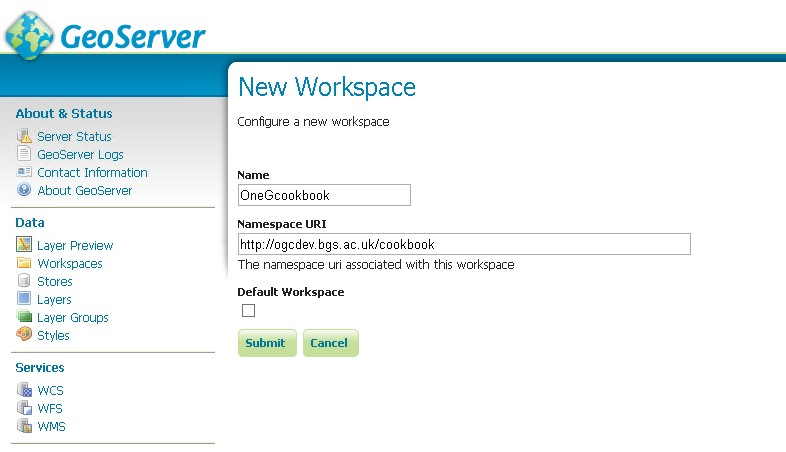
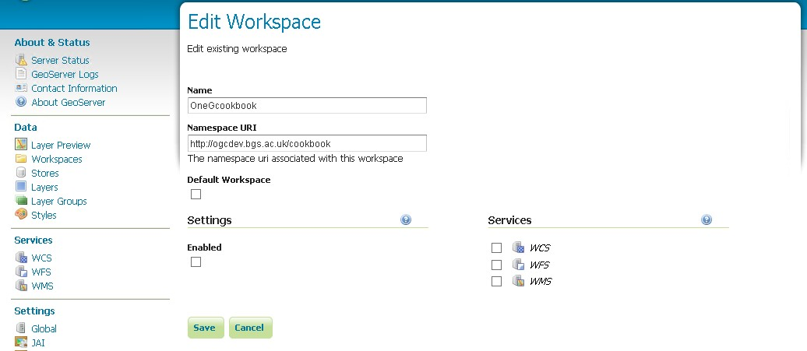
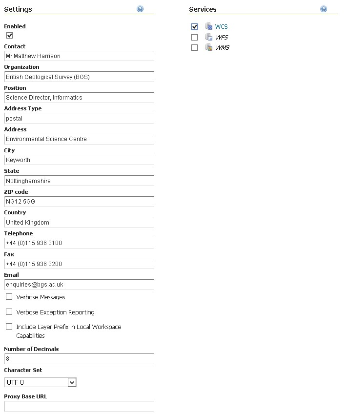
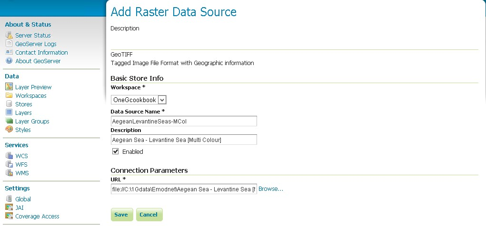
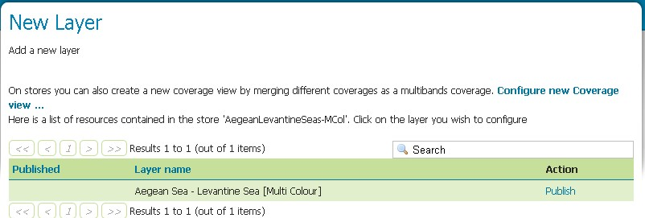
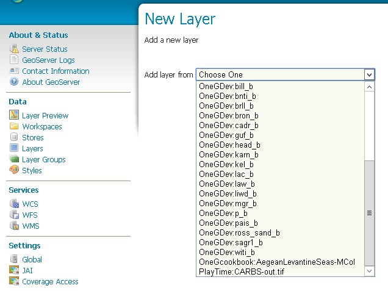
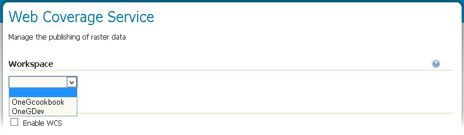
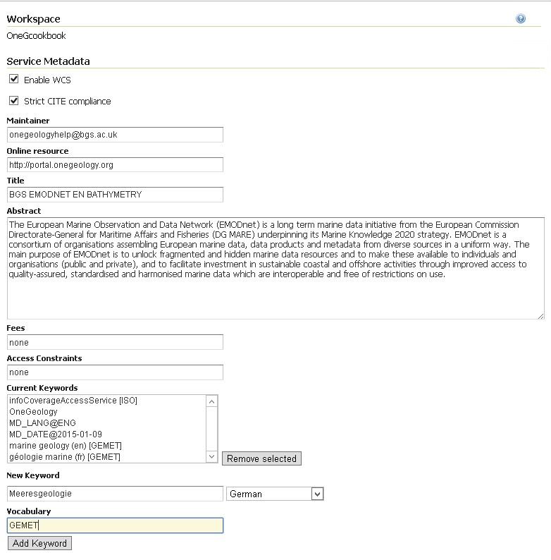
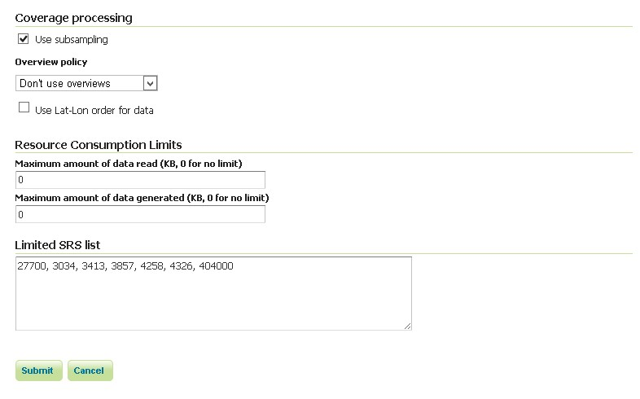
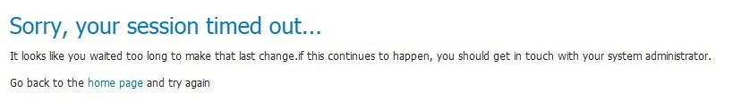

*****************************
How to serve a OneGeology WCS
*****************************

The OneGeology portal will soon be able to display output from Web Coverage Services (WCS).

To have your coverage data visible in the portal the client will require that your WCS server software supports the latest OGC WCS 2 standard, and can produce images in a format supported natively in common web browsers, that is, with a MIME type of image/png, image/jpeg, or image/gif.

The WCS service must be able to provide coverages in the default coordinate reference system (CRS) used by the portal, that is EPSG:4326 (http://www.opengis.net/def/crs/EPSG/0/4326).

The portal will use GetCoverage requests with subsetting to retrieve images from the coverage service.

Currently to enable harvesting of the service into the portal catalogue, the service will also need to provide a WCS 1.0.0 GetCapabilities response, or provide a static GetCapabilities file to the same effect.  See Appendix A for an example WCS 1.0.0 response.

To be included in the OneGeology portal, services should cover one of the topics listed in Appendix I of the OneGeology WMS cookbook, see http://onegeology.org/wmsCookbook/appendixI.html for details.

Example requests
================

GeoServer (2.6)
---------------

GetCapabilities request

<http://194.66.252.155/geoserver/OneGDev/wcs?service=WCS&acceptversions=2.0.1&request=GetCapabilities&>

GetCapabilities (1.0.0) request to enable harvesting

<http://194.66.252.155/geoserver/OneGDev/wcs?service=WCS&version=1.0.0&request=GetCapabilities&>

DescribeCoverage request 

<http://194.66.252.155/geoserver/OneGDev/wcs?service=WCS&version=2.0.1&CoverageId=OneGDev__AegeanLevantineSeas-MCol&request=DescribeCoverage&>

GetCoverage, output as image/png

<http://194.66.252.155/geoserver/OneGDev/wcs?service=WCS&version=2.0.1&CoverageId=OneGDev__AegeanLevantineSeas-MCol&request=GetCoverage&format=image/png&>

Subsetting request using the native coverage CRS, output as image/png

<http://194.66.252.155/geoserver/OneGDev/wcs?service=WCS&version=2.0.1&CoverageId=OneGDev__AegeanLevantineSeas-MCol&request=GetCoverage&format=image/png&subset=Lat(34.53627,38.88686)&subset=Long(25.43366,31.32234)&>

Subsetting request explicitly stating the CRS, output as image/png

<http://194.66.252.155/geoserver/OneGDev/wcs?service=WCS&version=2.0.1&request=GetCoverage&CoverageId=OneGDev__AegeanLevantineSeas-MCol&format=image/png&subset=Lat,http://www.opengis.net/def/crs/EPSG/0/4326(34.53627,38.88686)&subset=Long,http://www.opengis.net/def/crs/EPSG/0/4326(25.43366,31.32234)&>

Subsetting request explicitly stating the CRS, output as image/png and scaled to half size using a ScaleFactor

<http://194.66.252.155/geoserver/OneGDev/wcs?service=WCS&version=2.0.1&request=GetCoverage&CoverageId=OneGDev__AegeanLevantineSeas-MCol&format=image/png&subset=Lat,http://www.opengis.net/def/crs/EPSG/0/4326(34.53627,38.88686)&subset=Long,http://www.opengis.net/def/crs/EPSG/0/4326(25.43366,31.32234)&SCALEFACTOR=0.5&>

Subsetting request using the native coverage CRS, output as image/png and scaled to half size using ScaleAxes factors.

<http://194.66.252.155/geoserver/OneGDev/wcs?service=WCS&version=2.0.1&request=GetCoverage&CoverageId=OneGDev__AegeanLevantineSeas-MCol&format=image/png&subset=Lat(34.53627,38.88686)&subset=Long(25.43366,31.32234)&ScaleAxes=http://www.opengis.net/def/axis/OGC/1/i(0.5),http://www.opengis.net/def/axis/OGC/1/j(0.5)&>

MapServer (6.4.1)
-----------------

GetCapabilities (version 1.0.0)

<http://194.66.252.155/cgi-bin/BGS_EMODnet_bathymetry/ows?service=WCS&version=1.0.0&request=GetCapabilities&>

GetCapabilities (version 2.0.1)

<http://194.66.252.155/cgi-bin/BGS_EMODnet_bathymetry/ows?service=WCS&acceptversions=2.0.1&request=GetCapabilities&>

Note that the version 1.0.0 response gives better coverage metadata than the 2.0.1 response.   With the 2.0 version of the specification the intention is that the DescribeCoverage Operation should be used to discover detailed information about the coverage.

DescribeCoverage (version 1.0.0)

<http://194.66.252.155/cgi-bin/BGS_EMODnet_bathymetry/ows?service=WCS&version=1.0.0&request=DescribeCoverage&Coverage=BGS_EMODNET_WesternMed-MCol&>

DescribeCoverage (version 2.0.1)

<http://194.66.252.155/cgi-bin/BGS_EMODnet_bathymetry/ows?service=WCS&version=2.0.1&request=DescribeCoverage&CoverageId=BGS_EMODNET_WesternMed-MCol&>

GetCoverage, output as image/jpeg

<http://194.66.252.155/cgi-bin/BGS_EMODnet_bathymetry/ows?service=WCS&version=2.0.1&request=GetCoverage&CoverageId=BGS_EMODNET_AegeanLevantineSeas-MCol&format=image/jpeg&>

Subsetting request explicitly stating the CRS, output as image/png

<http://194.66.252.155/cgi-bin/BGS_EMODnet_bathymetry/ows?service=WCS&version=2.0.1&request=GetCoverage&CoverageId=BGS_EMODNET_AegeanLevantineSeas-MCol&format=image/png&subset=lat,http://www.opengis.net/def/crs/EPSG/0/4326(34.53627,38.88686)&subset=long,http://www.opengis.net/def/crs/EPSG/0/4326(25.43366,31.32234)&>

Subsetting request explicitly stating the CRS, output as image/jpeg

<http://194.66.252.155/cgi-bin/BGS_EMODnet_bathymetry/ows?service=WCS&version=2.0.1&request=GetCoverage&CoverageId=BGS_EMODNET_AegeanLevantineSeas-MCol&format=image/jpeg&subset=lat,http://www.opengis.net/def/crs/EPSG/0/4326(34.53627,38.88686)&subset=long,http://www.opengis.net/def/crs/EPSG/0/4326(25.43366,31.32234)&>

Note there is a current MapServer bug (https://github.com/mapserver/mapserver/issues/5047), which prevents correct subsetting without explicitly specifying the CRS; scaling also doesn’t seem to be working.

Exemplar data used in this cookbook
===================================

For the purposes of this cookbook we will use the Bathymetry Multi-colour 3-Band GeoTiffs supplied by the EMODnet project and available for download from the “Portal for Bathymetry” (http://portal.emodnet-bathymetry.eu/)  

Metadata to be used in configuring your service and coverages (layers)
======================================================================

Your coverage service and coverage (layer) metadata should follow the OneGeology WMS profile where possible, see http://onegeology.org/wmsCookbook/2.html  for details; exceptions to this rule include the WMS Service name and WMS Root layer name (there are no similar WCS service name requirements). 

Configuring a OneGeology WCS service using GeoServer
====================================================

Whilst GeoServer can use a number of data formats as inputs for its WCS services at present you must use GeoTIFFs if you want to provide output in image/png or image/jpeg formats, such that the coverages can be viewed within the portal. 

Workspaces
----------

The first step in configuring any GeoServer service is to create a Workspace, which is done by clicking on the Workspaces link in the left hand menu of the GeoServer administrator, and then ‘Add new workspace’.

Give the workspace a memorable name; we suggest that this name is kept as short as possible because the workspace name is used throughout the service and is appended to all layer identifiers.
The workspace name will (can be omitted if you are your GeoServer service has a single workspace) also make up part of the URL for the service.

http://127.0.0.1:8080/geoserver/OneGcookbook/wcs

Note you can set up a proxy and configure Proxy URL base to achieve the desired ONEG WMS profile URL name if required.

Give the workspace a URI; this can be any URI (and doesn’t have to resolve).
When you have created your workspace you can edit its properties.  You will need to click the enabled box and also the WCS services option.

Once you have Enabled the service, you will be able to edit the contact details for your service.  By default you will have the standard Contact Information populated into this form. These contact details will be provided as part of the service GetCapabilities response.
  

Stores
------

The next step is to use the ‘Stores’ menu option to set up a Raster data source for each of our exemplar (EMODnet) GeoTIFFs.    To do this, go to the left hand menu ‘Stores’ option, and click the  ‘Add new store’ link.  Under the Raster Data Sources heading select ‘GeoTIFF - Tagged Image File Format with Geographic information’.  Select the newly created Workspace from the drop down list. 

Add a Data Source name (recommended that you omit spaces here) which will become part of the identifier for your data in the service.   Use the Connection Parameters URL to link to the actual data.

In this example we have our EMODnet data on our server at::

   C:\1Gdata\Emodnet

The file protocol URL to access this path is::

   file://C:\1Gdata\Emodnet

So in this case to access our Tiff the URL is::

   file://C:\1Gdata\Emodnet\Aegean Sea - Levantine Sea [Multi Colour].tif

Remember to enable the data source by ticking the box.

When you save your store you should get an option to Publish your data source as a Layer.

You will need to repeat these steps to create a data source for all of the GeoTIFFs that you wish to make available in your service.

Layers
------

If you didn’t Publish the data as part of the data source configuration, the final step is to create a layer using your data sources.  Select the Layers option in the left hand menu, then find the Workspace:Datasource name combination required from the drop down list.

That’s essentially it, as the information that you can add (as opposed to the information that is auto-populated) in the layer properties is not used in either the GetCapabilities or the DescribeCoverage response.

Service level metadata
----------------------

To configure service level metadata, choose the WCS option in the Services section of the Left hand menu.  Then select your workspace from the dropdown list.

To get your service to be available you must tick the Enable WCS option box.  

To conform to the OneGeology WCS profile you must also tick the Strict CITE compliance option box.

Online Resource here is a link to your (or any other) web site (not your service), that provides information about your data.

Title must follow the WMS naming conventions

Abstract covers the service in general.  You may also add information about the individual layers.

Fees and Access Constraints for your service, if you have no constraints then you MUST explicitly state this using ‘none’.

Keywords can include a language code and reference a vocabulary.

For example in the example shown below we have a keyword only “OneGeology”, a keyword with vocabulary “infoCoverageAccessService [ISO]”, and a keyword with vocabulary and language code “marine geology (en) [GEMET]” .  The new keyword shown in the form will become (when the Add Keyword button is clicked) “Meeresgeologie (de) [GEMET]”

The GEMET keywords come from http://www.eionet.europa.eu/gemet/en/themes/

Finally you need to configure a limited list of projection systems that your service will provide, REMEMBER the service must support EPSG:4326.

The above list gives the following in the GetCapabilities response::

   <wcscrs:crsSupported>http://www.opengis.net/def/crs/EPSG/0/27700</wcscrs:crsSupported>
   <wcscrs:crsSupported>http://www.opengis.net/def/crs/EPSG/0/3034</wcscrs:crsSupported>
   <wcscrs:crsSupported>http://www.opengis.net/def/crs/EPSG/0/3413</wcscrs:crsSupported>
   <wcscrs:crsSupported>http://www.opengis.net/def/crs/EPSG/0/3857</wcscrs:crsSupported>
   <wcscrs:crsSupported>http://www.opengis.net/def/crs/EPSG/0/4258</wcscrs:crsSupported>
   <wcscrs:crsSupported>http://www.opengis.net/def/crs/EPSG/0/4326</wcscrs:crsSupported>
   <wcscrs:crsSupported>http://www.opengis.net/def/crs/EPSG/0/404000</wcscrs:crsSupported>
   
Troubleshooting
---------------

If you start getting error messages when using GeoServer, you will probably need to increase the JAVA permgen space.  This can occur when you are serving lots of raster data. See http://osgeo-org.1560.x6.nabble.com/Session-times-out-when-adding-new-stores-or-layers-td4910354.html

Configuring a OneGeology WCS service using MapServer
====================================================

These notes should be read in conjunction with Cookbook 1 (http://onegeology.org/docs/technical/CB1-HowTo_Serve_a_1G-L1_conformantWMS_v2.pdf). Cookbook 1 details how to set up a MapServer service using a variety of web servers and operating systems.  

The principal configuration relating to the WCS aspect of this service is shown below.  The map configuration file uses INCLUDE statements to include configuration common to other services or common across coverages in the same service to ease maintenance and readability.   When setting up your own service you do not have to use INCLUDES, but instead you can substitute the actual included code directly in the same position in the configuration file (modified to your own requirements).

::

   MAP
       CONFIG "PROJ_LIB" "C:/apps/gisinternals/bin/proj/SHARE"
       CONFIG "MS_ERRORFILE" "C:/logs/mapserver/Tst/WCS/ms_error.log"
       DEBUG 0    
       NAME "BGS_EMODNET_EN_BATHYMETRY"    
   #========================================================================#
   # EXTENT
   # Change to appropriate min-x,min-y,max-x,max-y coordinates for your data
   #========================================================================#
       EXTENT -26.1146 30.0104 36.7354 65.3896  
       INCLUDE "../DefaultMapIncludes/BGS-service-std-output-plus3c.map"
       INCLUDE "../DefaultMapIncludes/BGS-std-legend.map"
       MAXSIZE 4096
       PROJECTION
           "init=epsg:4326"
       END
       SHAPEPATH "C:/1Gdata/Emodnet"
       SIZE 600 800
       STATUS ON
   #========================================================================#
   # Units of the map coordinates. Used for scale bar and scale computations.
   #========================================================================#    
       UNITS dd
   #====================================================================#
   # Start of web interface definition (including WMS enabling metadata)
   #====================================================================#
       WEB
           HEADER "tmpl/query_header.html"
           FOOTER "tmpl/query_footer.html"
           IMAGEPATH "C:/WxS/ms/out/tmp/"
           IMAGEURL "/ms_tmp/"
           METADATA
               INCLUDE "../DefaultMapIncludes/BGS-service-contacts.map"
               INCLUDE "../DefaultMapIncludes/BGS-ServiceMetadata2.map"
   #================================================================================#
   # OWS_ metadata applies to all available services (WMS, WFS, WCS, SOS...)
   # WCS_ metadata applies to WFS services only. Values will override an OWS setting
   # WFS_ metadata applies to WFS services only. Values will override an OWS setting
   # WMS_ metadata applies to WMS services only. Values will override an OWS setting
   #================================================================================#
   # OWS_ABSTRACT, WCS_ABSTRACT**, WFS_ABSTRACT, WMS_ABSTRACT...
   # Put your organisation name and any other information you want to include.
   # ** FOR WCS 1.0.0 you need to use _DESCRIPTION instead of _ABSTRACT
   #============================================================================#
               "OWS_ABSTRACT" "The European Marine Observation and Data Network (EMODnet) is a long term marine data initiative from the European Commission Directorate-General for Maritime Affairs and Fisheries (DG MARE) underpinning its Marine Knowledge 2020 strategy. EMODnet is a consortium of organisations assembling European marine data, data products and metadata from diverse sources in a uniform way. The main purpose of EMODnet is to unlock fragmented and hidden marine data resources and to make these available to individuals and organisations (public and private), and to facilitate investment in sustainable coastal and offshore activities through improved access to quality-assured, standardised and harmonised marine data which are interoperable and free of restrictions on use."
               "OWS_ACCESSCONSTRAINTS" "none"
               "OWS_FEES" "none"
   #===========================================================================#
   # OWS_KEYWORDLIST
   # Put your organisation name and any other information you want to include.
   # You MUST include "OneGeology" as one of the keywords.
   # Do NOT use spaces after the commas in the keyword listing.
   #===========================================================================#   
               "OWS_KEYWORDLIST" "OneGeology,infoCoverageAccessService,Europe,EMODnet,Bathymetry,MD_LANG@ENG,MD_DATE@2015-04-14"
               "OWS_SERVICE_ONLINERESOURCE" "http://www.emodnet.eu/"
               "OWS_SLD_ENABLED" "FALSE"
   #===========================================================================#
   # "OWS_SRS" For WCS/WFS you need to list the default projection first
   #===========================================================================#            
               "OWS_SRS" "EPSG:4326 EPSG:3031 EPSG:3034 EPSG:3413 EPSG:3857 EPSG:4258"
               "OWS_TITLE" "BGS EMODnet bathymetry"
               "OWS_UPDATESEQUENCE" "2015-04-14T14:29:00Z"
               "WCS_DESCRIPTION" "The European Marine Observation and Data Network (EMODnet) is a long term marine data initiative from the European Commission Directorate-General for Maritime Affairs and Fisheries (DG MARE) underpinning its Marine Knowledge 2020 strategy. EMODnet is a consortium of organisations assembling European marine data, data products and metadata from diverse sources in a uniform way. The main purpose of EMODnet is to unlock fragmented and hidden marine data resources and to make these available to individuals and organisations (public and private), and to facilitate investment in sustainable coastal and offshore activities through improved access to quality-assured, standardised and harmonised marine data which are interoperable and free of restrictions on use."
               "WCS_ENABLE_REQUEST" "*"
   #============================================================================#           
   # "WCS_LABEL" Is MANDATORY metadata for WCS version 1.0.0 GetCapabilities in SERVICE and LAYER (coverage) metadata.
   # It should be the same value as the WCS_TITLE (which is used as its replacement in later WCS versions).
   #============================================================================# 
               "WCS_LABEL" "BGS EMODnet bathymetry"
               "WMS_BBOX_EXTENDED" "TRUE"
               "WMS_ENABLE_REQUEST" "GetCapabilities GetMap GetLegendGraphic"
               "WMS_FEATURE_INFO_MIME_TYPE" "text/html"
   #============================================================================#
   # INSPIRE extended capabilities 
   # Requires MapServer 6.2.0 and above, or the values are ignored
   #============================================================================#
               INCLUDE "../DefaultMapIncludes/BGS-service-embedded-INSPIRE.map"
               "WMS_INSPIRE_METADATADATE" "2014-11-28"
               "WMS_INSPIRE_RESOURCELOCATOR" "http://ogc.bgs.ac.uk/cgi-bin/BGS_EMODNET_EN_BATHYMETRY/ows?"
               "WMS_INSPIRE_TEMPORAL_REFERENCE" "2014-11-28"
               "WMS_ROOTLAYER_TITLE" "BGS EMODnet bathymetry"
           END
       END
       LAYER
           NAME BGS_EMODNET_CentralMed-MCol
           TYPE RASTER
           STATUS ON
           DATA "Adriatic Sea - Ionian Sea - Central Mediterranean [Multi Colour].tif"
           PROJECTION
               "init=epsg:4326"
           END
           METADATA
               INCLUDE "../DefaultMapIncludes/BGS-Attribution.map"
               INCLUDE "emodnet-mcol-legend.map"          
               "band1_BAND_DESCRIPTION" "Red"
               "band2_BAND_DESCRIPTION" "Green"
               "band3_BAND_DESCRIPTION" "Blue"
               "WCS_BAND_INTERPRETATION" "Colour"
               "WCS_BANDCOUNT" "3"            
               "WCS_BAND_NAMES" "band1 band2 band3"
               "WCS_DESCRIPTION" "European Marine Observation and Data Network (EMODnet) bathymetry for the Adriatic Sea - Ionian Sea - Central Mediterranean region.  Native data is multi-colour GeoTiff."
               "WCS_IMAGEMODE" "BYTE"
               "WCS_INTERVAL" "0 255"
               "WCS_LABEL" "Adriatic Sea - Ionian Sea - Central Mediterranean [Multi Colour]"
               "WCS_NATIVE_FORMAT" "image/tiff"
               "WCS_RANGESET_AXES" "bands"
               "WCS_RANGESET_DESCRIPTION" "Depth"
   #===================================================
   # "WCS_RANGESET_LABEL" is mandatory 1.0.0 metadata
   #===================================================
               "WCS_RANGESET_LABEL" "Red/Green/Blue colour interpretations"
   #===================================================          
   # "WCS_RANGESET_NAME" is mandatory 1.0.0 metadata
   #===================================================
               "WCS_RANGESET_NAME" "band"
               "WCS_SIGNIFICANT_FIGURES" "3"
               "WCS_SIZE" "2977 3883"
               "OWS_ABSTRACT" "European Marine Observation and Data Network (EMODnet) bathymetry for the Adriatic Sea - Ionian Sea - Central Mediterranean region.  Native data is multi-colour GeoTiff."
               "OWS_KEYWORDLIST" "OneGeology,continent@Europe,dataprovider@EMODnet,serviceprovider@British Geological Survey,DS_TOPIC@geoscientificInformation,DS_DATE@2011-06-30,Bathymetry,CRS_SUPPORTED@EPSG:4326 EPSG:3031 EPSG:3034 EPSG:3413 EPSG:3857 EPSG:4258"
               "OWS_SRS" "EPSG:4326 EPSG:3031 EPSG:3034 EPSG:3413 EPSG:3857 EPSG:4258"
               "OWS_TITLE" "Adriatic Sea - Ionian Sea - Central Mediterranean [Multi Colour]"
           END
           TOLERANCE 10
       END
       LAYER
           NAME BGS_EMODNET_AegeanLevantineSeas-MCol
           TYPE RASTER
           STATUS ON
           DATA "Aegean Sea - Levantine Sea [Multi Colour].tif"
           PROJECTION
               "init=epsg:4326"
           END
           METADATA
               INCLUDE "../DefaultMapIncludes/BGS-Attribution.map"
               INCLUDE "emodnet-mcol-legend.map"
               "band1_BAND_DESCRIPTION" "Red"
               "band2_BAND_DESCRIPTION" "Green"
               "band3_BAND_DESCRIPTION" "Blue"
               "OWS_ABSTRACT" "European Marine Observation and Data Network (EMODnet) bathymetry for the Aegean Sea - Levantine Sea region.  Native data is multi-colour GeoTiff."
               "OWS_KEYWORDLIST" "OneGeology,continent@Europe,dataprovider@EMODnet,serviceprovider@British Geological Survey,DS_TOPIC@geoscientificInformation,DS_DATE@2011-06-30,Bathymetry,CRS_SUPPORTED@EPSG:4326 EPSG:3031 EPSG:3034 EPSG:3413 EPSG:3857 EPSG:4258"
               "OWS_SRS" "EPSG:4326 EPSG:3031 EPSG:3034 EPSG:3413 EPSG:3857 EPSG:4258"
               "OWS_TITLE" "Aegean Sea - Levantine Sea [Multi Colour]"
               "WCS_BAND_INTERPRETATION" "Colour"
               "WCS_BANDCOUNT" "3"
               "WCS_BAND_NAMES" "band1 band2 band3"
               "WCS_DESCRIPTION" "European Marine Observation and Data Network (EMODnet) bathymetry for the Aegean Sea - Levantine Sea region.  Native data is multi-colour GeoTiff."
               "WCS_IMAGEMODE" "BYTE"
               "WCS_INTERVAL" "0 255"
               "WCS_LABEL" "Aegean Sea - Levantine Sea [Multi Colour]"
               "WCS_NATIVE_FORMAT" "image/tiff"
               "WCS_RANGESET_AXES" "bands"
               "WCS_RANGESET_DESCRIPTION" "Depth"
               "WCS_RANGESET_LABEL" "Red/Green/Blue colour interpretations"
               "WCS_RANGESET_NAME" "band"
               "WCS_SIGNIFICANT_FIGURES" "3"
               "WCS_SIZE" "3480 2638"
            END
           TOLERANCE 10
       END
       LAYER
           NAME BGS_EMODNET_BayBiscayIberianCoast-MCol
           TYPE RASTER
           STATUS ON
           DATA "Bay of Biscay - Iberian Coast [Multi Colour].tif"
           PROJECTION
               "init=epsg:4326"
           END
           METADATA
               INCLUDE "../DefaultMapIncludes/BGS-Attribution.map"
               INCLUDE "emodnet-mcol-legend.map"
               "band1_BAND_DESCRIPTION" "Red"
               "band2_BAND_DESCRIPTION" "Green"
               "band3_BAND_DESCRIPTION" "Blue"
               "OWS_ABSTRACT" "European Marine Observation and Data Network (EMODnet) bathymetry for the  region.  Native data is multi-colour GeoTiff."
               "OWS_KEYWORDLIST" "OneGeology,continent@Europe,dataprovider@EMODnet,serviceprovider@British Geological Survey,DS_TOPIC@geoscientificInformation,DS_DATE@2011-06-30,Bathymetry,CRS_SUPPORTED@EPSG:4326 EPSG:3031 EPSG:3034 EPSG:3413 EPSG:3857 EPSG:4258"
               "OWS_SRS" "EPSG:4326 EPSG:3031 EPSG:3034 EPSG:3413 EPSG:3857 EPSG:4258"
               "OWS_TITLE" "Bay of Biscay - Iberian Coast [Multi Colour]"
               "WCS_BAND_INTERPRETATION" "Colour"
               "WCS_BANDCOUNT" "3"
               "WCS_BAND_NAMES" "band1 band2 band3"
               "WCS_DESCRIPTION" "European Marine Observation and Data Network (EMODnet) bathymetry for the Bay of Biscay - Iberian Coast region.  Native data is multi-colour GeoTiff."
               "WCS_IMAGEMODE" "BYTE"
               "WCS_INTERVAL" "0 255"
               "WCS_LABEL" "Bay of Biscay - Iberian Coast [Multi Colour]"
               "WCS_NATIVE_FORMAT" "image/tiff"
               "WCS_RANGESET_AXES" "bands"
               "WCS_RANGESET_DESCRIPTION" "Depth"
               "WCS_RANGESET_LABEL" "Red/Green/Blue colour interpretations"
               "WCS_RANGESET_NAME" "band"
               "WCS_SIGNIFICANT_FIGURES" "3"
               "WCS_SIZE" "6150 3368"
           END
           TOLERANCE 10
       END
       LAYER
           NAME BGS_EMODNET_CelticSeas-MCol
           TYPE RASTER
           STATUS ON
           DATA "Celtic Seas [Multi Colour].tif"
           PROJECTION
               "init=epsg:4326"
           END
           METADATA
               INCLUDE "../DefaultMapIncludes/BGS-Attribution.map"
               INCLUDE "emodnet-mcol-legend.map"
               "band1_BAND_DESCRIPTION" "Red"
               "band2_BAND_DESCRIPTION" "Green"
               "band3_BAND_DESCRIPTION" "Blue"
               "OWS_ABSTRACT" "European Marine Observation and Data Network (EMODnet) bathymetry for the Celtic Seas region.  Native data is multi-colour GeoTiff."
               "OWS_KEYWORDLIST" "OneGeology,continent@Europe,dataprovider@EMODnet,serviceprovider@British Geological Survey,DS_TOPIC@geoscientificInformation,DS_DATE@2011-06-30,Bathymetry,CRS_SUPPORTED@EPSG:4326 EPSG:3031 EPSG:3034 EPSG:3413 EPSG:3857 EPSG:4258"
               "OWS_SRS" "EPSG:4326 EPSG:3031 EPSG:3034 EPSG:3413 EPSG:3857 EPSG:4258"
               "OWS_TITLE" "Celtic Seas [Multi Colour]"
               "WCS_BAND_INTERPRETATION" "Colour"
               "WCS_BANDCOUNT" "3"
               "WCS_BAND_NAMES" "band1 band2 band3"
               "WCS_DESCRIPTION" "European Marine Observation and Data Network (EMODnet) bathymetry for the Celtic Seas region.  Native data is multi-colour GeoTiff."
               "WCS_IMAGEMODE" "BYTE"
               "WCS_INTERVAL" "0 255"
               "WCS_LABEL" "Celtic Seas [Multi Colour]"
               "WCS_NATIVE_FORMAT" "image/tiff"
               "WCS_RANGESET_AXES" "bands"
               "WCS_RANGESET_DESCRIPTION" "Depth"
               "WCS_RANGESET_LABEL" "Red/Green/Blue colour interpretations"
               "WCS_RANGESET_NAME" "band"
               "WCS_SIGNIFICANT_FIGURES" "3"
               "WCS_SIZE" "6150 4100"
           END
           TOLERANCE 10
       END
       LAYER
           NAME BGS_EMODNET_GreaterNorthSea-MCol
           TYPE RASTER
           STATUS ON
           DATA "Greater North Sea [Multi Colour].tif"
           PROJECTION
               "init=epsg:4326"
           END
           METADATA
               INCLUDE "../DefaultMapIncludes/BGS-Attribution.map"
               INCLUDE "emodnet-mcol-legend.map"
               "band1_BAND_DESCRIPTION" "Red"
               "band2_BAND_DESCRIPTION" "Green"
               "band3_BAND_DESCRIPTION" "Blue"
               "OWS_ABSTRACT" "European Marine Observation and Data Network (EMODnet) bathymetry for the Greater North Sea region.  Native data is multi-colour GeoTiff."
               "OWS_KEYWORDLIST" "OneGeology,continent@Europe,dataprovider@EMODnet,serviceprovider@British Geological Survey,DS_TOPIC@geoscientificInformation,DS_DATE@2011-06-30,Bathymetry,CRS_SUPPORTED@EPSG:4326 EPSG:3031 EPSG:3034 EPSG:3413 EPSG:3857 EPSG:4258"
               "OWS_SRS" "EPSG:4326 EPSG:3031 EPSG:3034 EPSG:3413 EPSG:3857 EPSG:4258"          
               "OWS_TITLE" "Greater North Sea [Multi Colour]"
               "WCS_BAND_INTERPRETATION" "Colour"
               "WCS_BANDCOUNT" "3"
               "WCS_BAND_NAMES" "band1 band2 band3"
               "WCS_DESCRIPTION" "European Marine Observation and Data Network (EMODnet) bathymetry for the Greater North Sea region.  Native data is multi-colour GeoTiff."            
               "WCS_IMAGEMODE" "BYTE"
               "WCS_INTERVAL" "0 255"
               "WCS_LABEL" "Greater North Sea [Multi Colour]"
               "WCS_NATIVE_FORMAT" "image/tiff"
               "WCS_RANGESET_AXES" "bands"
               "WCS_RANGESET_DESCRIPTION" "Depth"
               "WCS_RANGESET_LABEL" "Red/Green/Blue colour interpretations"
               "WCS_RANGESET_NAME" "band"
               "WCS_SIGNIFICANT_FIGURES" "3"
               "WCS_SIZE" "3420 3979"
           END
           TOLERANCE 10
       END
       LAYER
           NAME BGS_EMODNET_WesternMed-MCol
           TYPE RASTER
           STATUS ON
           DATA "Western Mediterranean [Multi Colour].tif"
           PROJECTION
               "init=epsg:4326"
           END
           METADATA
               INCLUDE "../DefaultMapIncludes/BGS-Attribution.map"
               INCLUDE "emodnet-mcol-legend.map"
               "band1_BAND_DESCRIPTION" "Red"
               "band2_BAND_DESCRIPTION" "Green"
               "band3_BAND_DESCRIPTION" "Blue"
               "OWS_ABSTRACT" "European Marine Observation and Data Network (EMODnet) bathymetry for the Western Mediterranean region.  Native data is multi-colour GeoTiff."
               "OWS_KEYWORDLIST" "OneGeology,continent@Europe,dataprovider@EMODnet,serviceprovider@British Geological Survey,DS_TOPIC@geoscientificInformation,DS_DATE@2011-06-30,Bathymetry,CRS_SUPPORTED@EPSG:4326 EPSG:3031 EPSG:3034 EPSG:3413 EPSG:3857 EPSG:4258"
               "OWS_SRS" "EPSG:4326 EPSG:3031 EPSG:3034 EPSG:3413 EPSG:3857 EPSG:4258"
               "OWS_TITLE" "Western Mediterranean [Multi Colour]"
               "WCS_BAND_INTERPRETATION" "Colour"
               "WCS_BANDCOUNT" "3"
               "WCS_BAND_NAMES" "band1 band2 band3"
               "WCS_DESCRIPTION" "European Marine Observation and Data Network (EMODnet) bathymetry for the Western Mediterranean region.  Native data is multi-colour GeoTiff."
               "WCS_IMAGEMODE" "BYTE"
               "WCS_INTERVAL" "0 255"
               "WCS_LABEL" "Western Mediterranean [Multi Colour]"   
               "WCS_NATIVE_FORMAT" "image/tiff"
               "WCS_RANGESET_AXES" "bands"       
               "WCS_RANGESET_DESCRIPTION" "Depth"
               "WCS_RANGESET_LABEL" "Red/Green/Blue colour interpretations"
               "WCS_RANGESET_NAME" "band"                    
               "WCS_SIGNIFICANT_FIGURES" "3"
               "WCS_SIZE" "2477 2297"
           END
           TOLERANCE 10
       END
   END

INCLUDES
--------

The following listing shows all the included configuration files.  Some of these includes relate to the WMS part of the service only (as indicated by a WMS\_ prefix) and are shown here for completeness.  Line numbers come from the actual configuration file for the test service, and may not exactly match the lines of the configuration file above.

::

   Line 11:     INCLUDE "../DefaultMapIncludes/BGS-service-std-output-plus3c.map"

::

       #IMAGECOLOR: Background colour for the map canvas
       IMAGECOLOR 255 255 255
       IMAGETYPE png  
       OUTPUTFORMAT
   		NAME png
   		DRIVER "AGG/PNG"
   		MIMETYPE "image/png"
   		IMAGEMODE RGBA
   		EXTENSION "png"
           TRANSPARENT OFF
   		FORMATOPTION "INTERLACE=ON,TRANSPARENT=OFF"
       END
       OUTPUTFORMAT
           NAME "AAIGRID"
           DRIVER "GDAL/AAIGRID"
           MIMETYPE "image/x-aaigrid"
           IMAGEMODE INT16
           EXTENSION "grd"
           FORMATOPTION "FILENAME=result.grd"
       END

::

   Line 12:     INCLUDE "../DefaultMapIncludes/BGS-std-legend.map"

::

       LEGEND
           OUTLINECOLOR 200 200 200
           KEYSPACING 10 10
           LABEL
               TYPE bitmap
               SIZE small
           END
       END

::

   Line 33:     INCLUDE "../DefaultMapIncludes/BGS-service-contacts.map"

::

               "OWS_ADDRESS" "Environmental Science Centre"
               "OWS_ADDRESSTYPE" "postal"
               "OWS_CITY" "Keyworth"
               "OWS_CONTACTELECTRONICMAILADDRESS" "enquiries@bgs.ac.uk"
               "OWS_CONTACTFACSIMILETELEPHONE" "+44 (0)115 936 3200"
               "OWS_CONTACTINSTRUCTIONS" ""
               "OWS_CONTACTPERSON" "Mr Matthew Harrison"
               "OWS_CONTACTORGANIZATION" "British Geological Survey (BGS)"
               "OWS_CONTACTPOSITION" "Science Director Informatics"
               "OWS_CONTACTVOICETELEPHONE" "+44 (0)115 936 3100"
               "OWS_COUNTRY" "United Kingdom"
               "OWS_HOURSOFSERVICE" "Mon-Fri, 09:00-17:00"
               "OWS_POSTCODE" "NG12 5GG"
               "OWS_ROLE" "pointOfContact"
               "OWS_STATEORPROVINCE" "Nottinghamshire"

::

   Line 34:     INCLUDE "../DefaultMapIncludes/BGS-ServiceMetadata2.map"

::

   #=====================================================================#
   # WMS_ATTRIBUTION_*
   # In this metadata block is added to the root layer metadata ONLY
   #=====================================================================#
               INCLUDE "../DefaultMapIncludes/BGS-Attribution.map"
   
               WMS_KEYWORDLIST_GEMET_ITEMS "Bathymetry"
               WMS_KEYWORDLIST_ISO_ITEMS "infoMapAccessService"
               WMS_KEYWORDLIST_VOCABULARY "GEMET,ISO"
               WMS_LANGUAGES "eng"

::

   Line 77:     INCLUDE "../DefaultMapIncludes/BGS-service-embedded-INSPIRE.map"

::

   # Type 1: Embed some metadata in the INSPIRE GetCapabilities response
   # Generic values for BGS services
   #======================================================================#
               WCS_INSPIRE_KEYWORD "infoCoverageAccessService"
               WMS_INSPIRE_CAPABILITIES "embed"
               WMS_INSPIRE_KEYWORD "infoMapAccessService"
               WMS_INSPIRE_MPOC_EMAIL "enqiries@bgs.ac.uk"
               WMS_INSPIRE_MPOC_NAME "Mr Matthew Harrison"

::

   Lines 93, 134, 169, 204, 239, 274:	INCLUDE "../DefaultMapIncludes/BGS-Attribution.map"

::

               WMS_ATTRIBUTION_TITLE "British Geological Survey (BGS)"
               WMS_ATTRIBUTION_ONLINERESOURCE "http://www.bgs.ac.uk/"
               WMS_ATTRIBUTION_LOGOURL_HREF "http://ogc.bgs.ac.uk/img/bgs_c_t_275x60.gif"
               WMS_ATTRIBUTION_LOGOURL_FORMAT "image/gif"
               WMS_ATTRIBUTION_LOGOURL_WIDTH "275"
               WMS_ATTRIBUTION_LOGOURL_HEIGHT "60"
               WMS_AUTHORITYURL_NAME "BritishGeologicalSurvey"
               WMS_AUTHORITYURL_HREF http://data.bgs.ac.uk/ref/BritishGeologicalSurvey

::

   Lines 94, 135, 170, 205, 240, 275:             INCLUDE "emodnet-mcol-legend.map"

::

               WMS_STYLE "default"
               WMS_STYLE_DEFAULT_LEGENDURL_HEIGHT "276"
               WMS_STYLE_DEFAULT_LEGENDURL_WIDTH "75"
               WMS_STYLE_DEFAULT_LEGENDURL_HREF "http://194.66.252.155/BGS_EMODnet_bathymetry/legend_depth_multicolour.png"
               WMS_STYLE_DEFAULT_LEGENDURL_FORMAT "image/png"   

Appendix A: Example WCS version 1.0.0 GetCapabilities response
==============================================================

Note the purpose of the WCS 1.0.0 GetCapabilities response is just to enable harvesting of important metadata into the OneGeology catalogue for the OneGeology portal.  The service itself MUST support WCS 2.

::

   <WCS_Capabilities version="1.0.0" updateSequence="2015-04-14T14:29:00Z"
     xmlns="http://www.opengis.net/wcs" xmlns:xlink="http://www.w3.org/1999/xlink"
     xmlns:gml="http://www.opengis.net/gml" xmlns:xsi="http://www.w3.org/2001/XMLSchema-instance"
     xsi:schemaLocation="http://www.opengis.net/wcs
       http://schemas.opengis.net/wcs/1.0.0/wcsCapabilities.xsd">
     <Service>
       <description>The European Marine Observation and Data Network (EMODnet) is a long term marine data initiative from the European Commission Directorate-General for Maritime Affairs and Fisheries (DG MARE) underpinning its Marine Knowledge 2020 strategy. EMODnet is a consortium of organisations assembling European marine data, data products and metadata from diverse sources in a uniform way. The main purpose of EMODnet is to unlock fragmented and hidden marine data resources and to make these available to individuals and organisations (public and private), and to facilitate investment in sustainable coastal and offshore activities through improved access to quality-assured, standardised and harmonised marine data which are interoperable and free of restrictions on use.</description>
       <name>MapServer WCS</name>
       <label>BGS EMODnet bathymetry</label>
       <keywords>
         <keyword>OneGeology</keyword>
         <keyword>infoCoverageAccessService</keyword>
         <keyword>Europe</keyword>
         <keyword>EMODnet</keyword>
         <keyword>Bathymetry</keyword>
         <keyword>MD_LANG@ENG</keyword>
         <keyword>MD_DATE@2015-04-14</keyword>
       </keywords>
       <responsibleParty>
         <individualName>Mr Matthew Harrison</individualName>
         <organisationName>British Geological Survey (BGS)</organisationName>
         <positionName>Science Director Informatics</positionName>
         <contactInfo>
           <phone>
             <voice>+44 (0)115 936 3100</voice>
             <facsimile>+44 (0)115 936 3200</facsimile>
           </phone>
           <address>
             <deliveryPoint>Environmental Science Centre</deliveryPoint>
             <city>Keyworth</city>
             <administrativeArea>Nottinghamshire</administrativeArea>
             <postalCode>NG12 5GG</postalCode>
             <country>United Kingdom</country>
             <electronicMailAddress>enquiries@bgs.ac.uk</electronicMailAddress>
           </address>
           <onlineResource xlink:type="simple" xlink:href="http://www.emodnet.eu/"/>
         </contactInfo>
       </responsibleParty>
       <fees>none</fees>
       <accessConstraints>none</accessConstraints>
     </Service>
     <Capability>
       <Request>
         <GetCapabilities>
           <DCPType>
             <HTTP>
               <Get>
                 <OnlineResource xlink:type="simple"
                   xlink:href="http://194.66.252.155/cgi-bin/BGS_EMODnet_bathymetry/ows?"/>
               </Get>
             </HTTP>
           </DCPType>
           <DCPType>
             <HTTP>
               <Post>
                 <OnlineResource xlink:type="simple"
                   xlink:href="http://194.66.252.155/cgi-bin/BGS_EMODnet_bathymetry/ows?"/>
               </Post>
             </HTTP>
           </DCPType>
         </GetCapabilities>
         <DescribeCoverage>
           <DCPType>
             <HTTP>
               <Get>
                 <OnlineResource xlink:type="simple"
                   xlink:href="http://194.66.252.155/cgi-bin/BGS_EMODnet_bathymetry/ows?"/>
               </Get>
             </HTTP>
           </DCPType>
           <DCPType>
             <HTTP>
               <Post>
                 <OnlineResource xlink:type="simple"
                   xlink:href="http://194.66.252.155/cgi-bin/BGS_EMODnet_bathymetry/ows?"/>
               </Post>
             </HTTP>
           </DCPType>
         </DescribeCoverage>
         <GetCoverage>
           <DCPType>
             <HTTP>
               <Get>
                 <OnlineResource xlink:type="simple"
                   xlink:href="http://194.66.252.155/cgi-bin/BGS_EMODnet_bathymetry/ows?"/>
               </Get>
             </HTTP>
           </DCPType>
           <DCPType>
             <HTTP>
               <Post>
                 <OnlineResource xlink:type="simple"
                   xlink:href="http://194.66.252.155/cgi-bin/BGS_EMODnet_bathymetry/ows?"/>
               </Post>
             </HTTP>
           </DCPType>
         </GetCoverage>
       </Request>
       <Exception>
         <Format>application/vnd.ogc.se_xml</Format>
       </Exception>
     </Capability>
     <ContentMetadata>
       <CoverageOfferingBrief>
         <description>
   European Marine Observation and Data Network (EMODnet) bathymetry for the Adriatic Sea - Ionian Sea - Central Mediterranean region.  Native data is multi-colour GeoTiff.
         </description>
         <name>BGS_EMODNET_CentralMed-MCol</name>
         <label>Adriatic Sea - Ionian Sea - Central Mediterranean [Multi Colour]</label>
         <lonLatEnvelope srsName="urn:ogc:def:crs:OGC:1.3:CRS84">
           <gml:pos>9.83125 30.01040372</gml:pos>
           <gml:pos>22.23542659 46.18958333</gml:pos>
         </lonLatEnvelope>
         <keywords>
           <keyword>OneGeology</keyword>
           <keyword>continent@Europe</keyword>
           <keyword>dataprovider@EMODnet</keyword>
           <keyword>serviceprovider@British Geological Survey</keyword>
           <keyword>DS_TOPIC@geoscientificInformation</keyword>
           <keyword>DS_DATE@2011-06-30</keyword>
           <keyword>Bathymetry</keyword>
           <keyword>
             CRS_SUPPORTED@EPSG:4326 EPSG:3031 EPSG:3034 EPSG:3413 EPSG:3857 EPSG:4258
           </keyword>
         </keywords>
       </CoverageOfferingBrief>
       <CoverageOfferingBrief>
         <description>
   European Marine Observation and Data Network (EMODnet) bathymetry for the Aegean Sea - Levantine Sea region.  Native data is multi-colour GeoTiff.
         </description>
         <name>BGS_EMODNET_AegeanLevantineSeas-MCol</name>
         <label>Aegean Sea - Levantine Sea [Multi Colour]</label>
         <lonLatEnvelope srsName="urn:ogc:def:crs:OGC:1.3:CRS84">
           <gml:pos>22.23541667 30.39790787</gml:pos>
           <gml:pos>36.73542827 41.38958333</gml:pos>
         </lonLatEnvelope>
         <keywords>
           <keyword>OneGeology</keyword>
           <keyword>continent@Europe</keyword>
           <keyword>dataprovider@EMODnet</keyword>
           <keyword>serviceprovider@British Geological Survey</keyword>
           <keyword>DS_TOPIC@geoscientificInformation</keyword>
           <keyword>DS_DATE@2011-06-30</keyword>
           <keyword>Bathymetry</keyword>
           <keyword>
             CRS_SUPPORTED@EPSG:4326 EPSG:3031 EPSG:3034 EPSG:3413 EPSG:3857 EPSG:4258
           </keyword>
         </keywords>
       </CoverageOfferingBrief>
       <CoverageOfferingBrief>
         <description>
   European Marine Observation and Data Network (EMODnet) bathymetry for the Bay of Biscay - Iberian Coast region.  Native data is multi-colour GeoTiff.
         </description>
         <name>BGS_EMODNET_BayBiscayIberianCoast-MCol</name>
         <label>Bay of Biscay - Iberian Coast [Multi Colour]</label>
         <lonLatEnvelope srsName="urn:ogc:def:crs:OGC:1.3:CRS84">
           <gml:pos>-26.11458333 32.58123877</gml:pos>
           <gml:pos>-0.489562830000001 46.61458333</gml:pos>
         </lonLatEnvelope>
         <keywords>
           <keyword>OneGeology</keyword>
           <keyword>continent@Europe</keyword>
           <keyword>dataprovider@EMODnet</keyword>
           <keyword>serviceprovider@British Geological Survey</keyword>
           <keyword>DS_TOPIC@geoscientificInformation</keyword>
           <keyword>DS_DATE@2011-06-30</keyword>
           <keyword>Bathymetry</keyword>
           <keyword>
             CRS_SUPPORTED@EPSG:4326 EPSG:3031 EPSG:3034 EPSG:3413 EPSG:3857 EPSG:4258
           </keyword>
         </keywords>
       </CoverageOfferingBrief>
       <CoverageOfferingBrief>
         <description>
   European Marine Observation and Data Network (EMODnet) bathymetry for the Celtic Seas region.  Native data is multi-colour GeoTiff.
         </description>
         <name>BGS_EMODNET_CelticSeas-MCol</name>
         <label>Celtic Seas [Multi Colour]</label>
         <lonLatEnvelope srsName="urn:ogc:def:crs:OGC:1.3:CRS84">
           <gml:pos>-26.11458333 46.61456967</gml:pos>
           <gml:pos>-0.489562830000001 63.69791667</gml:pos>
         </lonLatEnvelope>
         <keywords>
           <keyword>OneGeology</keyword>
           <keyword>continent@Europe</keyword>
           <keyword>dataprovider@EMODnet</keyword>
           <keyword>serviceprovider@British Geological Survey</keyword>
           <keyword>DS_TOPIC@geoscientificInformation</keyword>
           <keyword>DS_DATE@2011-06-30</keyword>
           <keyword>Bathymetry</keyword>
           <keyword>
             CRS_SUPPORTED@EPSG:4326 EPSG:3031 EPSG:3034 EPSG:3413 EPSG:3857 EPSG:4258
           </keyword>
         </keywords>
       </CoverageOfferingBrief>
       <CoverageOfferingBrief>
         <description>
   European Marine Observation and Data Network (EMODnet) bathymetry for the Greater North Sea region.  Native data is multi-colour GeoTiff.
         </description>
         <name>BGS_EMODNET_GreaterNorthSea-MCol</name>
         <label>Greater North Sea [Multi Colour]</label>
         <lonLatEnvelope srsName="urn:ogc:def:crs:OGC:1.3:CRS84">
           <gml:pos>-0.48958333 48.8104034</gml:pos>
           <gml:pos>13.76042807 65.38958333</gml:pos>
         </lonLatEnvelope>
         <keywords>
           <keyword>OneGeology</keyword>
           <keyword>continent@Europe</keyword>
           <keyword>dataprovider@EMODnet</keyword>
           <keyword>serviceprovider@British Geological Survey</keyword>
           <keyword>DS_TOPIC@geoscientificInformation</keyword>
           <keyword>DS_DATE@2011-06-30</keyword>
           <keyword>Bathymetry</keyword>
           <keyword>
             CRS_SUPPORTED@EPSG:4326 EPSG:3031 EPSG:3034 EPSG:3413 EPSG:3857 EPSG:4258
           </keyword>
         </keywords>
       </CoverageOfferingBrief>
       <CoverageOfferingBrief>
         <description>
   European Marine Observation and Data Network (EMODnet) bathymetry for the Western Mediterranean region.  Native data is multi-colour GeoTiff.
         </description>
         <name>BGS_EMODNET_WesternMed-MCol</name>
         <label>Western Mediterranean [Multi Colour]</label>
         <lonLatEnvelope srsName="urn:ogc:def:crs:OGC:1.3:CRS84">
           <gml:pos>-0.48958333 35.21874234</gml:pos>
           <gml:pos>9.83125826 44.78958333</gml:pos>
         </lonLatEnvelope>
         <keywords>
           <keyword>OneGeology</keyword>
           <keyword>continent@Europe</keyword>
           <keyword>dataprovider@EMODnet</keyword>
           <keyword>serviceprovider@British Geological Survey</keyword>
           <keyword>DS_TOPIC@geoscientificInformation</keyword>
           <keyword>DS_DATE@2011-06-30</keyword>
           <keyword>Bathymetry</keyword>
           <keyword>
             CRS_SUPPORTED@EPSG:4326 EPSG:3031 EPSG:3034 EPSG:3413 EPSG:3857 EPSG:4258
           </keyword>
         </keywords>
       </CoverageOfferingBrief>
     </ContentMetadata>
   </WCS_Capabilities>
