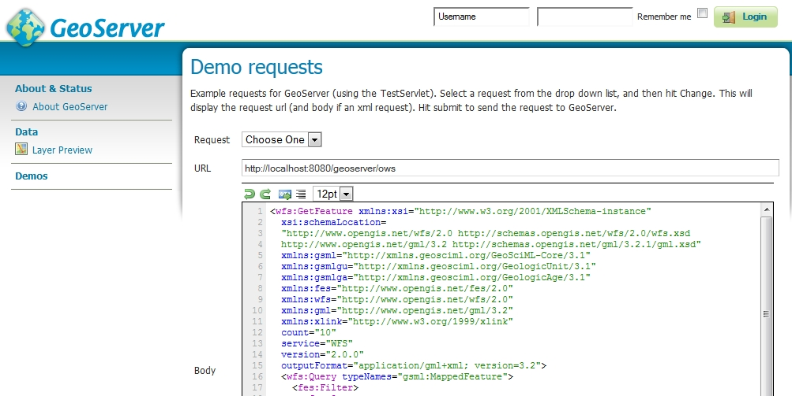
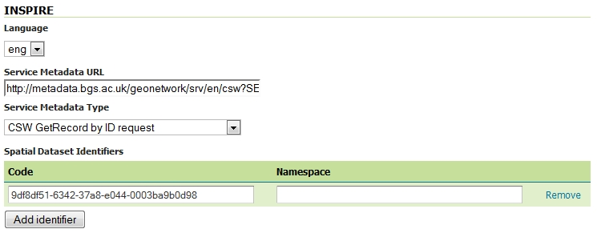

Example Data and Configuration
==============================

This tutorial chapter will show you how to set up a OneGeology compliant GeoSciML v4.1 WFS covering at least the encoding guidance in the `GeoSciML Encoding Cookbook <http://onegeology.org/docs/technical/GeoSciML_Cookbook_1.3.pdf>`_ using the Open Source GeoServer WFS and PostGIS spatial database with an example source dataset. It enables you to get some initial experience setting up a service. Your own services may be set up by customising it or you may use it to get some understanding of what is involved when setting up your own service.

The tutorial assumes you are familiar with representing complex features in GML applications.

Loading example PostGIS data
----------------------------

It is assumed that you have installed the PostGIS software and that you have a spatially enabled database (the default installation will create one called postgis). The following will all be working within this spatially enabled database.

Download the latest version of the database dump file wfscookbook.YYYY-MM-DD.backup from `<ftp://ftp.bgs.ac.uk/pubload/OneGeology/wfscookbook/>`_. (Each version will have its release date in place of YYYY-MM-DD.)

Create a separate schema for the example data. The schema name is used in the commands below so, if you change it from ``wfscookbook`` you will need to change these accordingly

.. code-block:: postgresql

   CREATE SCHEMA wfscookbook AUTHORIZATION postgres;

Import the data from the database dump file downloaded above. If you have installed the pgAdmin graphical administration tool you can use the menu option :menuselection:`Tools --> Restore...`. If you are using the command line you can use the command :command:`pg_restore --host localhost --port 5432 --username "postgres" --dbname "postgis" --no-password --no-owner --no-privileges --no-tablespaces --schema wfscookbook --verbose wfscookbook.backup` (assuming you are using the default 'postgis' named database.  You should create a database user with read-only access to these tables for the WFS software to use when accessing them.

.. code-block:: postgresql

   CREATE ROLE ows_reader LOGIN PASSWORD 'your_password'
    VALID UNTIL 'infinity';
   COMMENT ON ROLE ows_reader
   IS 'A role with read only access to data used in web services.';
   grant usage on schema wfscookbook to ows_reader;
   grant select on table geometry_columns to ows_reader;
   grant select on table spatial_ref_sys to ows_reader;
   grant select on all tables in schema wfscookbook to ows_reader;

If you have problems with the above steps which are difficult to resolve you may find that setting ``log_statement=all`` in ``postgresql.conf``, reloading the server and then monitoring the log file is helpful for debugging them.


Configuring GeoServer WFS
-------------------------

Download the latest version of the example configuration files in data_625k.YYYY-MM-DD.zip from `<ftp://ftp.bgs.ac.uk/pubload/OneGeology/wfscookbook/>`_ and expand it to a spare location on your server. Copy the files from this expanded directory to the matching locations in your GeoServer data directory. The main configuration files are inside the ``workspaces`` directory. The contents of the ``demo`` directory are some example requests which are documented below. Overwrite any files that already exist, although there shouldn't be any in a fresh installation (apart from the containing directories). Note that the web interface does not yet support app-schema store for layer administration so you will have to edit these files directly when configuring your service.

Copy the latest version of one of the files app-schema.cgi.YYYY-MM-DD.properties or app-schema.inspire.YYYY-MM-DD.properties from `<ftp://ftp.bgs.ac.uk/pubload/OneGeology/wfscookbook/>`_ to ``WEB-INF/classes/app-schema.properties`` depending on whether you wish to use CGI or INSPIRE vocabularies for property values. (Don't forget to rename the file, removing the `.inspire` or `.cgi` and datestamp parts.)

Edit the database connection parameters appropriately for your installation of PostgreSQL. If you want to use a JNDI data connection configured in your servlet container then you will also need to edit the appropriate places in the ``datastore.xml`` files described in a subsequent section. So it will be easier for initial testing just to enter the host, database, user and password parameters.

Perform any configuration required by your servlet container, and then start the servlet.

One configuration item you may need to change is to increase the memory available for Java. The method depends on how you have installed GeoServer but if you get ``java.lang.OutOfMemoryError: Java heap space`` errors with the request below you will need to increase the memory with a directive such as ``-Xmx256M``. The details of tuning memory and other options of the Java Virtual Machine are complex and not dealt with in this cookbook. Some information is in the GeoServer User Manual under the `Running in a Production Environment <http://docs.geoserver.org/stable/en/user/production/index.html>`_ section.

If you have used the Windows Installer you can apply this by editing the file ``C:\Program Files (x86)\GeoServer 2.4.5\wrapper\wrapper.conf`` (The exact file location will depend on where you installed GeoServer and which version you are using.) Find the line ``wrapper.java.maxmemory=128`` and increase the value 128 (or whatever it happens to be) to something like 256.

If you are running in Apache Tomcat on Windows you can use the "Configure Tomcat" program that the Tomcat Windows installer provides. In the "Java" tab you can put a maximum memory value such as 256 (MB) in the Maximum Memory pool field.

* The first time GeoServer starts with the tutorial configuration, it will download all the schema (XSD) files it needs and store them in the ``app-schema-cache`` folder in the data directory. **You must be connected to the internet for this to work.**

Complex Feature Test requests
`````````````````````````````

When GeoServer is running, test app-schema WFS in a web browser. You can query the feature types using these links. (Change ``localhost:8080`` in the examples below if you have deployed it at a different location.):

* `http://localhost:8080/geoserver/wfs?service=WFS&version=2.0.0& request=GetFeature&namespaces=xmlns(gsmlb,http%3A%2F%2Fwww.opengis.net%2Fgsml%2F4.1%2FGeoSciML-Basic) &typeNames=gsmlb:MappedFeature&count=25 <http://localhost:8080/geoserver/wfs?service=WFS&version=2.0.0&request=GetFeature&namespaces=xmlns(gsmlb,http%3A%2F%2Fwww.opengis.net%2Fgsml%2F4.1%2FGeoSciML-Basic)&typeNames=gsmlb:MappedFeature&count=25>`_

* `http://localhost:8080/geoserver/wfs?service=WFS&version=2.0.0& request=GetFeature&namespaces=xmlns(gsmlb,http%3A%2F%2Fwww.opengis.net%2Fgsml%2F4.1%2FGeoSciML-Basic) &typeNames=gsmlb:GeologicUnit&count=25 <http://localhost:8080/geoserver/wfs?service=WFS&version=2.0.0&request=GetFeature&namespaces=xmlns(gsmlb,http%3A%2F%2Fwww.opengis.net%2Fgsml%2F4.1%2FGeoSciML-Basic)&typeNames=gsmlb:GeologicUnit&count=25>`_

From GeoServer 2.7 there is also support for WFS 2.0 paged queries such as below. The performance has been tuned so that you should be able to retrieve a small subset range of features anywhere within a large set of features matching a particular query.

* `http://localhost:8080/geoserver/wfs?service=WFS&version=2.0.0& request=GetFeature&namespaces=xmlns(gsmlb,http%3A%2F%2Fwww.opengis.net%2Fgsml%2F4.1%2FGeoSciML-Basic)& typeNames=gsmlb:MappedFeature&count=10&startindex=9 <http://localhost:8080/geoserver/wfs?service=WFS&version=2.0.0&request=GetFeature&namespaces=xmlns(gsmlb,http%3A%2F%2Fwww.opengis.net%2Fgsml%2F4.1%2FGeoSciML-Basic)&typeNames=gsmlb:MappedFeature&count=10&startindex=9>`_ - Get features 10 to 20 (startindex is 0 for first feature)

* `http://localhost:8080/geoserver/wfs?service=WFS&version=2.0.0& request=GetFeature&namespaces=xmlns(gsmlb,http%3A%2F%2Fwww.opengis.net%2Fgsml%2F4.1%2FGeoSciML-Basic)& typeNames=gsmlb:MappedFeature&count=10&startindex=9999 <http://localhost:8080/geoserver/wfs?service=WFS&version=2.0.0&request=GetFeature&namespaces=xmlns(gsmlb,http%3A%2F%2Fwww.opengis.net%2Fgsml%2F4.1%2FGeoSciML-Basic)&typeNames=gsmlb:MappedFeature&count=10&startindex=9999>`_ - Get features 10000 to 10010

(At the time of writing the response is not fully WFS 2.0 compliant as the returned collection only returns a link to retrieve the previous set of results, not to the next set of results. However, a client that can formulate the paged queries should be able to work these out itself.)

You can also obtain WFS responses by using the `Demo requests <http://localhost:8080/geoserver/web/?wicket:bookmarkablePage=:org.geoserver.web.demo.DemoRequestsPage>`_ page in the GeoServer web interface. You can select some of the example age and lithology queries that are supplied with the example data directory from the request drop-down list or put ``http://localhost:8080/geoserver/ows`` into the service URL section and try pasting in your own queries. Some of the examples are reproduced below with their names as listed on the demo queries page.



A query for mapped features showing outcrops of geologic units of a particular age

``WFS_getFeature1GCgiAge.xml`` (Use ``WFS_getFeature1GInspireAge.xml`` if you have chosen the INSPIRE configuration.)

.. literalinclude:: WFS_getFeature1GCgiAge.xml
      :language: xml

A OneGeology query for mapped features showing outcrops of geological units with particular lithologies 

``WFS_getFeature1GCgiLith.xml`` (Use ``WFS_getFeature1GInspireLith.xml`` if you have chosen the INSPIRE configuration.)

.. literalinclude:: WFS_getFeature1GCgiLith.xml
      :language: xml

A bounding box query to retrieve mapped features with shapes that overlap the specified bounding box

``WFS_getFeature1GBBOX.xml``

.. literalinclude:: WFS_getFeature1GBBOX.xml
   :language: xml

.. note:: App-schema cannot be configured using the web interface, you will need to edit the configuration files directly. You will see the configured workspaces and stores appear in the web interface but not the layers (features). The properties that can be edited in the web interface are very limited.

INSPIRE Extended Capabilities
-----------------------------

If you are providing an INSPIRE download service you will need to provide the extra INSPIRE mandated metadata in the WFS GetCapabilities response. All INSPIRE specific requirements are optional for OneGeology use but will work as OneGeology services.

As described in the plugin documentation you should find a section in the WFS service settings of the administration interface where you can choose a language, enter a service metadata URL and type and add one or more spatial dataset identifiers. For guidance on what to enter in these settings see the `Technical Guidance for the implementation of INSPIRE Download Services <http://inspire.jrc.ec.europa.eu/documents/Network_Services/Technical_Guidance_Download_Services_v3.1.pdf>`_.

Check that the GetCapabilities responses contain your edited values.

.. note:: The plugin GUI only has two non-empty values for the Service Metadata Type: "Online ISO 19139 ServiceMetadata document" sets the MIME type to ``application/vnd.iso.19139+xml``, "CSW GetRecord by ID request" sets the MIME type to ``application/vnd.ogc.csw.GetRecordByIdResponse_xml``. If neither of these correspond to the actual MIME type of your metadata resource you could omit this element by choosing the blank option or work around it by manually editing the wfs.xml file inside the GeoServer data directory as documented in issue `GEOS-5157 <http://osgeo-org.atlassian.net/browse/GEOS-5157>`_ . As it isn't clear what a client would do with this information anyway, leaving it blank seems to be a good option.

For example, entering the values shown in the screenshot below would result in a GetCapabilities response with the ExtendedCapabilities section shown below it.



.. include:: ExtendedCapabilities.literal

INSPIRE Pre-defined Dataset Download
------------------------------------

If you decide that you are going to provide an INSPIRE pre-defined dataset download service direct from your WFS rather than pre-generating the full datasets and just providing links to the download through ATOM then you can do this by creating a Stored Query such as the one below. The example data directory includes the CreateStoredQuery command in the Demos examples.

.. code-block:: xml

 <?xml version="1.0" encoding="UTF-8"?>
 <wfs:CreateStoredQuery
  xmlns:xsi="http://www.w3.org/2001/XMLSchema-instance"
  xsi:schemaLocation=
   "http://www.opengis.net/wfs/2.0
    http://schemas.opengis.net/wfs/2.0/wfs.xsd"
  xmlns:gsmlb="http://www.opengis.net/gsml/4.1/GeoSciML-Basic"
  xmlns:fes="http://www.opengis.org/fes/2.0"
  xmlns:wfs="http://www.opengis.net/wfs/2.0"
  xmlns:gml="http://www.opengis.net/gml/3.2"
  xmlns:xsd="http://www.w3.org/2001/XMLSchema"
  service="WFS"
  version="2.0.0">
  <wfs:StoredQueryDefinition
   id='http://inspire.ec.europa.eu/operation/download/GetSpatialDataSet'>
   <wfs:Parameter name='CRS' type='xsd:string'/>
   <wfs:Parameter name='DataSetIdCode' type='xsd:string'/>
   <wfs:Parameter name='DataSetIdNamespace' type='xsd:string'/>
   <wfs:Parameter name='Language' type='xsd:string'/>
   <wfs:Parameter name="count" type="xsd:integer"></wfs:Parameter>
   <wfs:QueryExpressionText
    returnFeatureTypes='gsmlb:MappedFeature'
    language='urn:ogc:def:queryLanguage:OGC-WFS::WFS_QueryExpression'
    isPrivate='false'>
    <wfs:Query typeNames='gsmlb:MappedFeature' srsName="${CRS}">
    </wfs:Query>
   </wfs:QueryExpressionText>
  </wfs:StoredQueryDefinition>
 </wfs:CreateStoredQuery>

This can then be invoked with a request like:

 `http://localhost:8080/geoserver/ows?service=WFS&version=2.0.0&request=GetFeature& storedquery_id=http://inspire.ec.europa.eu/operation/download/GetSpatialDataSet& DataSetIdCode=13603180&DataSetIdNamespace=http://data.bgs.ac.uk/id/dataHolding/& CRS=urn:ogc:def:crs:EPSG::4326&Language=eng&count=20& <http://localhost:8080/geoserver/ows?service=WFS&version=2.0.0&request=GetFeature&storedquery_id=http://inspire.ec.europa.eu/operation/download/GetSpatialDataSet&DataSetIdCode=13603180&DataSetIdNamespace=http://data.bgs.ac.uk/id/dataHolding/&CRS=urn:ogc:def:crs:EPSG::4326&Language=eng&count=20&>`_

