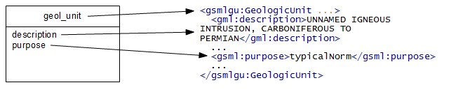
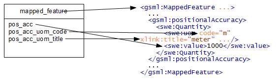
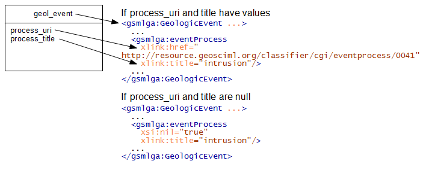

Overview
========

The text in this cookbook will assume you have your source data in tables in a relational database system. This is the most likely situation for data of any complexity but you should be able to adapt the details for other sources such as files etc.

You will need to study the GeoSciML data model. Having done this you will need to work out a mapping from your source data to appropriate parts of the GeoSciML model. See the `GeoSciML Encoding Cookbook <http://onegeology.org/docs/technical/GeoSciML_Cookbook_1.3.pdf>`_.  If you want to set up a service using the INSPIRE `Geology Theme Schema <http://inspire.ec.europa.eu/schemas/ge-core/3.0/GeologyCore.xsd>`_ in addition to the GeoSciML Schema then also consult the `INSPIRE Schema Cookbook <https://themes.jrc.ec.europa.eu/file/view/67794/encoding-cookbook-for-original-inspire-schema-wfs-services>`_. You will then have the task of configuring your software to generate XML conformant to your INSPIRE theme schema from your source data. The structure of your source data may be similar to or quite different from the INSPIRE model and we can't cover all possible situations but you will be able to make configuration changes in two places (i) in your underlying database and (ii) in the WFS software configuration mapping database contents to generated output. A number of constraints; administrative, performance, flexibility of the WFS software configuration and complexity will govern exactly how you do this but, as a general principle, it will usually be preferable to do as much in the database as possible to create source data matching INSPIRE output as closely as possible. GeoServer can do some quite powerful processing of the underlying data but this is often at the expense of performance and ability to query the data.

Normally you will have one main table for each feature type you are intending to serve. In a simple feature WFS each row will generate one feature and the values of the table columns will be the values contained in simple property values of the generated features (or spatial data columns generating GML geometry property values). The diagram below shows a table ``geol_unit`` which is mapped to the feature type ``gsmlgu:GeologicUnit``. Two example text columns ``description`` and ``purpose`` are mapped directly to simple feature properties ``gml:description`` and ``gsml:purpose`` with their text content being put directly inside the property elements.

With complex features such as in the INSPIRE data specifications there are a number of ways in which the configuration can be more complex.

A feature property could be 1-1 but its value a complex type with attributes or nested element content whose values come from the table columns. In the below diagram the columns of the ``mapped_feature`` table are directly placed inside property elements or attribute values within a complex nested property structure. 

.. note:: often attributes like the units of measure may be the same for all rows in your table and you may want to hard code a value such as "meter" in the service configuration rather than repeat the same values in every row of your database table.

The property values may be polymorphic having different content structure depending on the particular data under consideration. A simple example would be nillable properties where the output structure changes when the property has nil values.

Other complexities include one to many, many to one or many to many relationships between features and their properties. In these cases you will normally have separate database tables for the features and their property values (which may be features in their own right).
