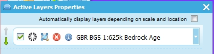
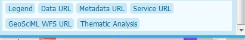
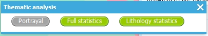
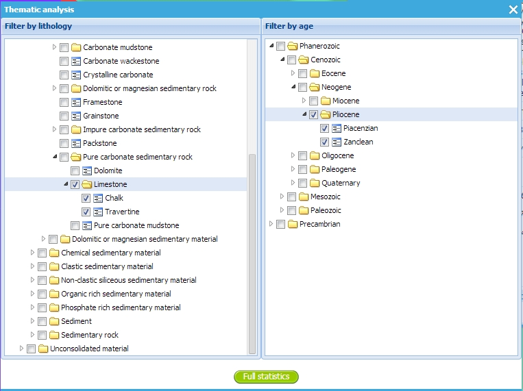
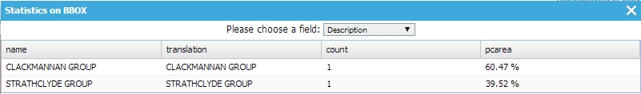
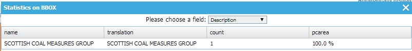

Portal Age and Lithology Query
==============================

The `OneGeology portal <http://portal.onegeology.org>`_ has a graphical interface to allow a user to select geological ages or lithologies from a hierarchical list and query a given WFS so that it returns all features with the selected property values within the current viewing window. In order to work with this your WFS must include the features and properties and dictionaries required by the query and described in the `GeoSciML Encoding Cookbook <http://onegeology.org/docs/technical/GeoSciML_Cookbook_1.3.pdf>`_ (or the older `GeoSciML 3.2 Encoding Cookbook for OneGeology 5 star WFS services. Version 1.0 <http://www.onegeology.org/docs/technical/GeoSciML_3.2_Encoding_Cookbook_for_5star_WFS_v1.0.pdf>`_). This chapter gives you some example queries which your WFS should support and shows how these are created in the OneGeology portal.

When you have set up a WFS for OneGeology you will be able to ask for it to be registered against one or more WMS layers that portray the data returned by it (possibly styled differently according to different property values). If you then select one of those registered WMS layers in the portal and select the :guilabel:`Active Layer Properties` you will see a dialog box like below:

If you expand the layer description by clicking on the down arrow at the right you should see buttons for GeoSciML WFS URL and Thematic Analysis at the bottom.

Clicking on the Thematic Analysis button will bring a choice of Full Statistics or Lithology Statistics

We will cover the Full Statistics option first and then the Lithology Statistics

The Full Statistics option brings up a dialog with collapsible hierarchical lists of geological age and lithology terms from the CGI dictionaries. You can select a number of age values or lithology values or combinations of these. Features satisfying any of the lithology terms and any of the age terms selected will be retrieved; if no age or lithology terms are selected then the features are not filtered on that property. By default, if you select a term that has sub categories (represented by a folder icon) then all the sub categories will also be selected. This will usually be what you want but you can unselect these afterwards if you wish.

The selected properties are queried for combined with a BBOX filter on the current view port of the portal. 

The Lithology Statistics option allows you to select just one lithology term but also to specify a proportion value so that only features where that lithology is present in at least the given proportion are returned. (It checks that the lower value of the proportion range is at least as high as the specified query proportion).

