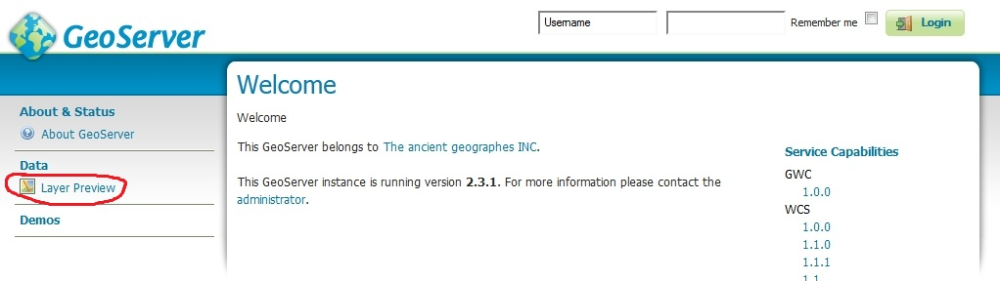

Installation of Software
========================

The software used here all has extensive documentation and support forums and mailing lists. Here we will just point you to the appropriate places to download the software and get installation instructions.

We assume:

* You have a basic familiarity with relational databases
* You are able to install applications such as PostGIS, Apache Tomcat, GeoServer etc. on a server with your chosen operating system using their project documentation.

Database
--------

If you already have your data in a relational database system you will want to check the `Working with Databases <http://docs.geoserver.org/stable/en/user/data/database/index.html>`_ section of the GeoServer manual to see if your database is supported by GeoServer and follow the instructions for installation of any extensions that may be needed for this support. PostGIS support is built into the core GeoServer download.

If you want to try the example data or don't have a supported database system you should install PostGIS. The `PostGIS Installation <http://www.postgis.net/install>`_ page contains instructions on how to do this for different operating systems. For the purposes of testing this cookbook setup we used the `Enterprise DB Windows Installer <http://www.enterprisedb.com/products-services-training/pgdownload>`_ which installs the base PostgreSQL database, has an option to install the PostGIS extension into this and also includes the pgAdmin graphical database administration tool.

You may use a database on the same machine as GeoServer or you can have it on a separate machine which is accessible over a network from your GeoServer machine.

GeoServer
---------

GeoServer has extensive `documentation <http://docs.geoserver.org/stable/en/user/index.html>`_ which you should refer to in addition to this cookbook. References will be made to relevant parts rather than repeating too much of what is already there. There is also the `geoserver-users mailing list <http://geoserver.org/comm/>`_.

Assumptions
```````````

You will need to have Java installed on the machine on which you are going to install GeoServer. The GeoServer manual recommends Oracle JRE 7 for GeoServer 2.7 at the time of writing but the mailing lists and our own experience indicate that JRE 8 is also fine. See `<http://docs.geoserver.org/stable/en/user/production/java.html#production-java>`_ for the current recommendations. If you want to try other versions of Java you may need to do extra work and be prepared to enter into technical discussions on the geoserver-users email list in order to get it working with these.

Ideally you will be familiar with deploying applications in a servlet container application such as `Apache Tomcat <http://tomcat.apache.org/>`_. If not, you can use one of the all-in-one installers that packages GeoServer already deployed in the `Jetty <http://www.mortbay.org/jetty/>`_ servlet container. Note that Tomcat and Jetty are the two most tested servlet containers used with GeoServer so, although you should be able to use others, there may be extra work involved and you may need to get advice from the geoserver-users email list.

Basic Installation
``````````````````

* `Download <http://geoserver.org/release/stable>`_ and install GeoServer following whichever one of the `installation paths <http://docs.geoserver.org/stable/en/user/installation/index.html>`_ in the GeoServer manual suits your situation best. If you already have a servlet container application such as `Apache Tomcat <http://tomcat.apache.org/>`_ set up or you are familiar with how to set one up then you will probably wish to download the web archive (WAR) and deploy that in your servlet container. If you are not comfortable with configuring a servlet container then you will probably wish to use one of the installer programs. 

* Run GeoServer at least once to check the installation has worked. If, for example, you are testing in a local instance of Tomcat on your own machine with default settings you should be able to visit http://localhost:8080/geoserver and click on the :guilabel:`Layer Preview` link to check that the example services shipped with GeoServer work properly. You will have to modify the preceding URL appropriately if you have deployed GeoServer on a different machine or port.



App-schema Plugin Installation
``````````````````````````````

* `Download <http://geoserver.org/release/stable>`_  and install the app-schema plugin ``geoserver-*-app-schema-plugin.zip`` following the `application schema installation instructions <http://docs.geoserver.org/stable/en/user/data/app-schema/installation.html>`_. Note the `WFS service settings <http://docs.geoserver.org/stable/en/user/data/app-schema/wfs-service-settings.html>`_.
* Check you can restart GeoServer without any errors being thrown.

INSPIRE Plugin Installation
```````````````````````````

If you are providing an INSPIRE download service you will need to provide the extra INSPIRE mandated metadata in the WFS GetCapabilities response. This is optional for OneGeology.

* `Download <http://geoserver.org/release/stable>`_ and install the INSPIRE plugin ``geoserver-*-inspire-plugin.zip`` following the `INSPIRE plugin installation instructions <http://docs.geoserver.org/stable/en/user/extensions/inspire/index.html>`_.

