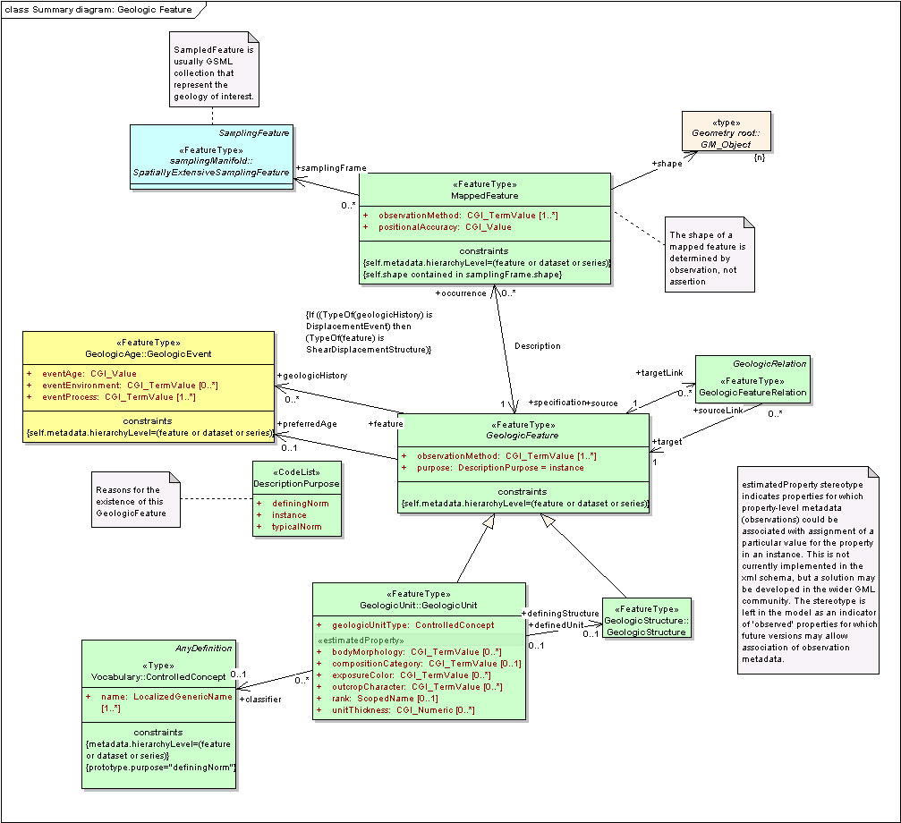

.. contents::

.. todo::

   Following sections from original WMS cookbook may be deleted or moved to other places.

These pages form a series of "cookbooks" written to assist organizations contributing to OneGeology.  The first cookbook describes how to deliver images of geological maps over the Internet as an Open Geospatial Consortium (OGC) Web Mapping Service (WMS). The second describes how to deliver feature data through an OGC Web Feature Service (WFS) in a number of formats. The third cookbook describes how to deliver coverage data in image or other gridded data formats through an OGC Web Coverage Service (WCS).

This cookbook explains how to set up both version 1.1.1 and 1.3.0 Web Map Services simultaneously and with minimal extra effort for adding the support for a version 1.3.0 WMS service.  The OneGeology Portal now supports version 1.3.0 as the default, i.e. where both versions are suppoprted 1.3.0 will be used.  **Note**, version 1.3.0 is required for 3 star accreditation.

You will need to set up a WMS to conform to being a Level 1 participant in OneGeology.  If you are already familiar with how to set up a WMS using software you already possess, you can read this guide (especially :ref:`OneGeology Profile <service_provision_onegeology_profile>`) just to find out the standard requirements for a OneGeology conformant WMS.  If you are unfamiliar with how to set up a WMS, you can use the example in this cookbook which shows in detail how to achieve this using the Open Source MapServer software (on a variety of platforms) and also provides pointers on doing this using ESRI ArcGIS and ArcIMS software.  This cookbook package consists of two parts: (1) these pages, and    (2) two exemplar WMS services based on British Geological Survey data,(i) an exemplar configuration using a shapefile with the BGS 625k data and, (ii) an exemplar configuration using an image file (such as might be created by scanning a paper map, when digital vector GIS data is not available for a particular country currently) using the BGS 625k bedrock age map, available for download over the Internet from a BGS FTP (file transfer protocol) server.

We provide two downloads depending on your needs:

* ftp://ftp.bgs.ac.uk/pubload/OneGeology/1G_WMS-exemplar-data-MS6-update.zip

  This zip file contains just the data and MapServer templates for the two exemplar services, configured for a standard MS4W installation.  Use this version of the zip if you already have a working copy of Windows MapServer (e.g. version 6.0.0+), or if you are compiling MapServer for Linux. This file is approximately 22Mb.

* ftp://ftp.bgs.ac.uk/pubload/OneGeology/1G_ms4w3_MS6-with-exemplar-data.zip

  This zip file contains a copy of MS4W MapServer (v.6.0.1) allowing you to serve both a WMS 1.1.1 and WMS 1.3.0, and the exemplar services data.   This version also contains a custom ‘crs’ file holding CRS:84 projection information, which can be used for setting up WMS 1.3.0 web services. Use this version of the zip if you are doing a fresh installation of MapServer for Windows Apache or IIS. This file is approximately 100Mb.

Registration Process
--------------------

Before you can submit your service to OneGeology, you must first register your organization as a OneGeology data provider by filling out the `registration form <http://onegeology.org/getting_involved/get_involved.cfm>`_ available from the OneGeology web site.

If you are willing and able to host your own data you will then need to fill in the `Data Coordination form <http://onegeology.org/technical_progress/data_coordination.cfm>`_ on the OneGeology website.

If you are unable to host your own data for any reason, then you will ALSO need to fill in the `buddy form <http://onegeology.org/technical_progress/buddy_coordination.cfm>`_ on the OneGeology website.

Next, send an email to `onegeologyhelp@bgs.ac.uk <mailto:onegeologyhelp@bgs.ac.uk>`_ with the URL of the proposed WMS service. Include in this email:

* The name of the geographical area
* the name of the data provider organization (usually this is the owner of the data)
* the name of the service provider organization

The OneGeology secretariat will check that they have written confirmation that the service provider owns the right to serve the proposed data and/or has permission from the data provider to serve that data.

You will be contacted by the OneGeology helpdesk with confirmation of receipt, plus any other feedback.

The service will then be reviewed for conformance with OneGeology requirements and, upon verification, the service URL will be forwarded to BRGM the (OneGeology Portal hosts) by the helpdesk team with a request to register the service in the `OneGeology Portal <http://portal.onegeology.org>`_ and `catalog <http://onegeology-catalog.brgm.fr/geonetwork/srv/en/main.home>`_.

If BRGM have any technical issues with the proposed service they will raise these issues with the helpdesk, and the helpdesk will in turn discuss theses issues with the service provider, if required.

When the service is fit for registration BRGM will email the OneGeology secretariat, your OneGeology WMS Service will now be officially registered and its layers are now visible in the OneGeology Portal.

As the reference information stored in the OneGeology portal and catalogue comes from your service directly it is highly recommended if you need to make major changes to information held in your WMS service, to modify your WMS service first and then ask the helpdesk to have your service updated.

If you have any queries please contact `onegeologyhelp@bgs.ac.uk <mailto:onegeologyhelp@bgs.ac.uk>`_.

Who should be reading this cookbook?
------------------------------------

This cookbook describes the viewing and use of WMS’ using commonly and freely available clients including of course the OneGeology Portal in the `How to view and access data from OneGeology services<use>` section and this information is therefore of use to anyone wishing to understand what a OneGeology Level 1 WMS contribution makes available.  The minimum technical capability that a Geological Survey, wishing to contribute a WMS to OneGeology, has to have is an existing web server that is visible without access restrictions to anyone internationally, and the technical staff to maintain and support that service.  This web server **must be running on port 80** (if using HTTP) or **must be running on port 443** (if using HTTPS) to be accessible to the OneGeology Portal client. If you already have another web server service running on port 80 such as Tomcat, it is possible to get that server to run on another port number, and then proxy requests though to it using the MS4W Apache web server.  For a quick overview of how to use the Apache-HTTP web server as such a ‘*reverse proxy*’ see http://onegeology.org/WMScookbook/appendixH.html.

.. todo::

   Might want to change Appendix H above to more general proxying info including other systems such as HAProxy?

If a survey does not have this capability then OneGeology has set up a system of volunteer ‘buddy’ organizations that may be prepared to serve your data as a WMS for you. You can request assistance through the `buddy coordination form <http://www.onegeology.org/technical_progress/buddy_coordination.cfm>`_.

The intended audience of this cookbook is the survey’s web applications developer and a geoscientist who is going to work with them to provide the digital data to be served.

A few OneGeology participants are already serving WMS’ using MapServer or other similar technologies.  If they are going to continue to use those technologies then they simply have to follow the naming and WMS configuration guidelines here to serve an OneGeology conformant WMS that can be registered with the OneGeology Portal and Client.  The OneGeology conformant service naming conventions are described in detail in :ref:`OneGeology Profile <service_provision_onegeology_profile>`.

Even if you are not going to use MapServer to serve your WMS please scan through these pages and read in full :ref:`OneGeology Profile <service_provision_onegeology_profile>` and appendices `F <appendix_F_>`_ and `G <http://onegeology.org/WMScookbook/appendixG.html>`_ for example WMS GetCapabilities responses, which show how these naming conventions are used. See `Appendix E <http://onegeology.org/WMScookbook/appendixE.html>`_ for the MapServer configuration file that shows how one particular piece of software implements the ICS 2009 colour scheme that it is requested that OneGeology services try and implement for an age layer symbolization.

.. _appendix_F: http://onegeology.org/WMScookbook/appendixF.html

.. todo::

   change above links to old cookbook after deciding on reorganisation of structure

What type of data should be served as a contribution to OneGeology Level 1?
---------------------------------------------------------------------------

As cited in the `brief overview of the OneGeology initiative <http://www.onegeology.org/technical_progress/home.html>`_

  each contributor decides which maps to contribute

and 

  it is anticipated that the majority of contributed maps will be bedrock and/or superficial maps, lithological and/or lithostratigraphical and/or chronostratigraphical where possible, but again, each contributor decides.

If chronostratigraphical symbolization is being offered then if possible the target scheme to use would be the `IUGS 2009 colour scheme <iugs_2009_>`_.

.. _iugs_2009: https://www.seegrid.csiro.au/wiki/pub/CGIModel/GeologicTime/ISChart2009.pdf

If you wish you are also encouraged to go a step further and follow the GeoSciML-Lite schema, which would allow your age service to be queried and re-symbolized using CGI URI codes.  See `Section 7 <http://onegeology.org/WMScookbook/7_1.html>`_ for details on how to enable GeoSciML-Lite in your service.

This definition of these target ideal data contents represented by the Level 1 participants was agreed at the Brighton meeting but it also forms a small part of the GeoSciML logical model of geoscience concepts that OneGeology aspires to use to serve Level 2 Web Feature Services (WFS) in which the actual data in GML XML form is served over the web and not just a pictorial image of the map as in a WMS service.

A relevant UML (Universal Modelling Language) fragment of that GeoSciML model is shown below for those who want to understand the long term context:

Any Level 1 participant that plans in the long term to serve a Level 2 OneGeology WFS web service will want to serve this type of category of data to make it straightforward to move from a Level 1 WMS to a Level 2 WFS.

   UML diagram for a fragment of the GeoSciML model (click to enlarge)

We emphasise that these geoscientific categories or feature types are only the target aim for OneGeology and if you have other data that you wish to serve and contribute then you are very much encouraged to do so.  Similarly, whilst the target scale of data to be published is 1:1 000 000 OneGeology will happily accept data between the scales 1:500 000 and 1:5 000 000 with some other useful baseline datasets being of even larger scale.  For example the British Geological Survey has decided to contribute its 1:625 000 scale data — and as it would take time and money to change this to a 1:1 000 000 scale it is not worth the effort to make this change.

A WMS is served from digital data and this comes in two forms; vector digital geological data in a GIS format such as ESRI's shapefile or a digitally scanned map in an image format such as GeoTIFF or JPEG.  A digitally scanned map in an image format is required if the map you wish to serve is only currently available in paper map form — perhaps from a historical library source.

If you wish to serve a WMS from a paper map source then follow `scanning a paper map <paper_map>` and then proceed to one of the sections on using your preferred specific WMS server software.

