.. contents::

***********************************************************
6 Using GeoServer software to serve OneGeology web services
***********************************************************

GeoServer is an free and open sourced Java-based server for providing OGC web services.  GeoServer runs on top of a Java web server, such as Jetty or (recommneded for a production environment) Tomcat.  GeoServer can be downloaded from `http://geoserver.org/download/ <http://geoserver.org/download/>`_, the latest stable build is version 2.8.0.  A number of modules and extentions exist for adding functionality, such as the INSPIRE plugin `geoserver-2.8.0-inspire-plugin.zip <http://sourceforge.net/projects/geoserver/files/GeoServer/2.8.0/extensions/geoserver-2.8.0-inspire-plugin.zip/download>`_ (for adding INSPIRE extended capabilities to your services), and the Application Schema plugin `geoserver-2.8.0-app-schema-plugin.zip <http://sourceforge.net/projects/geoserver/files/GeoServer/2.8.0/extensions/geoserver-2.8.0-app-schema-plugin.zip/download>`_.

GeoServer is a good choice if you wish to set up both a GeoSciML-Portrayal WMS and WFS.  When considering using GeoServer for a GeoSciML-Portrayal service you are limited to using a vector data source, by default you would use either an ESRI shape file or a PostGIS database, but you can use any number of other databases (ArcSDE, DB2, H2, MySQL, Oracle, SQL Server, Teradata) by adding the appropriate  extention. Element names in the output XML are determined by the field names in the data source. Shapefiles use dBase tables to contain thematic property data, and the field names in a shape file are limited to 10 characters in length. Because some of the fields in the GeoSciML-Portrayal schema are longer than 10 characters, ESRI shapefiles are not suitable as a datastore for GeoSciML-Portrayal services that utilize the simple configuration approach in GeoServer. A more complicated configuration schema utilizing an ‘application schema’ is also available to GeoServer users, but to avoid this complication, it is recommended to use PostGIS as the data store for GeoServer GeoSciML-Portrayal implementation.

This procedure assumes that you have a working GeoServer implementation with PostGIS, and that you have administrative privileges necessary to create workspaces, stores, and layers accessible to GeoServer. In order for services to be publicly accessible, the host and port of the GeoServer instance must be configured to allow remote access to the GeoServer instance.

6.1 Logging in
==============

The Web Administration Interface is a browser-based tool for administering the server software remotely. To deploy a web service in the GeoServer environment, log in to the Web Administration Interface for the GeoServer instance you will be using to deploy your data as a web service. To access this tool, open a web browser and enter the web address into the navigation bar. GeoServer is usually installed such that the administrative interface can be accessed at a URL with the following address pattern:

**http://<host>:<port>/geoserver/web/**, **<port>** is usually **8080**, and <host> is the name or IP address of the server.

The default account settings for GeoServer are as follows:

* Username: admin
* Password: geoserver

For security reasons, it is recommended that you change your password to something more secure as soon as possible.

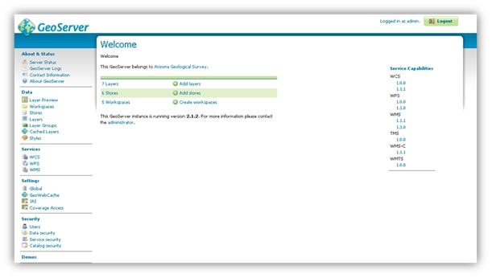

   GeoServer administration interface web page.

6.2 Editing contact information metadata
========================================

Within the GeoServer Web Administration Interface, click **Contact Information**, under About & Status.  This brings you to a Contact Information form in which you can provide contact information for your GeoServer instance. The information entered here becomes part of service-level metadata for the web service that is accessed by the OGC GetCapabilities request. Consequently, Contact Information entered here should be as precise and comprehensive as possible.

See `http://onegeology.org/wmsCookbook/2_4_1.html <2_4_1.html>`_ for details of required service level metadata

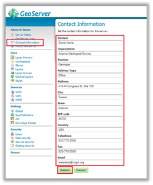

   GeoServer contact information

6.3 Creating a workspace (and editing service metadata)
=======================================================

#. After entering contact information for your GeoServer instance, you will need to create a workspace for your web service.
#. On the left side of the GeoServer **Web Administration Interface**, under **Data**, click **Workspaces**. This will bring you to the **Workspaces** page, wherein you can manage existing workspaces and create new workspaces.
#. Click **Add New Workspace**. This will bring you to the Edit Workspace page for your new workspace.
#. Two fields are present on the Edit Workspace page:

   * **Name**: The service title; may contain spaces or special characters, see notes below for further details.
   * **Namespace URI**: A URI associated with your project; this can be any URI (and doesn’t have to resolve).

#. When you are finished, click **Save**.

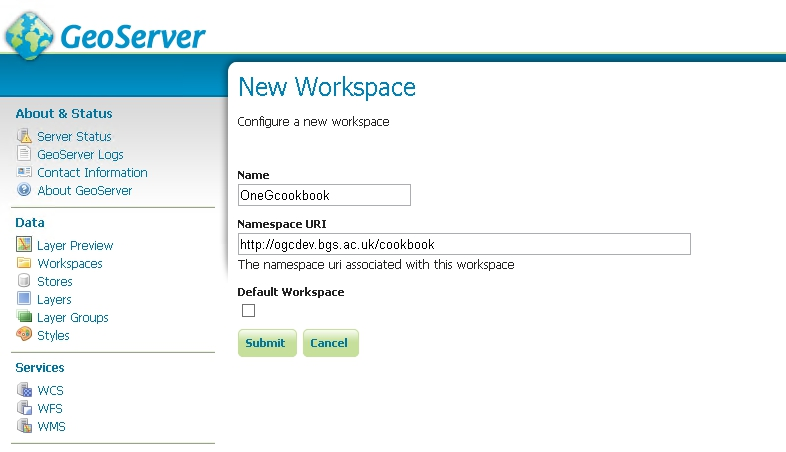

   Create a GeoServer Workspace

Give the workspace a memorable name; we suggest that this name is kept as short as possible because the workspace name is used throughout the service and is appended to all layer identifiers.  The workspace name will also make up part of the URL for the service, for example: *http://127.0.0.1:8080/geoserver/OneGcookbook/wcs?*

Note you can set up a proxy and configure Proxy URL base to achieve the desired OneGeology WMS profile URL name if required.

When you have created your workspace you can edit its properties.  You will need to click the enabled box and also the WMS services option

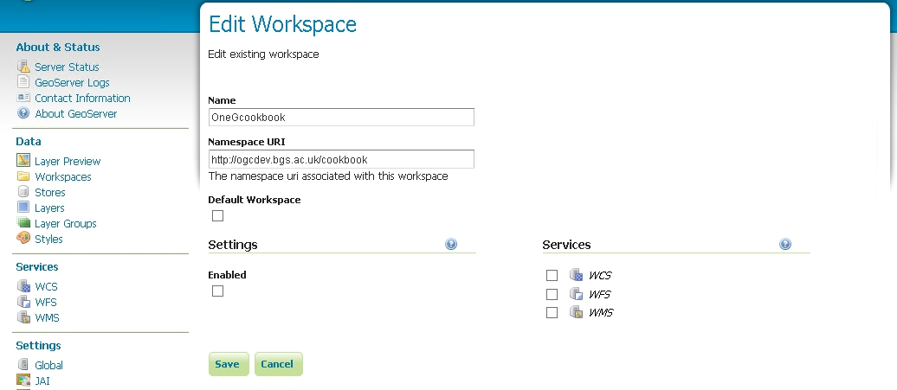

   Edit a GeoServer Workspace

Once you have **Enabled** the service, you will be able to edit the contact details for your service. By default you will have the standard metadata populated into this form. These metadata will be provided as part of the service GetCapabilities response.

See `http://onegeology.org/wmsCookbook/2_4_1.html <2_4_1.html>`_ for details of required service level metadata

At the top of the page you need to add the service title and abstract, plus any constaints on use of the service and any access constraints.  We recommned that you also select the strict CITE compliance option.  The Online resource url listed in this section is not intended to be the URL of the service, but instead a URL to obtain further information on the service provider.

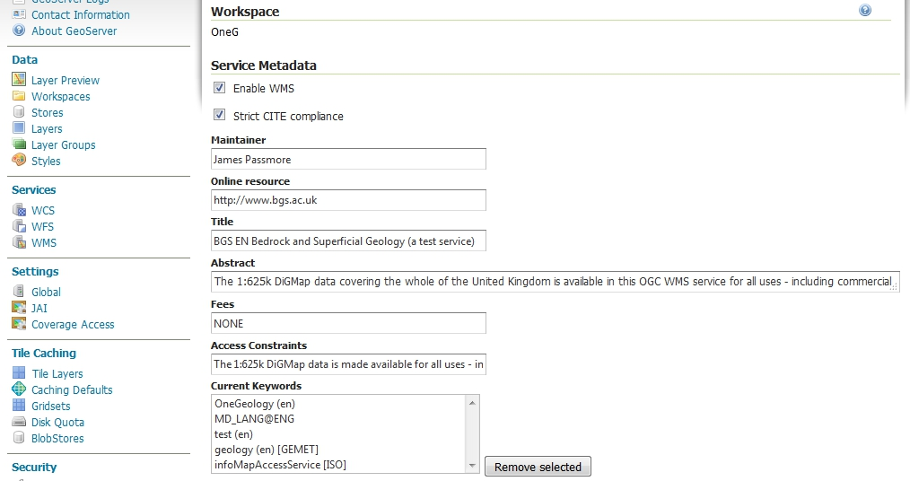

   Editing GeoServer WMS service properties (1)

In the middle of the page you can configure a limited list of SRS for the service; it is recommended that you use this option otherwise you will get the full list of GeoServer supported coordinate reference systems (about 4100), which makes the **capabilities** document slow to parse.  Remember you must support EPSG:4326 for the portal.

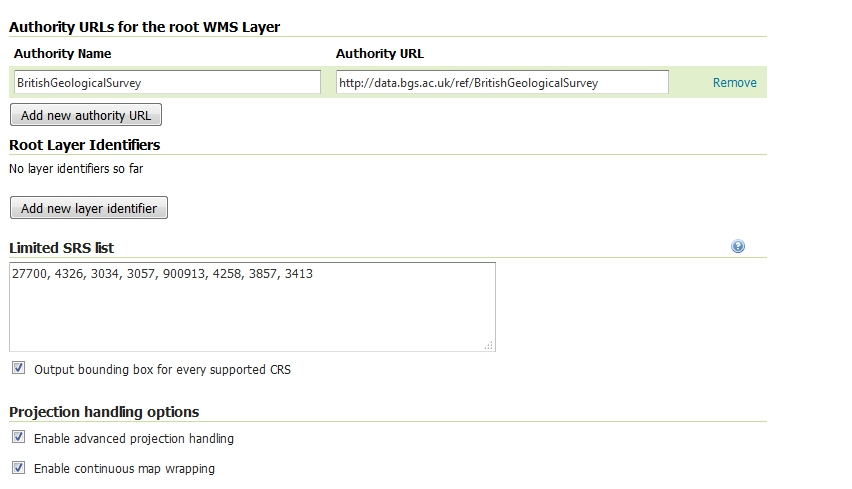

   Editing GeoServer WMS service properties (2)

If you have added the INSPIRE extension plugin, at the bottom of the page you will be able to configure a scenario 1 style extended capabilities section.  See the GeoServer documentation (http://docs.geoserver.org/stable/en/user/extensions/inspire/index.html) for further details.

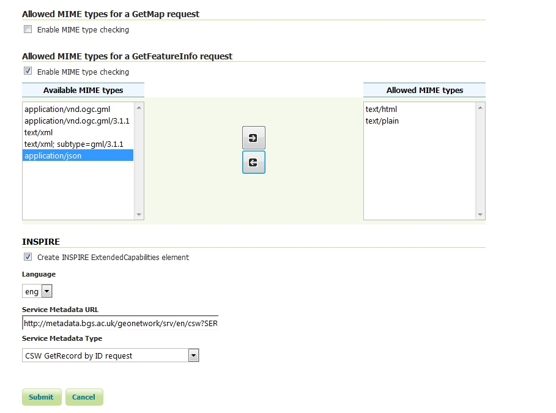

   Editing GeoServer WMS service properties (3)

6.4 Configuring a data store
============================

The next step is to use the Stores menu option to set up any sources of data for our service.

On the left side of the GeoServer **Web Administration Interface**, under **Data**, click **Stores**. This will bring you to the **Stores** page. On the **Stores** page, click **Add New Store**, then choose the type of data source you wish to configure from the list of options.

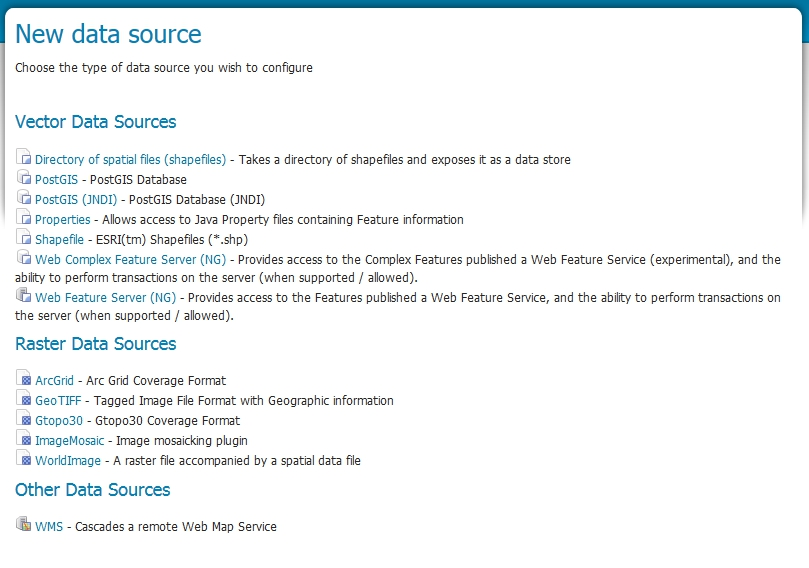

   GeoServer data store options (version 2.8-beta)

In the following sections we take you through how to configure a PostGIS data source (section 6.4.1) and a Shapefile (section 6.4.2).  If you have a raster data source take a look at the stores section of the `OneGeology WCS cookbook </docs/technical/CB6-HowToServe-a-OneGeology-WCS_v1.pdf>`_.

6.4.1 Connecting to a PostGIS database
======================================

On the **New Data Source** page, choose **PostGIS** as the data source by clicking **PostGIS**. This will bring you to a **New Vector Data Source** page. Complete the following steps:

#. Select a **Service Title** from the **Workspace** drop down menu. Select the workspace you created in the ‘Creating a Workspace’ section
#. Type a name for your data store in the **Data Source Name field** (spaces are acceptable here); add a description if desired
#. Make sure that the **Enabled** checkbox is checked
#. Set the **Connection Parameters** for your PostGIS data source; if the PostGIS data source is located on a remote server, you will need to provide the appropriate host, port, database name, user name, and password to access it:

   * **Host:** use ‘localhost’ if the PostGIS data source is on the same machine as your GeoServer instance; more specific host information will be necessary if your PostGIS data source is on a remote server
   * **Port:** default is 5432
   * **Database name:** this information will depend on the PostGIS data source
   * **Schema:** this information will depend on the PostGIS data source
   * **User name:** this information will depend on the PostGIS data source
   * **Password:** this information will depend on the PostGIS data source

#. When finished, click **Save**.

At this stage you have configured a store of data (a postgis database connection) that is available to your workspace, but you have no actual layers; see `section 6.5 <6_5.html>`_ for details of how to configure your layers.

6.4.2 Connecting to a shapefile data source
===========================================

#. First, place the shapefile of the intended data source in a file location that can be accessed by your GeoServer instance. For the following example file location, a folder named ‘shapefiles’ was created to house shapefiles in the geoserver installation directory: **%installLocation%\\geoserver\\data\\shapefiles**      
#. On the New Data Source page, choose Shapefile as the source by clicking Shapefile. This will bring you to a New Vector Data Source page.

   .. figure:: GeoServerDSr.jpg
      :target: GeoServerDS.jpg
      :height: 599
      :width: 600
      :alt: Edit Vector Data Source in GeoServer

      Edit Vector Data Source in GeoServer

#. In the Workspace drop down menu, select the workspace you created in the last step
#. Type a name for your data store in the Data Source Name field.
#. Add a description for the store, if desired.  This description is for internal use only.
#. Make sure that the Enabled checkbox is checked.
#. Under Connection Parameters, click Browse... and navigate to the saved shapefile.  The file will have to be accessible in the file system on the server that is hosting GeoServer.
#. When finished, click **Save**.

At this stage you have configured a store of data (a shapefile) that is available to your workspace, but you have no actual layers; see `section 6.5 <6_5.html>`_ for details of how to configure your layers.

6.4.2.1 Using application schemas extension
===========================================

If you wish to configure a GeoSciML-Portrayal cabaility in any layers in your service and you are using shapefiles as the data source for those layers then you will need to use the application schemas extension.

Shapefiles use dBase tables to contain thematic property data, and the field names in a shapefile are limited to 10 characters in length. Because some of the fields in the GeoSciML-Portrayal schema are longer than 10 characters a more complicated configuration utilizing the GeoServer Application Schema extension must be used for GeoServer GeoSciML-Portrayal implementation based on a shapefile.  This extension allows data sources to be configured with a mapping from field names in the data source to XML element names in the representation of that data returned by a WMS GetFeatureInfo request.  This field name mapping is essential for enabling user-defined map legend schemes based on OGC Styled Layer Descriptor (SLD) files that expect GeoSciML-Portrayal field names

The application scheme extension must be downloaded and installed separately, as it is not part of the standard GeoServer installation.  Once the extension is installed, you will need to create a mapping file, and restart GeoServer to enable the new configuration.

6.4.2.1.1 Install application schema .jar files
-----------------------------------------------

See the Geoserver extensions page on Sourceforge `http://sourceforge.net/projects/geoserver/files/GeoServer%20Extensions/ <http://sourceforge.net/projects/geoserver/files/GeoServer%20Extensions/>`_ to get the application schema extension appropriate to your version of GeoServer

#. Go to the above Sourceforge page and click the link for the version of GeoServer that you have installed.  For example if you have Geoserver 2.3.5 installed click on the 2.3.5 link.
#. Download the app-schema plugin zip file for the same version of your GeoServer instance.  So for Geoserver 2.3.5 you would download the geoserver-2.3.5-app-schema-plugin.zip file
#. Unzip the app-schema plugin zip file to obtain the jar files inside. Do not unzip the jar files.
#. Place the jar files in the WEB-INF/lib directory of your GeoServer installation.
#. Restart GeoServer to load the extension

6.4.2.1.2 Create mapping file
-----------------------------

The mapping file is an XML file that maps fields from the data source into the fields of the XML output schema. For this example, the data source is a shapefile; this could be used as a workflow with continuation from `Section 7.1.2 <7_1_2.html>`_.  The example mapping file, below, uses field names in a shapefile that are the automatically truncated names generated by ESRI software mapping from the long field names to the valid Shapefile field names. If other field names are used in the shapefile (e.g. the recommended abbreviations in `Appendix K <appendixK.html>`_), the strings in the sourceExpression/OCQL elements should be modified appropriately.

.. code-block:: xml

   <?xml version="1.0" encoding="UTF-8"?>
   <as:AppSchemaDataAccess
   xmlns:as="http://www.geotools.org/app-schema"
   xmlns:ogc="http://www.opengis.net/ogc"
   xmlns:xs="http://www.w3.org/2001/XMLSchema"
   xmlns:xsi="http://www.w3.org/2001/XMLSchema-instance"
   xsi:schemaLocation="http://www.geotools.org/app-schema
   http://ogc.bgs.ac.uk/mapping/AppSchemaDataAccess.xsd">
   <namespaces>
     <Namespace>
       <prefix>gsmlp</prefix>
       <uri>http://xmlns.geosciml.org/geosciml-portrayal/2.0</uri>
     </Namespace>
     <Namespace>
       <prefix>gml</prefix>
       <uri>http://www.opengis.net/gml</uri>
     </Namespace>
   </namespaces>
   <sourceDataStores>
     <DataStore>
       <id>shapefile</id>
       <parameters>
         <Parameter>
           <name>url</name>
           <value>
             file:/home/geoserver/downloads/shapefiles/GeologicUnitView.shp
           </value>
         </Parameter>
         <Parameter>
           <name>memory mapped buffer</name>
           <value>false</value>
         </Parameter>
         <Parameter>
           <name>create spatial index</name>
           <value>true</value>
         </Parameter>
         <Parameter>
           <name>charset</name>
           <value>ISO-8859-1</value>
         </Parameter>
       </parameters>
     </DataStore>
   </sourceDataStores>
   <targetTypes>
     <FeatureType>
       <schemaUri>
         http://schemas.usgin.org/files/geologic-units/2.0/GeoSciML.xsd
       </schemaUri>
     </FeatureType>
   </targetTypes>
   <typeMappings>
     <FeatureTypeMapping>
       <sourceDataStore>shapefile</sourceDataStore>
       <sourceType>GeologicUnitView</sourceType>
       <targetElement>gsmlp:GeologicUnitView</targetElement>
       <attributeMappings>
         <AttributeMapping>
           <targetAttribute>gsmlp:GeologicUnitView</targetAttribute>
           <idExpression>
             <OCQL>getId()</OCQL>
           </idExpression>
         </AttributeMapping>
         <AttributeMapping>
           <targetAttribute>gsmlp:identifier</targetAttribute>
           <sourceExpression>
             <OCQL>identifier</OCQL>
           </sourceExpression>
         </AttributeMapping>
         <AttributeMapping>
           <targetAttribute>gsmlp:name</targetAttribute>
           <sourceExpression>
             <OCQL>name</OCQL>
           </sourceExpression>
         </AttributeMapping>
         <AttributeMapping>
           <targetAttribute>gsmlp:description</targetAttribute>
           <sourceExpression>
             <OCQL>descriptio</OCQL>
           </sourceExpression>
         </AttributeMapping>
         <AttributeMapping>
           <targetAttribute>gsmlp:geologicUnitType</targetAttribute>
           <sourceExpression>
             <OCQL>geologicUn</OCQL>
           </sourceExpression>
         </AttributeMapping>
         <AttributeMapping>
           <targetAttribute>gsmlp:rank</targetAttribute>
           <sourceExpression>
             <OCQL>rank</OCQL>
           </sourceExpression>
         </AttributeMapping>
         <AttributeMapping>
           <targetAttribute>gsmlp:lithology</targetAttribute>
           <sourceExpression>
             <OCQL>lithology</OCQL>
           </sourceExpression>
         </AttributeMapping>
         <AttributeMapping>
           <targetAttribute>gsmlp:geologicHistory</targetAttribute>
           <sourceExpression>
             <OCQL>geologicHi</OCQL>
           </sourceExpression>
         </AttributeMapping>
         <AttributeMapping>
           <targetAttribute>gsmlp:observationMethod</targetAttribute>
           <sourceExpression>
             <OCQL>observatio</OCQL>
           </sourceExpression>
         </AttributeMapping>
         <AttributeMapping>
           <targetAttribute>gsmlp:positionalAccuracy</targetAttribute>
           <sourceExpression>
             <OCQL>positional</OCQL>
           </sourceExpression>
         </AttributeMapping>
         <AttributeMapping>
           <targetAttribute>gsmlp:source</targetAttribute>
           <sourceExpression>
             <OCQL>source</OCQL>
           </sourceExpression>
         </AttributeMapping>
         <AttributeMapping>
           <targetAttribute>gsmlp:geologicUnitType_uri</targetAttribute>
           <sourceExpression>
             <OCQL>geologic_1</OCQL>
           </sourceExpression>
         </AttributeMapping>
         <AttributeMapping>
           <targetAttribute>gsmlp:representativeLithology_uri</targetAttribute>
           <sourceExpression>
             <OCQL>representa</OCQL>
           </sourceExpression>
         </AttributeMapping>
         <AttributeMapping>
           <targetAttribute>gsmlp:representativeAge_uri</targetAttribute>
           <sourceExpression>
             <OCQL>represen_1</OCQL>
           </sourceExpression>
         </AttributeMapping>
         <AttributeMapping>
           <targetAttribute>gsmlp:representativeOlderAge_uri</targetAttribute>
           <sourceExpression>
             <OCQL>represen_2</OCQL>
           </sourceExpression>
         </AttributeMapping>
         <AttributeMapping>
           <targetAttribute>gsmlp:representativeYoungerAge_uri</targetAttribute>
           <sourceExpression>
             <OCQL>represen_3</OCQL>
           </sourceExpression>
         </AttributeMapping>
         <AttributeMapping>
           <targetAttribute>gsmlp:specification_uri</targetAttribute>
           <sourceExpression>
             <OCQL>specificat</OCQL>
           </sourceExpression>
         </AttributeMapping>
         <AttributeMapping>
           <targetAttribute>gsmlp:metadata_uri</targetAttribute>
           <sourceExpression>
             <OCQL>metadata_u</OCQL>
           </sourceExpression>
         </AttributeMapping>
         <AttributeMapping>
           <targetAttribute>gsmlp:genericSymbolizer</targetAttribute>
           <sourceExpression>
             <OCQL>genericSym</OCQL>
           </sourceExpression>
         </AttributeMapping>
         <AttributeMapping>
           <targetAttribute>gsmlp:shape</targetAttribute>
           <sourceExpression>
             <OCQL>the_geom</OCQL>
           </sourceExpression>
         </AttributeMapping>
       </attributeMappings>
     </FeatureTypeMapping>
   </typeMappings>
   </as:AppSchemaDataAccess>

Create this mapping file with the prefix and namespace binding, the connection parameters (data source here is a shapefile), the online location of the schema (XSD), and the field mapping.

See helpful GeoServer documentation at the following locations: http://docs.geoserver.org/stable/en/user/data/app-schema/mapping-file.html and http://docs.geoserver.org/stable/en/user/data/app-schema/data-stores.html#shapefile

Place the file in the GeoServer file location of the datastore. An example file location might be: ``C:\Program Files (x86)\OpenGeo\OpenGeo Suite\webapps\geoserver\data\workspaces\gsmlp\Lithostratigraphy\`` where **gsmlp** is the name of your Workspace, and Lithostratigraphy is the Data Store name.

6.4.2.1.3 Edit datastore.xml file
---------------------------------

This file is located in the same Data Store directory. To enable application-schemas, this file must indicate that the shapefile is no longer used for field names, but the mapping file instead. Example datastore.xml, after editing:

.. code-block:: xml

   <dataStore>
     <id>DataStoreInfoImpl--49e58162:140a6f913de:-8000</id>
     <name>ShearDisplacementStructureView</name>
     <enabled>true</enabled>
     <workspace>
       <id>WorkspaceInfoImpl--1739a454:14097568969:-7fe9</id>
     </workspace>
     <connectionParameters>
       <entry key="dbtype">app-schema</entry>
       <entry key="url">
       file:workspaces/gsmlp/ShearDisplacementStructureView/ShearDisplacementStructureViewAZGS.xml
       </entry>
       <entry key="namespace">http://xmlns.geosciml.org/geosciml-portrayal/2.0</entry>
     </connectionParameters>
     <__default>false</__default>
   </dataStore>

6.4.2.1.4 Restart GeoServer
---------------------------

After restarting GeoServer, the datastore for the desired layer will now read the field names from the mapping file, while still pulling the data from the indicated shapefile.  The same can be done with data connections to PostGIS or any other type of data store.

6.5 Adding layers to a workspace
================================

Having created a workspace and specified one or more data sources for your service, you will now associated data with layers offered by the service in your workspace.

On the left side of the GeoServer **Web Administration Interface**, under **Data**, click **Layers**. This will bring up the **Layers** page.

On the **Layers** page, click **Add a new resource**. This will take you to the **New Layer** page.

On the **New Layer** page, use the pull down menu at the top of the page to select a workspace:data source combination that you previous specified. Doing so will populate the **New Layer** page with a list of layers that may be published; click **Publish** to make the associated layer publicly accessible to anyone who connects to your web service.

.. note::

   You may publish the same layer multiple times. To do so, click **Publish again**.

After clicking **Publish**, the **Edit Layer** page for the corresponding layer automatically appears. The **Edit Layer** page contains two tabs, **Data** and **Publishing**

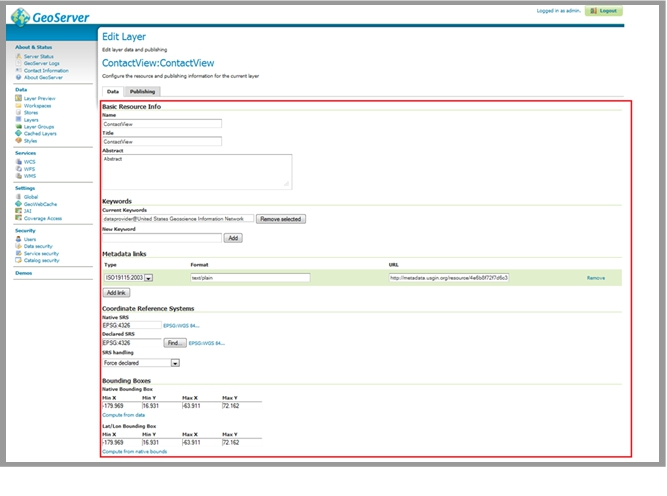

   Edit Layer Page

6.5.1 The Data tab of the Edit Layer page
-----------------------------------------

The **Data** tab contains fields within which you may specify the name, title, abstract, bounding box, spatial reference system, keywords, and metadata links for each layer in your web service. This information will be present within the **Capabilities document** produced by your web service in response to a **GetCapabilities** request, so it is very important to enter this information carefully for each layer in your web service.

It is recommended to enter the bounding boxes for your service manually, as doing so permits you to provide a more useful bounding box for your web service.

Note: GeoServer occasionally hangs up. To fix this, try restarting the service on Apache-Tomcat.

6.5.2 The Publishing tab of the Edit Layer page
-----------------------------------------------

After populating the fields in the **Data** tab, click the **Publishing** tab.

The **Publishing** tab contains **Layer Style** settings for the corresponding layer of your web service. **Layer Style** settings are dependent on the geometry of the layer (point, line, or polygon). See the ‘styling’ section of this document for more details.

Generally, it is faster and more precise to import **Layer Style** settings from an existing style than it is to manually specify values for each field in the **Publishing tab**. To import **Layer Style** settings from an existing style, select the desired style from the **Available Styles** list.

To populate the Available Styles list, you might need to import layer styles from an SLD file. For further instructions, see the ‘Importing Layer Styles from an SLD File’ section.

When you have populated the fields in the **Publishing** tab, click **Save**.

6.5.3 Creating group layers
===========================

In some situations it is desireable to create a group layer, for example you may want to do this to comply with INSPIRE layer naming regulations to create a layer called GE.GeologicUnit to group all of your layers that are spatial objects of type GeologicUnit.

On the left side of the GeoServer **Web Administration Interface**, under **Data**, click **Layer Groups**. This will bring up the **Layer Groups** page.  Click the add new layer group link to add a new group layer; this opens a New Layer Group page.

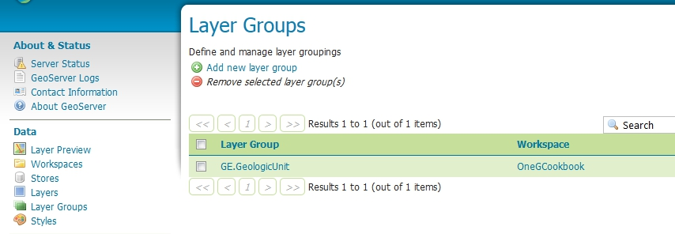

   Create or edit a Group layer

Add the name, title, and abstract.  If you are following INSPIRE regulations note the name and title must be EXACTLY as in the technical guidelines.  You may enter anything in the abstract, though we suggest you provide as much information about the grouping as possible.  Select the workspace you want to use and enter the layers that you want to group; the layers must already be available in the workspace.  The layers will display on top of each other so when adding layers you may wish to chose a layer order, for example if you want to group layers that are point features on top of polygon features.  Note the drawing order is the inverse of what will appear, that is the first drawn layer will appear at the bottom of the resultant map image.

Now select the default projection system for the group and then click the Generate Bounds button, this will generate a bounding box based on the extents of all your listed layers, though you may add the bounding box manually if you wish.  To ensure that a user can see which layers are included in the group, you will also need to choose the *Named Tree* Mode (and not use the default Single mode).

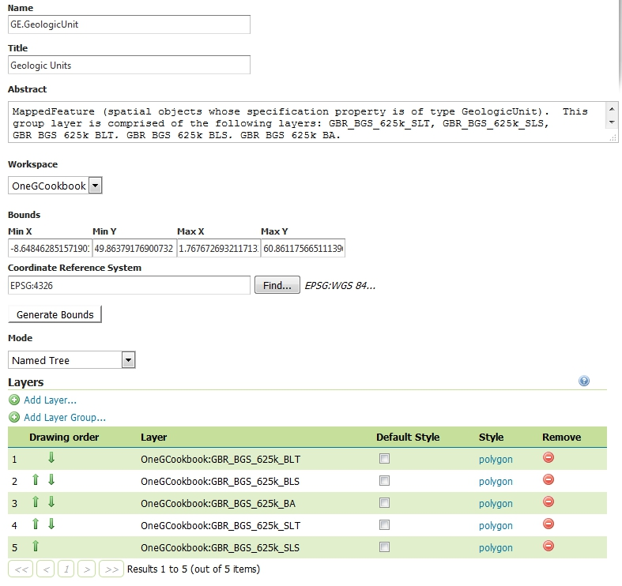

   Group layer properties

The output of a grouped layer is shown below (excerpt from a GetCapabilities response).

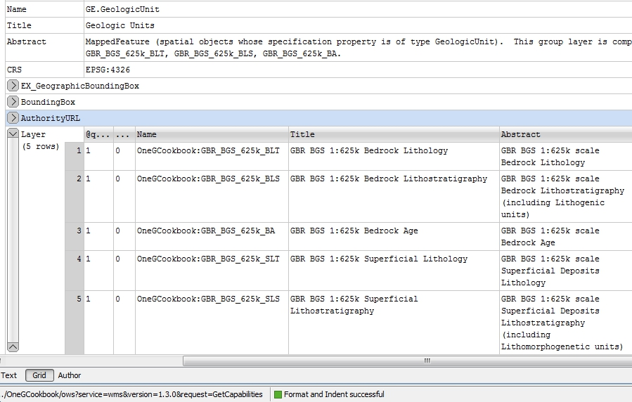

   Group layer output

6.6 Importing layer styles from an SLD file
===========================================

On the left side of the GeoServer **Web Administration Interface**, under **Data**, click **Styles**. This will open the **Styles** page.

If the Style you want is not listed on the Styles page, you will need to add it to the list by clicking **Add a New Style**. This brings you to the **Style Editor** page.

On the Style Editor page, you have the choice to copy/paste an SLD or upload a .sld XML document. The **Validate** button may be used to validate the SLD file against the OGC XML schema before using it. Click **Submit** to add the SLD to the list on the **Styles** page.

6.7 GeoServer troubleshooting
=============================

Q: I made a change in the database on my server and now the service is not working
   A: Try clearing the cache and reloading GeoServer on the Server Status page. If that doesn’t work, try hard restarting the service through Apache Tomcat.  
Q: Can I use a replicated Feature Class to create a service on GeoServer?
   A: No.
Q: I set up my services under three separate workspaces. When I connected to the WMS in ArcCatalog, all the layers appeared as one bundle. Is there a way to separate them out so I can add them individually?
   A: Yes.

Though setting up your services under different workspaces seems to imply that they can be accessed as discrete services, GeoServer defaults to providing one capabilities document containing the information for all of the services set up on your instance of GeoServer. To access workspaces individually, you will need customize your Get request to specify the desired workspace.

For example: a Geological Survey might run three services on GeoServer:

* GeologicUnitView
* FaultView
* ContactView

To perform a GetCapabilities request for GeologicUnitView, your GetCapabilities request will appear as follows:

http://services.a.survey.gov/geoserver/GeologicUnitView/ows?service=WMS&request=GetCapabilities&

This URL opens the WMS **capabilities document** for the GeologicUnitView workspace only. A generic form of the service endpoint for the request is as follows:

http://[host server]/geoserver/[Workspace Name]/ows?

Q: Is it possible to configure GeoServer so that I do not need to use PostGIS?
   A: Try installing the ArcSDE plug-in for GeoServer. To do this, you will need to download the extension from GeoServer’s website. Make sure to match the versions of the extension and GeoServer.  If you can get it to work, you should be able to connect to other SDE databases running on, for instance, MS SQL or Oracle.
Q: All of my data are in Shapefiles. Can I deploy a shapefile as a GeoSciML-Portrayal service?
   A: The problem you will run into is the truncation of field names that occurs in shapefiles. Ideally you will have a full version of the data in PostGIS. As mentioned in the above document, to be compliant with GeoSciML-Portrayal, you will need to make sure there is no truncation in field names; they must be an exact match for the GeoSciML-Portrayal schema. To map table fields to XML elements with different names you will have to use the `Application Schema extension <http://docs.geoserver.org/stable/en/user/data/app-schema/index.html>`_ for GeoServer. 
